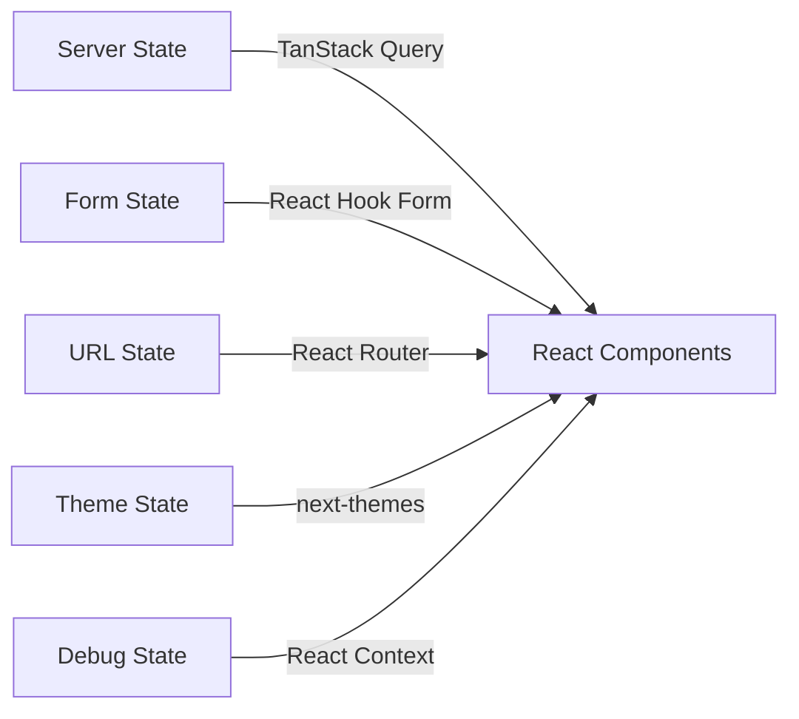
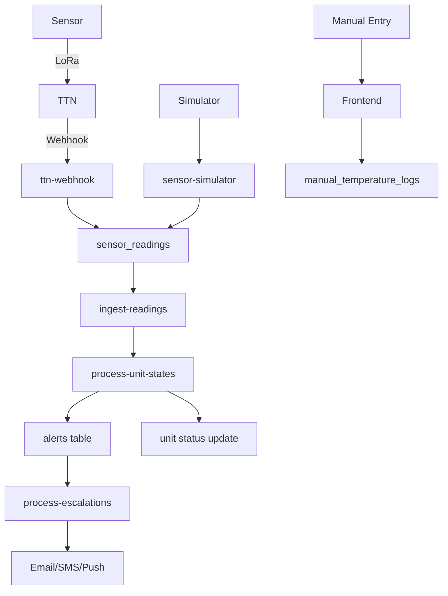
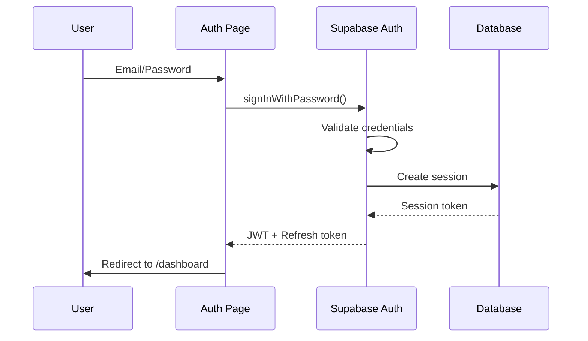
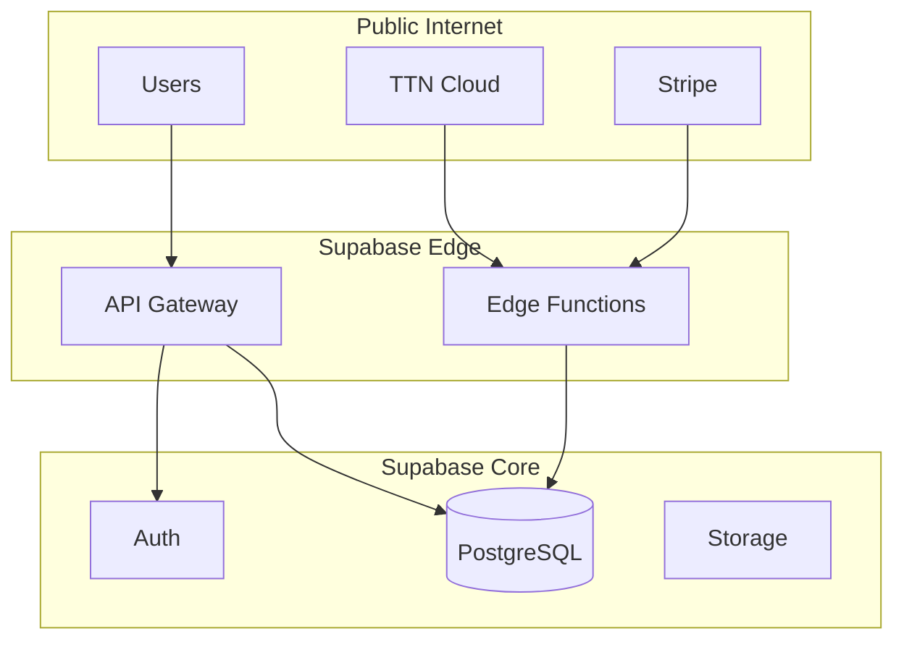
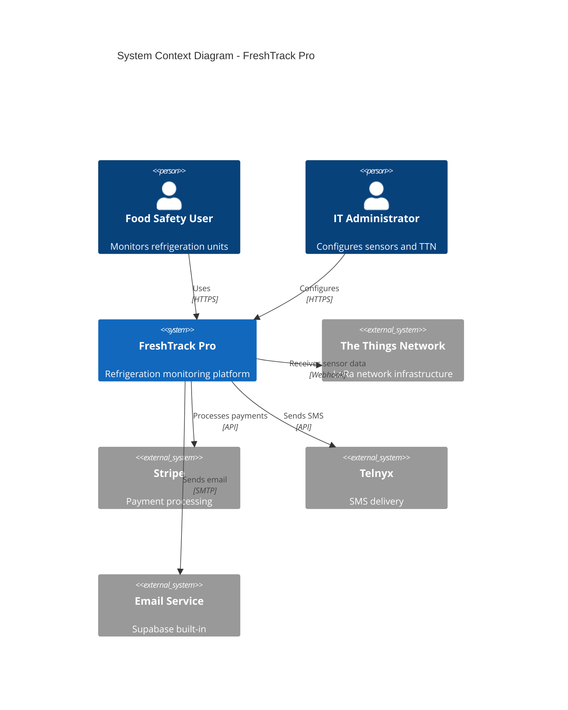
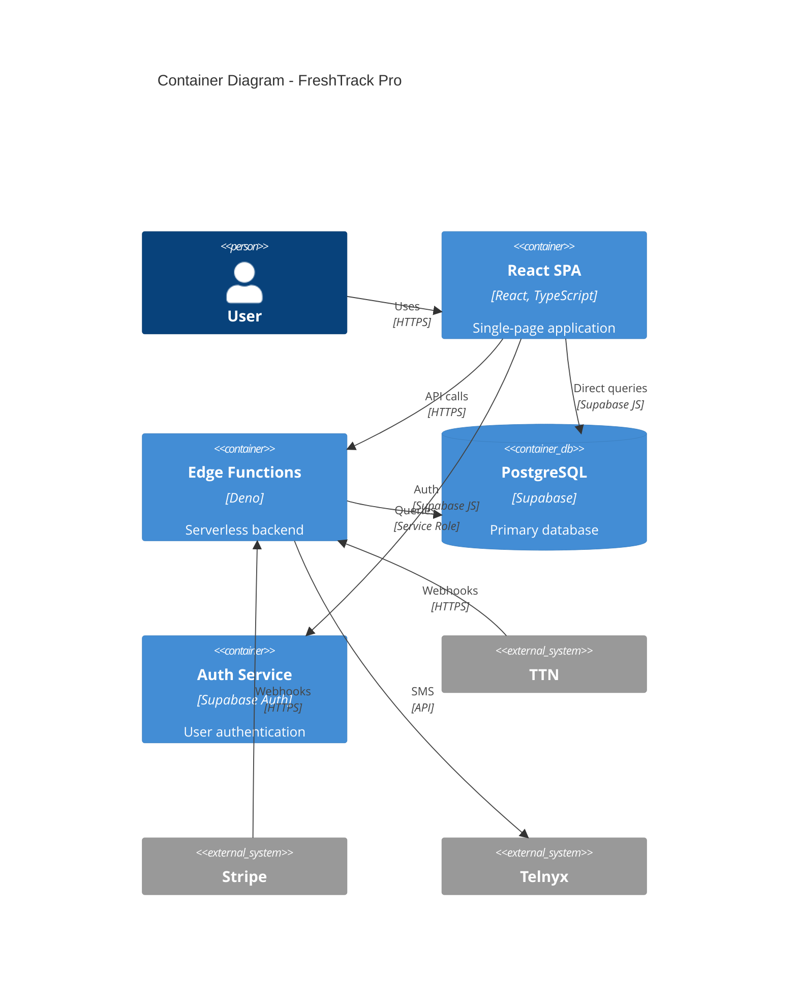

# FreshTrack Pro System Architecture

> Complete system architecture documentation

---

## Table of Contents

1. [Architecture Overview](#architecture-overview)
2. [Frontend Architecture](#frontend-architecture)
3. [Backend Architecture](#backend-architecture)
4. [Database Architecture](#database-architecture)
5. [Authentication & Authorization](#authentication-authorization)
6. [Third-Party Integrations](#third-party-integrations)
7. [Environment Separation](#environment-separation)
8. [Security Boundaries](#security-boundaries)
9. [Diagrams](#diagrams)

---

## Architecture Overview

FreshTrack Pro follows a modern Jamstack architecture with:
- **React SPA** for the frontend
- **Supabase** for backend (PostgreSQL + Edge Functions + Auth)
- **Event-driven processing** for sensor data and alerts
- **Multi-tenant isolation** via Row-Level Security

### Architectural Principles

1. **Single Source of Truth (SSOT)**
   - `process-unit-states` is the only service that creates/resolves alerts
   - `process-escalations` is the only service that sends notifications
   - `get_effective_alert_rules` RPC resolves the cascade logic

2. **Event-Driven Processing**
   - Sensor data triggers state evaluation
   - State changes trigger notifications
   - All actions are logged for audit

3. **Hierarchical Configuration**
   - Settings cascade: Organization → Site → Area → Unit
   - Lower levels override higher levels

4. **Offline-First for Critical Operations**
   - Manual temperature logging works offline
   - IndexedDB for local storage with sync

---

## Frontend Architecture

### Technology Stack

| Layer | Technology | Purpose |
|-------|------------|---------|
| Framework | React 18.3.1 | UI components and state |
| Routing | React Router 6.30.1 | Client-side navigation |
| State | TanStack Query 5.83.0 | Server state management |
| Forms | React Hook Form + Zod | Form handling and validation |
| Styling | Tailwind CSS 3.4.17 | Utility-first CSS |
| Components | shadcn/ui (Radix) | Accessible component library |
| Build | Vite 5.4.19 | Fast development and bundling |

### Component Architecture

```
src/
├── pages/              # Route-level components (23 pages)
│   ├── Dashboard.tsx   # Main monitoring view
│   ├── Settings.tsx    # Multi-tab configuration
│   └── ...
├── components/         # Reusable components (112+ files)
│   ├── ui/             # shadcn base components (43)
│   ├── settings/       # Settings panels
│   ├── unit/           # Unit monitoring
│   ├── alerts/         # Alert display
│   └── ...
├── hooks/              # Custom React hooks (25)
│   ├── useUnitStatus.ts
│   ├── useAlertRules.ts
│   └── ...
├── lib/                # Utilities and config
│   ├── alertConfig.ts
│   ├── statusConfig.ts
│   └── ...
├── contexts/           # React contexts
│   ├── DebugContext.tsx
│   └── TTNConfigContext.tsx
└── integrations/       # External service clients
    └── supabase/
```

### State Management Pattern



### Key Patterns

1. **Query Keys**: Structured for cache invalidation
   ```typescript
   ['units', unitId]
   ['alerts', { organizationId, status: 'active' }]
   ['alert-rules', { unitId }]
   ```

2. **Component Composition**: Use shadcn components as building blocks
3. **Config Objects**: Centralized status/alert configuration in `lib/`

---

## Backend Architecture

### Edge Functions Overview

The backend consists of 33 Deno-based edge functions organized by purpose:

#### Data Ingestion (3 functions)
| Function | Purpose | Trigger |
|----------|---------|---------|
| `ttn-webhook` | Receive TTN uplink messages | HTTP POST from TTN |
| `ingest-readings` | Generic sensor data ingestion | HTTP POST |
| `sensor-simulator` | Generate test data | HTTP POST |

#### Alert Processing (2 functions)
| Function | Purpose | Trigger |
|----------|---------|---------|
| `process-unit-states` | Evaluate unit states, create/resolve alerts | Called after ingestion |
| `process-escalations` | Send notifications per policy | Called after state changes |

#### TTN Management (12 functions)
| Function | Purpose |
|----------|---------|
| `ttn-bootstrap` | Auto-configure webhooks |
| `ttn-manage-application` | Create/update TTN apps |
| `ttn-provision-device` | Register sensors with TTN |
| `ttn-provision-gateway` | Register gateways with TTN |
| `ttn-provision-org` | Provision org in TTN |
| `ttn-provision-worker` | Background provisioning |
| `ttn-list-devices` | List TTN devices |
| `ttn-gateway-preflight` | Validate gateway permissions |
| `ttn-deprovision-worker` | Cleanup deprovisioned devices |
| `update-ttn-webhook` | Update webhook config |
| `manage-ttn-settings` | TTN settings CRUD |
| `sync-ttn-settings` | Sync from emulator |

#### User & Data Management (6 functions)
| Function | Purpose |
|----------|---------|
| `user-sync-emitter` | User sync events |
| `cleanup-user-sensors` | User data cleanup |
| `update-sensor-assignment` | Sensor assignment |
| `account-deletion-jobs` | GDPR deletion |
| `export-temperature-logs` | Compliance data export |
| `check-password-breach` | Password security |

#### Billing (3 functions)
| Function | Purpose |
|----------|---------|
| `stripe-checkout` | Create checkout sessions |
| `stripe-portal` | Customer portal access |
| `stripe-webhook` | Handle Stripe events |

#### Utilities (7 functions)
| Function | Purpose |
|----------|---------|
| `health-check` | System health monitoring |
| `check-slug-available` | Org slug validation |
| `send-sms-alert` | Telnyx SMS delivery |
| `org-state-api` | Pull-based state API |
| `fetch-org-state` | Org TTN state |
| `emulator-sync` | Emulator integration |
| `run-simulator-heartbeats` | Simulated heartbeats |

### Data Processing Pipeline



### Function Security

| Security Level | Functions | Auth Method |
|----------------|-----------|-------------|
| Public | Health check endpoints | None |
| User Auth | Most API endpoints | JWT (Supabase Auth) |
| Internal Only | process-unit-states, process-escalations | INTERNAL_API_KEY header |
| Webhook | ttn-webhook, stripe-webhook | Webhook secret |

---

## Database Architecture

### PostgreSQL 14.1 on Supabase

The database contains 60+ tables organized by domain:

#### Hierarchy Tables
```
organizations
    └── sites
        └── areas
            └── units
```

#### Core Tables by Domain

| Domain | Tables |
|--------|--------|
| Hierarchy | organizations, sites, areas, units |
| Sensors | lora_sensors, gateways, devices (legacy), sensor_readings |
| Alerts | alerts, alert_rules, alert_rules_history |
| Notifications | notification_policies, notification_events, escalation_contacts |
| Compliance | corrective_actions, calibration_records, event_logs |
| TTN | ttn_connections, ttn_provisioning_queue, ttn_provisioning_logs |
| Users | profiles, user_roles, user_sync_log |
| Billing | subscriptions, invoices |

### Row-Level Security (RLS)

All tables enforce RLS policies based on:
- User's organization membership (`user_roles`)
- Data ownership chain (units → areas → sites → organizations)

Example policy pattern:
```sql
-- Users can only see units in their organization
CREATE POLICY "Users can view org units" ON units
  FOR SELECT
  USING (
    EXISTS (
      SELECT 1 FROM user_roles ur
      JOIN sites s ON s.organization_id = ur.organization_id
      JOIN areas a ON a.site_id = s.id
      WHERE a.id = units.area_id
      AND ur.user_id = auth.uid()
    )
  );
```

### Key RPC Functions

| Function | Purpose |
|----------|---------|
| `get_effective_alert_rules(p_unit_id)` | Resolve cascaded alert rules |
| `get_effective_notification_policy(...)` | Resolve cascaded notification policy |
| `create_organization_with_owner(...)` | Atomic org creation |
| `user_belongs_to_org(...)` | Access check |
| `has_role(...)` | Role authorization |
| `enqueue_deprovision_jobs_for_unit(...)` | TTN cleanup queue |

---

## Authentication & Authorization

### Authentication Flow



### Session Management
- JWT tokens via Supabase Auth
- Automatic token refresh
- Session stored in localStorage

### Authorization Model

| Role | Capabilities |
|------|--------------|
| `owner` | Full org control, billing, user management |
| `manager` | Settings, alerts, reports |
| `operator` | Manual logging, alert acknowledgment |
| `viewer` | Read-only dashboard access |

### Permission Checks

```typescript
// Frontend hook
const { hasRole } = useUserRole();
if (hasRole('manager')) { /* show settings */ }

// Backend RPC
SELECT has_role(auth.uid(), 'manager', org_id);
```

---

## Third-Party Integrations

### The Things Network (TTN)

**Purpose**: LoRa sensor network connectivity

**Architecture**:
- Per-organization TTN Application
- Webhook-based uplink reception
- Device provisioning via TTN API

**Data Flow**:
```
Sensor → LoRa Gateway → TTN → ttn-webhook → Database
```

**Configuration**: Stored in `ttn_connections` table per organization

### Stripe

**Purpose**: Subscription billing

**Architecture**:
- Checkout sessions for new subscriptions
- Customer portal for management
- Webhook for event processing

**Plans**:
| Plan | Price | Sensors | Features |
|------|-------|---------|----------|
| Starter | $29/mo | 5 | Basic monitoring |
| Pro | $79/mo | 25 | SMS alerts |
| HACCP | $199/mo | 100 | Compliance reports |
| Enterprise | Custom | Unlimited | Custom features |

### Telnyx

**Purpose**: SMS alert delivery via toll-free number

**Configuration**:
| Property | Value |
|----------|-------|
| Messaging Profile | `frost guard` |
| Profile ID | `40019baa-aa62-463c-b254-463c66f4b2d3` |
| Phone Number | `+18889890560` (Toll-Free) |
| Webhook | Ed25519 signature verification |

**Usage**: Called by `process-escalations` → `send-sms-alert` for critical alerts

**Secrets Required**:
| Secret | Purpose |
|--------|---------|
| `TELNYX_API_KEY` | API authentication |
| `TELNYX_PHONE_NUMBER` | Sender phone number |
| `TELNYX_MESSAGING_PROFILE_ID` | Message routing |
| `TELNYX_PUBLIC_KEY` | Webhook signature verification |

---

## Environment Separation

### Environments

| Environment | Purpose | Database | Edge Functions |
|-------------|---------|----------|----------------|
| Local | Development | Local Supabase | `supabase functions serve` |
| Staging | Testing | Staging project | Deployed |
| Production | Live users | Production project | Deployed |

### Environment Variables

**Frontend (Vite)**:
```env
VITE_SUPABASE_URL=https://xxx.supabase.co
VITE_SUPABASE_PUBLISHABLE_KEY=eyJhbG...
VITE_SUPABASE_PROJECT_ID=xxx
```

**Edge Functions**:
```env
SUPABASE_URL=<auto-injected>
SUPABASE_SERVICE_ROLE_KEY=<auto-injected>
INTERNAL_API_KEY=<secret>
TTN_API_KEY=<per-org in database>
STRIPE_SECRET_KEY=<secret>
STRIPE_WEBHOOK_SECRET=<secret>
TELNYX_API_KEY=<secret>
TELNYX_PHONE_NUMBER=<secret>
```

### Configuration Management

- **supabase/config.toml**: Edge function settings
- **Database**: Organization-specific settings (TTN credentials)
- **Secrets**: Managed via Supabase dashboard

---

## Security Boundaries

### Network Security



### Data Security

| Data Type | Protection |
|-----------|------------|
| User passwords | Bcrypt hash (Supabase Auth) |
| TTN API keys | Encrypted at rest in database |
| Webhook secrets | Hashed for comparison |
| Session tokens | JWT with expiration |
| Sensitive logs | Masked before logging |

### Input Validation

- **Frontend**: Zod schemas in `lib/validation.ts`
- **Backend**: Zod validation in edge functions
- **Database**: CHECK constraints and triggers

### Security Best Practices

1. **Never expose service role key** to frontend
2. **Use RLS** for all data access
3. **Validate internal API keys** for scheduled functions
4. **Constant-time comparison** for webhook secrets
5. **Log without sensitive data** (mask phone numbers, keys)

---

## Diagrams

### System Context Diagram

See: [SYSTEM_CONTEXT.md](../diagrams/SYSTEM_CONTEXT.md)

### Container Diagram

See: [CONTAINER_DIAGRAM.md](../diagrams/CONTAINER_DIAGRAM.md)

### C4 Context (Embedded)



### Container Diagram (Embedded)



---

## Related Documentation

- [DATA_MODEL.md](../engineering/DATA_MODEL.md) - Database schema details
- [API.md](../engineering/API.md) - Edge function documentation
- [INTEGRATIONS.md](../engineering/INTEGRATIONS.md) - Third-party integration guides
- [OBSERVABILITY.md](../engineering/OBSERVABILITY.md) - Logging and monitoring
