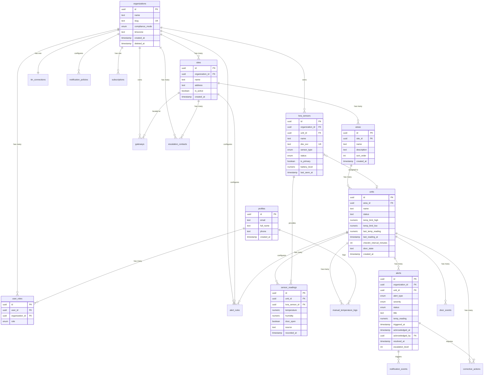
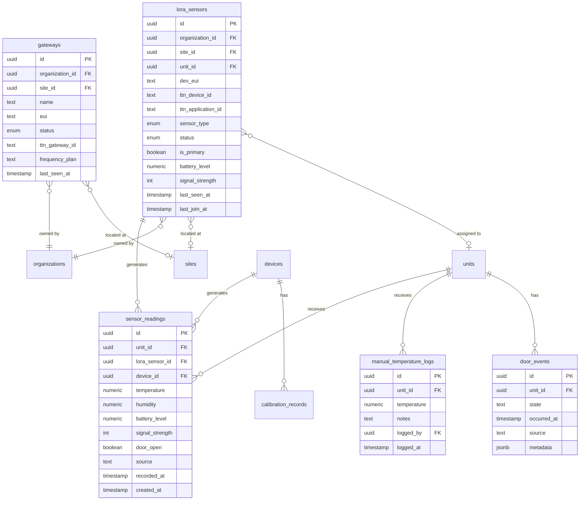
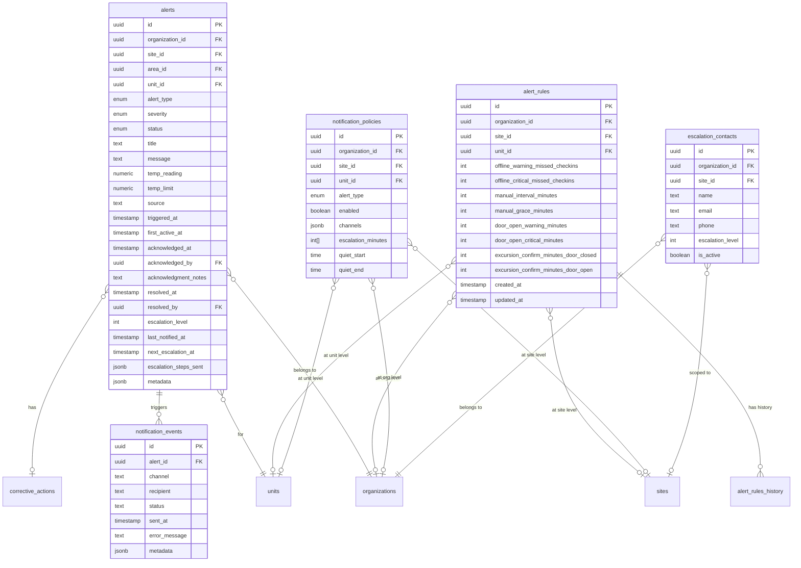
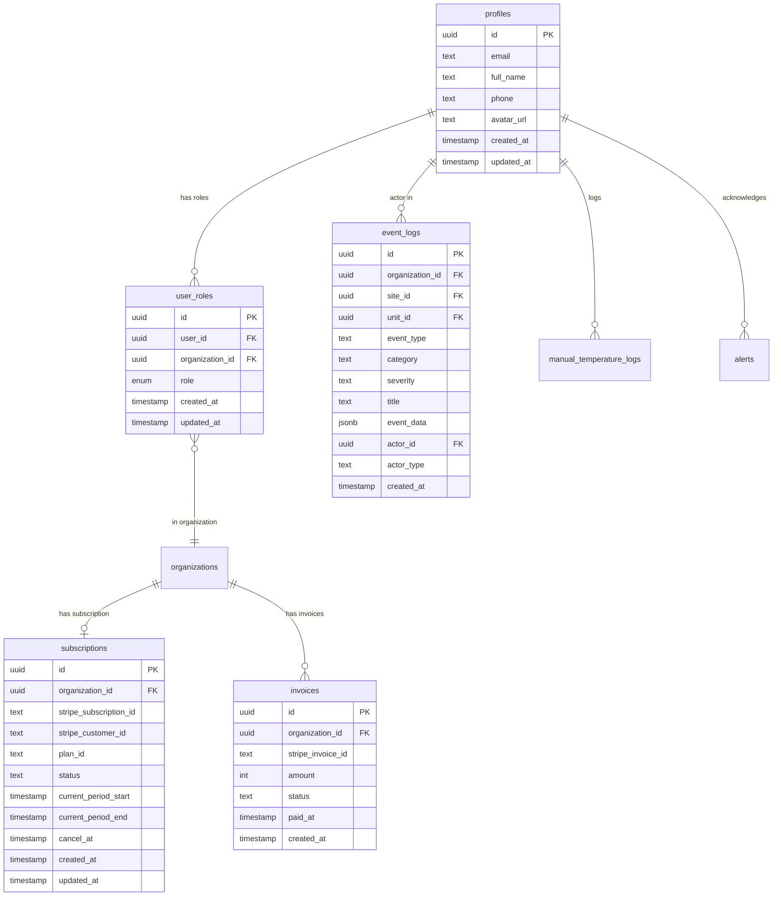
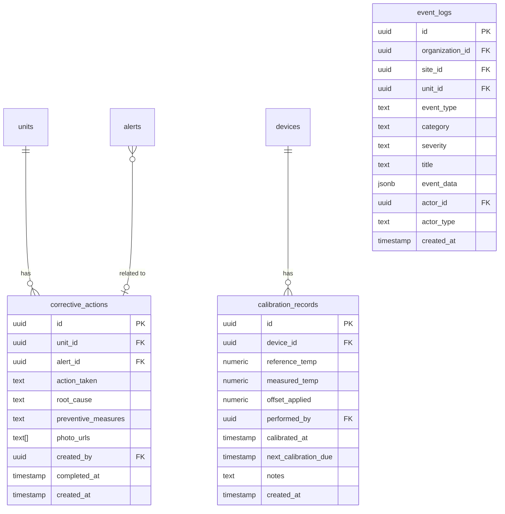

# Entity-Relationship Diagram

> Database entity-relationship diagrams for FreshTrack Pro

---

## Core Entity Relationships



---

## Sensor & Reading Relationships



---

## Alert & Notification Relationships



---

## TTN Integration Relationships

```mermaid
erDiagram
    organizations ||--|| ttn_connections : "has config"
    organizations ||--o{ ttn_provisioning_queue : "has jobs"
    organizations ||--o{ ttn_provisioning_logs : "has logs"
    organizations ||--o{ ttn_deprovision_jobs : "has cleanup"

    lora_sensors ||--o{ ttn_provisioning_queue : "provisioned via"
    gateways ||--o{ ttn_provisioning_queue : "provisioned via"

    ttn_provisioning_queue ||--o{ ttn_provisioning_logs : "has logs"

    ttn_connections {
        uuid id PK
        uuid organization_id FK UK
        text application_id
        text api_key
        text webhook_secret
        text cluster
        text webhook_url
        boolean is_configured
        timestamp last_sync_at
        timestamp created_at
        timestamp updated_at
    }

    ttn_provisioning_queue {
        uuid id PK
        uuid organization_id FK
        uuid sensor_id FK
        uuid gateway_id FK
        text action
        text status
        int attempts
        text last_error
        timestamp processed_at
        timestamp created_at
    }

    ttn_provisioning_logs {
        uuid id PK
        uuid queue_id FK
        uuid organization_id FK
        text action
        boolean success
        jsonb response
        text error
        timestamp created_at
    }

    ttn_deprovision_jobs {
        uuid id PK
        uuid organization_id FK
        uuid sensor_id FK
        text dev_eui
        text status
        timestamp created_at
        timestamp processed_at
    }
```

---

## User & Billing Relationships



---

## Compliance Relationships



---

## Related Documentation

- [DATA_MODEL.md](../engineering/DATA_MODEL.md) - Complete schema documentation
- [ARCHITECTURE.md](../architecture/ARCHITECTURE.md) - Database architecture
