# Flowcharts

> Process flowcharts for data ingestion, alert processing, and system operations

---

## Table of Contents

1. [Data Ingestion Flow](#data-ingestion-flow)
2. [Alert Processing Flow](#alert-processing-flow)
3. [Notification Flow](#notification-flow)
4. [TTN Provisioning Flow](#ttn-provisioning-flow)
5. [Manual Logging Flow](#manual-logging-flow)
6. [Authentication Flow](#authentication-flow)
7. [Cascade Resolution Flow](#cascade-resolution-flow)

---

## Data Ingestion Flow

### TTN Webhook Processing

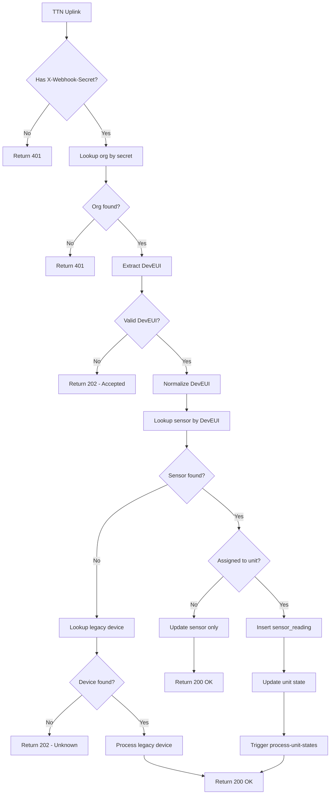

### Sensor Reading Processing

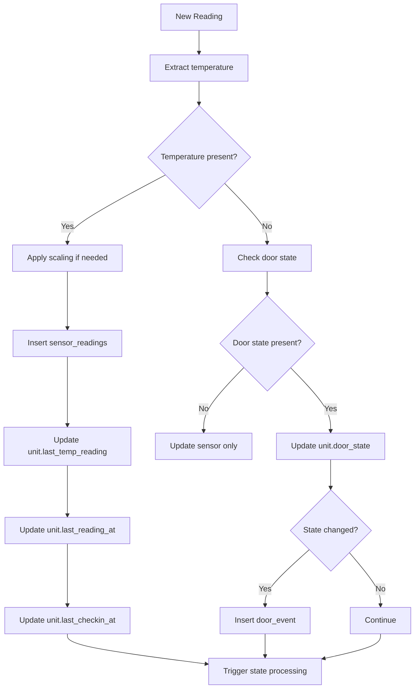

---

## Alert Processing Flow

### Unit State Evaluation (process-unit-states)

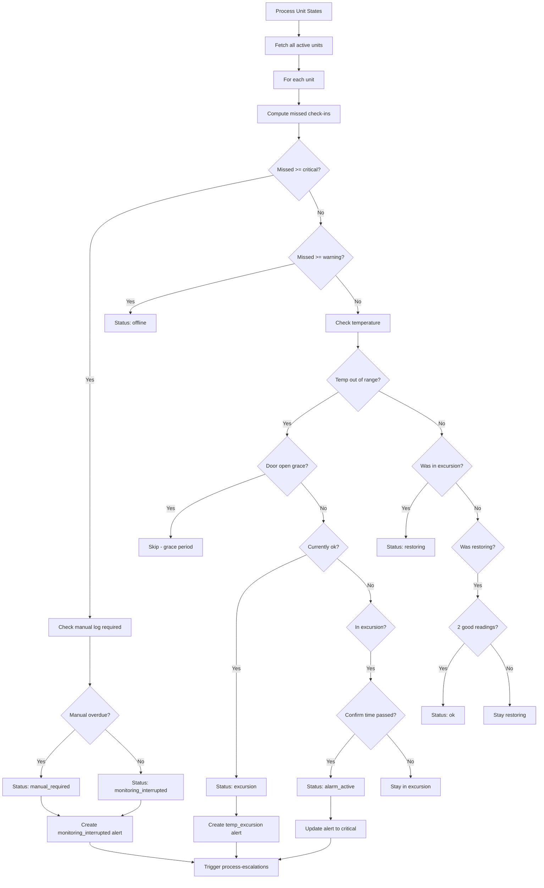

### Temperature Excursion Detection

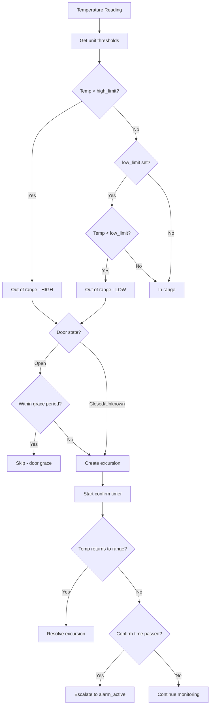

---

## Notification Flow

### Escalation Processing (process-escalations)

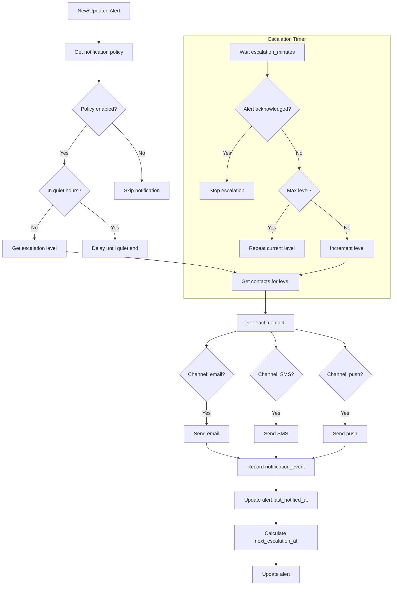

### SMS Delivery

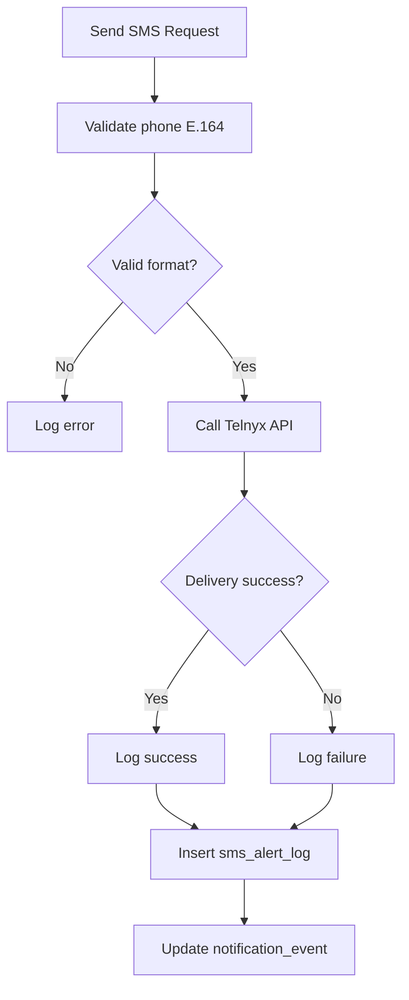

---

## TTN Provisioning Flow

### Device Provisioning

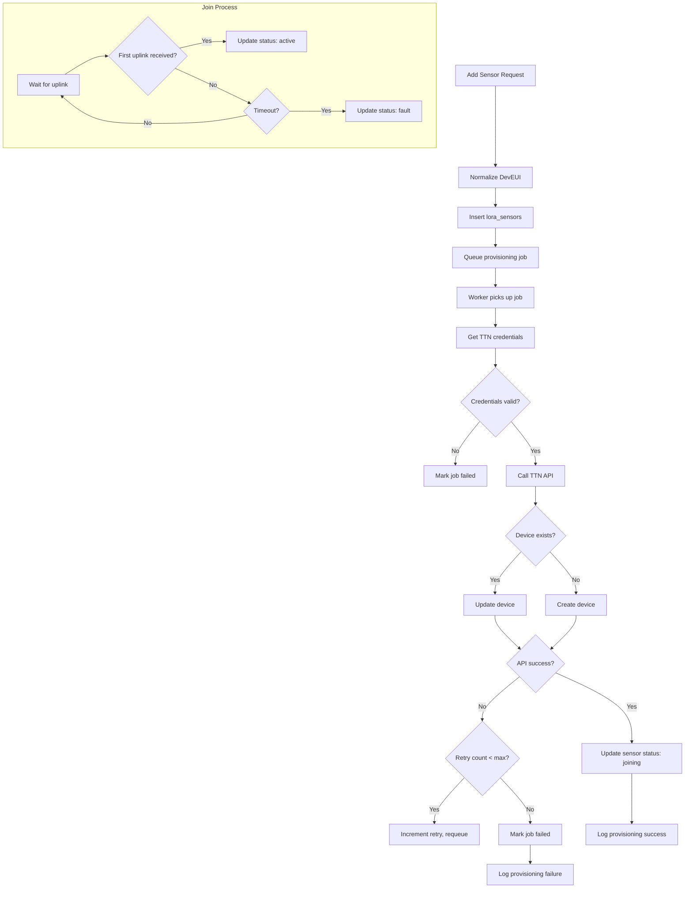

### Webhook Bootstrap

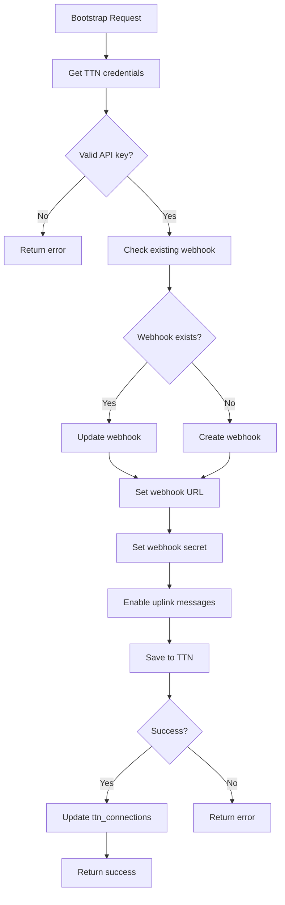

---

## Manual Logging Flow

```mermaid
flowchart TD
    A[User submits log] --> B[Validate temperature]
    B --> C{Valid range?}

    C -->|No| D[Show validation error]
    C -->|Yes| E{Online?}

    E -->|Yes| F[Insert manual_temperature_logs]
    E -->|No| G[Store in IndexedDB]

    F --> H{Success?}
    H -->|Yes| I[Update unit.last_manual_log_at]
    H -->|No| J[Show error toast]

    G --> K[Show "saved offline" toast]
    I --> L[Show success toast]

    K --> M[Queue sync]

    subgraph "Background Sync"
        N[Connection restored]
        N --> O[Get queued logs]
        O --> P[For each log]
        P --> Q[Insert to database]
        Q --> R{Success?}
        R -->|Yes| S[Remove from queue]
        R -->|No| T[Retry later]
        S --> U{More logs?}
        U -->|Yes| P
        U -->|No| V[Show "synced" toast]
    end
```

---

## Authentication Flow

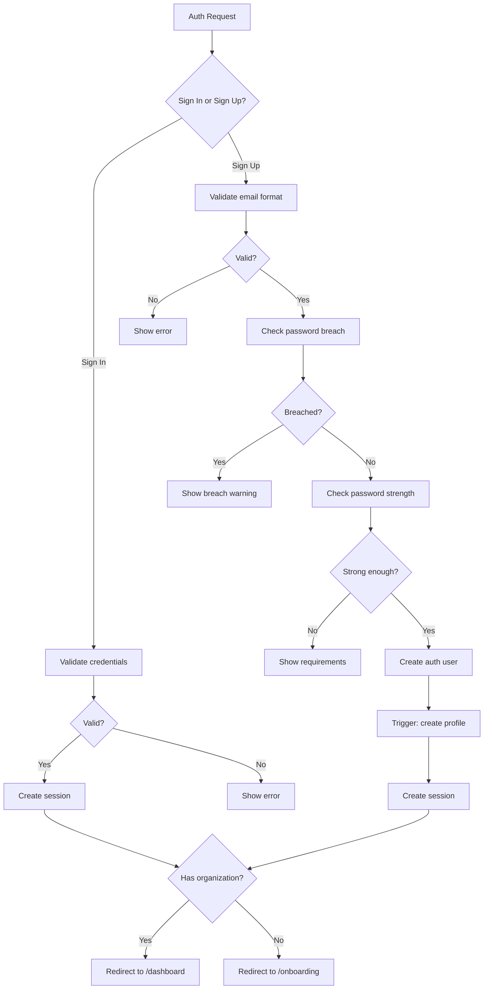

---

## Cascade Resolution Flow

### Alert Rules Cascade

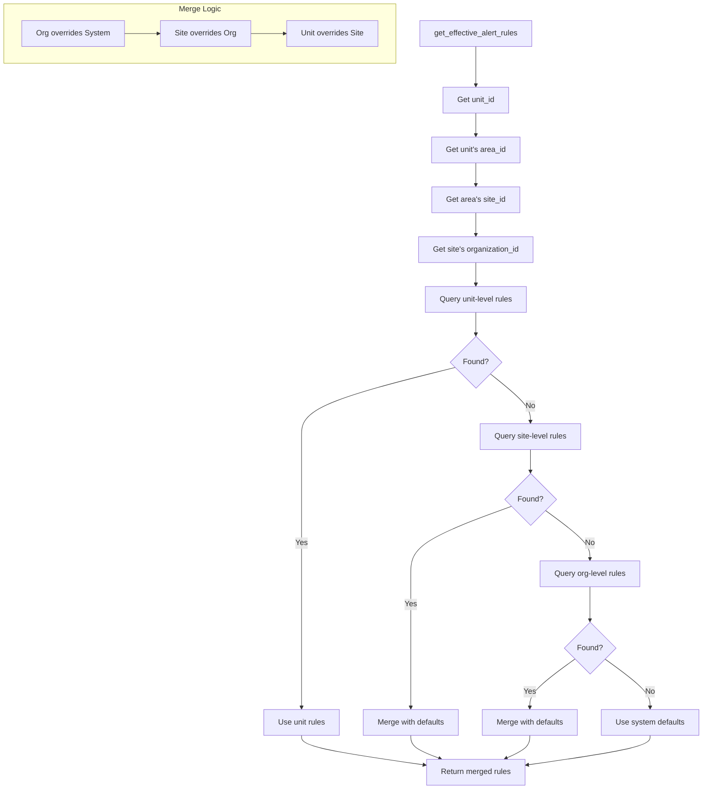

### Notification Policy Cascade

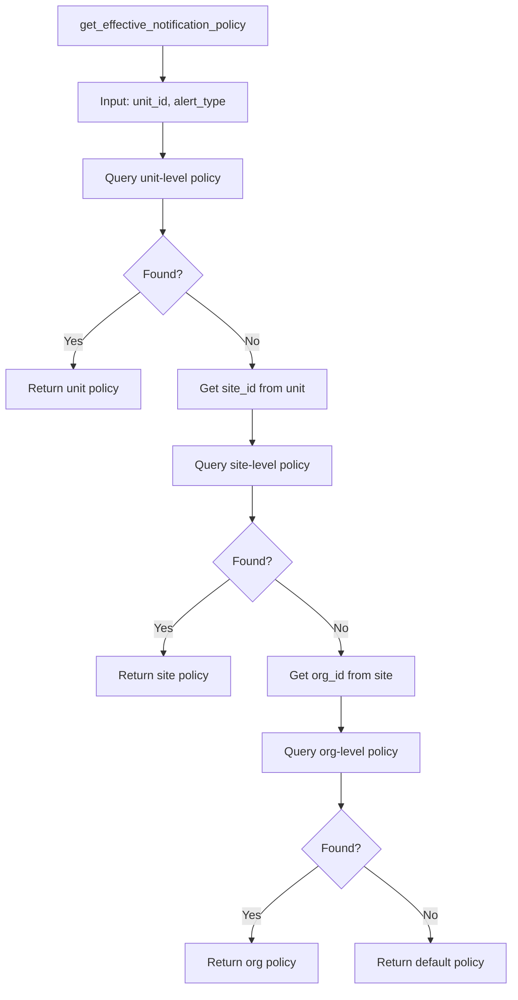

---

## Related Documentation

- [API.md](../engineering/API.md) - Edge function details
- [SEQUENCES.md](../diagrams/SEQUENCES.md) - Sequence diagrams
- [STATE_MACHINES.md](../diagrams/STATE_MACHINES.md) - State machines
