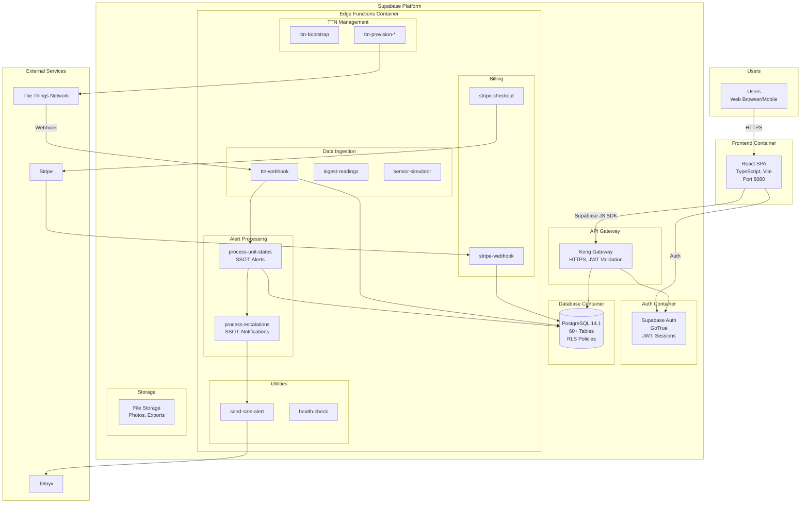
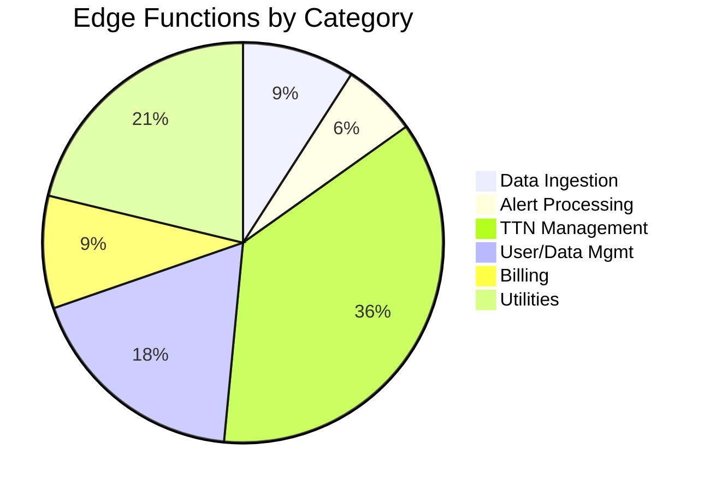
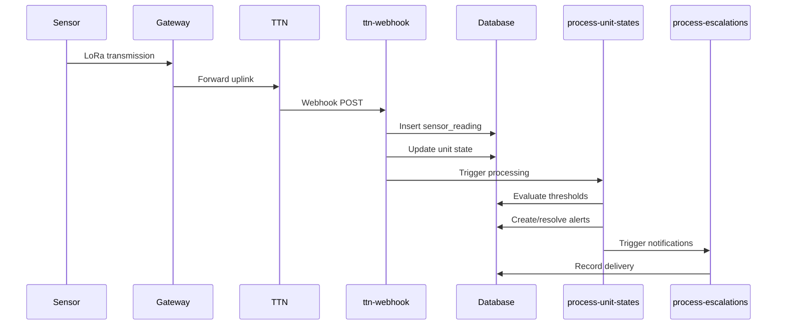
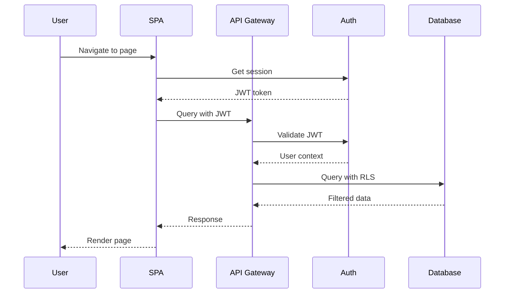
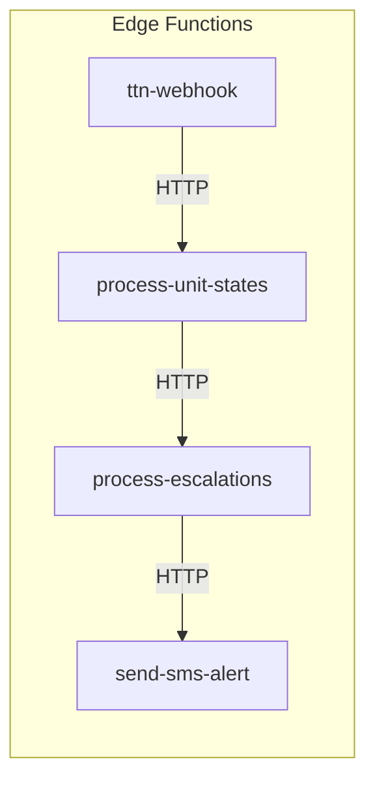
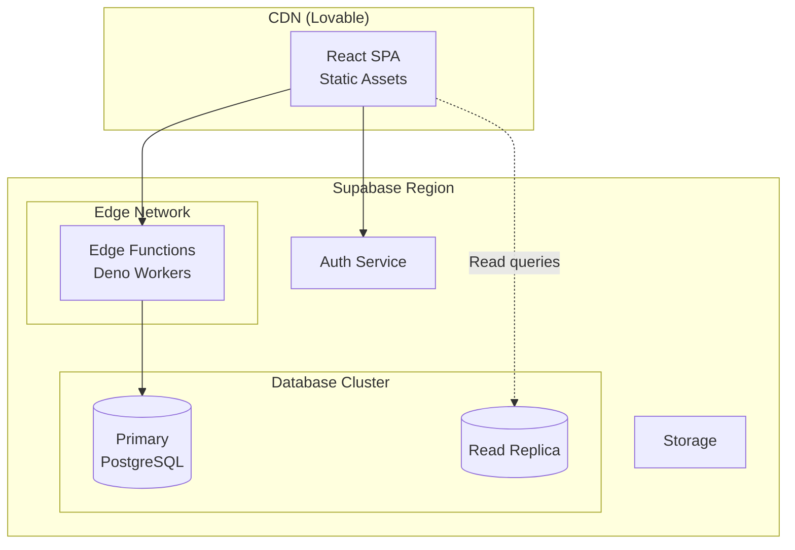

# Container Diagram

> Internal container-level architecture of FreshTrack Pro

---

## C4 Container Diagram

---

## Container Details

### Frontend Container

| Property | Value |
|----------|-------|
| Technology | React 18.3.1, TypeScript, Vite |
| Build | `npm run build` → `dist/` |
| Hosting | Lovable platform (CDN) |
| Port | 8080 (development) |

**Responsibilities**:
- User interface rendering
- Client-side routing
- Form handling and validation
- Offline data caching (IndexedDB)
- PWA functionality

### Auth Container

| Property | Value |
|----------|-------|
| Technology | Supabase Auth (GoTrue) |
| Protocol | JWT (HS256) |
| Session | localStorage |

**Responsibilities**:
- User authentication
- Session management
- Password reset
- OAuth providers (if configured)

### Database Container

| Property | Value |
|----------|-------|
| Technology | PostgreSQL 14.1 |
| Tables | 60+ |
| Access Control | Row-Level Security |

**Key Features**:
- RLS policies for multi-tenancy
- Database functions (RPC)
- Triggers for event handling
- Foreign key relationships

### Edge Functions Container

| Property | Value |
|----------|-------|
| Runtime | Deno |
| Functions | 33 |
| Invocation | HTTP, Scheduled |

**Function Categories**:

---

## Data Flow Patterns

### Sensor Data Flow

### User Request Flow

---

## Container Communication

### Protocols

| From | To | Protocol | Auth |
|------|----|---------|----- |
| SPA | Gateway | HTTPS | JWT |
| SPA | Auth | HTTPS | API Key |
| TTN | ttn-webhook | HTTPS | Webhook Secret |
| Stripe | stripe-webhook | HTTPS | Signature |
| Edge → Database | TCP | Service Role Key |
| Edge → Telnyx | HTTPS | API Credentials |
| Edge → TTN | HTTPS | Org API Key |

### Internal Communication

---

## Deployment Architecture

---

## Scalability Considerations

| Component | Scaling Method |
|-----------|----------------|
| SPA | CDN distribution |
| Edge Functions | Auto-scaling workers |
| Database | Vertical scaling, read replicas |
| Auth | Managed by Supabase |

---

## Related Diagrams

- [SYSTEM_CONTEXT.md](./SYSTEM_CONTEXT.md) - External context
- [FLOWCHARTS.md](../charts/FLOWCHARTS.md) - Process flows
- [ARCHITECTURE.md](../architecture/ARCHITECTURE.md) - Full documentation
