# Page Diagrams

> Component and data flow diagrams for each application page

---

## Table of Contents

1. [Dashboard](#dashboard)
2. [Unit Detail](#unit-detail)
3. [Alerts](#alerts)
4. [Settings](#settings)
5. [Manual Log](#manual-log)
6. [Reports](#reports)
7. [Auth Page](#auth-page)
8. [Site Detail](#site-detail)
9. [Area Detail](#area-detail)
10. [Health Dashboard](#health-dashboard)
11. [Onboarding](#onboarding)

---

## Landing Page

**Route**: `/`
**File**: `src/pages/Index.tsx`

### Component Diagram

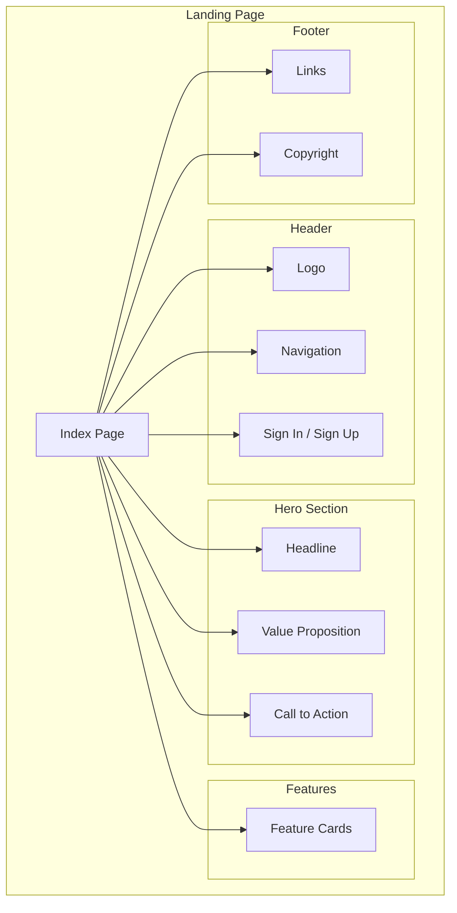
```mermaid
graph TB
    subgraph "Landing Page"
        LP[Index Page]

        subgraph "Header"
            LG[Logo]
            NV[Navigation]
            SA[Sign In / Sign Up]
        end

        subgraph "Hero Section"
            HL[Headline]
            VP[Value Proposition]
            CTA[Call to Action]
        end

        subgraph "Features"
            F1[Feature Cards]
        end

        subgraph "Footer"
            LK[Links]
            CP[Copyright]
        end
    end

    LP --> LG
    LP --> NV
    LP --> SA
    LP --> HL
    LP --> VP
    LP --> CTA
    LP --> F1
    LP --> LK
    LP --> CP
```

### State Machine

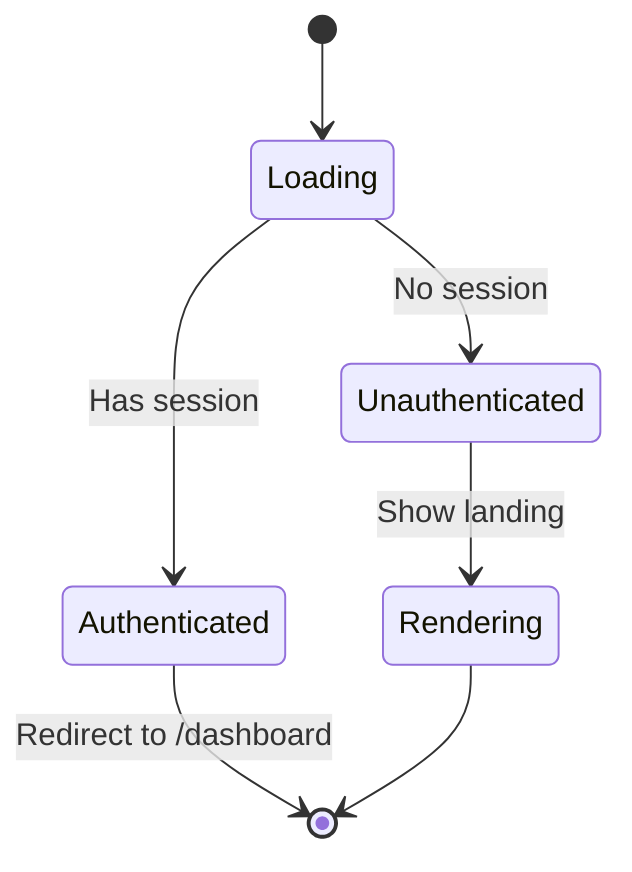
```mermaid
stateDiagram-v2
    [*] --> Loading
    Loading --> Authenticated: Has session
    Loading --> Unauthenticated: No session

    Authenticated --> [*]: Redirect to /dashboard
    Unauthenticated --> Rendering: Show landing
    Rendering --> [*]
```

---

## Organization Dashboard

**Route**: `/organization`
**File**: `src/pages/OrganizationDashboard.tsx`

### Component Diagram

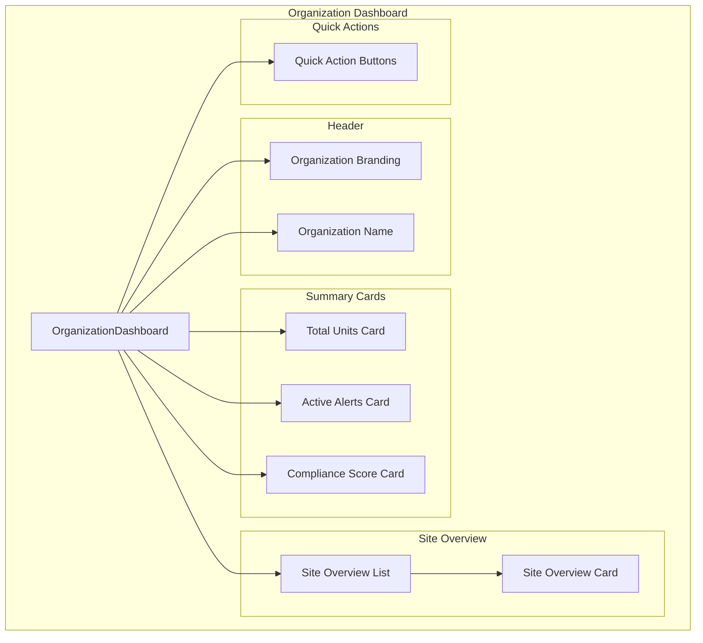
```mermaid
graph TB
    subgraph "Organization Dashboard"
        OD[OrganizationDashboard]

        subgraph "Header"
            OB[Organization Branding]
            ON[Organization Name]
        end

        subgraph "Summary Cards"
            TU[Total Units Card]
            AA[Active Alerts Card]
            CS[Compliance Score Card]
        end

        subgraph "Site Overview"
            SOL[Site Overview List]
            SOC[Site Overview Card]
        end

        subgraph "Quick Actions"
            QA[Quick Action Buttons]
        end
    end

    OD --> OB
    OD --> ON
    OD --> TU
    OD --> AA
    OD --> CS
    OD --> SOL
    SOL --> SOC
    OD --> QA
```

---

## Sites

**Route**: `/sites`
**File**: `src/pages/Sites.tsx`

### Component Diagram

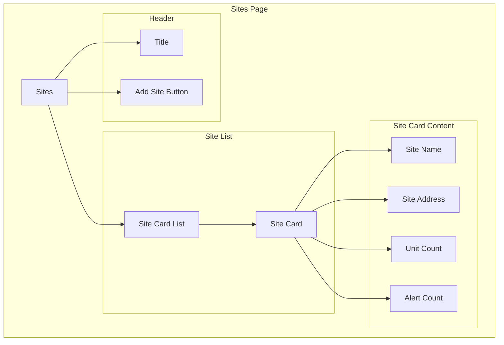
```mermaid
graph TB
    subgraph "Sites Page"
        SP[Sites]

        subgraph "Header"
            TL[Title]
            ASB[Add Site Button]
        end

        subgraph "Site List"
            SCL[Site Card List]
            SC[Site Card]
        end

        subgraph "Site Card Content"
            SN[Site Name]
            SA[Site Address]
            UC[Unit Count]
            AC[Alert Count]
        end
    end

    SP --> TL
    SP --> ASB
    SP --> SCL
    SCL --> SC
    SC --> SN
    SC --> SA
    SC --> UC
    SC --> AC
```

---

## Event History

**Route**: `/events`
**File**: `src/pages/EventHistory.tsx`

### Component Diagram

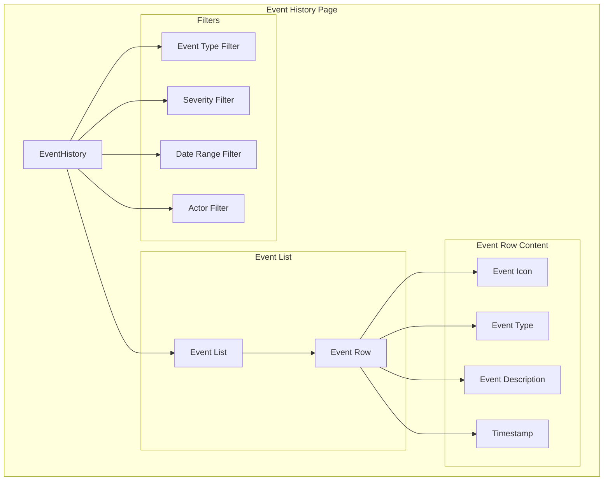
```mermaid
graph TB
    subgraph "Event History Page"
        EH[EventHistory]

        subgraph "Filters"
            ETF[Event Type Filter]
            SEF[Severity Filter]
            DRF[Date Range Filter]
            AF[Actor Filter]
        end

        subgraph "Event List"
            EL[Event List]
            ER[Event Row]
        end

        subgraph "Event Row Content"
            EI[Event Icon]
            ET[Event Type]
            ED[Event Description]
            TS[Timestamp]
        end
    end

    EH --> ETF
    EH --> SEF
    EH --> DRF
    EH --> AF
    EH --> EL
    EL --> ER
    ER --> EI
    ER --> ET
    ER --> ED
    ER --> TS
```

### State Machine

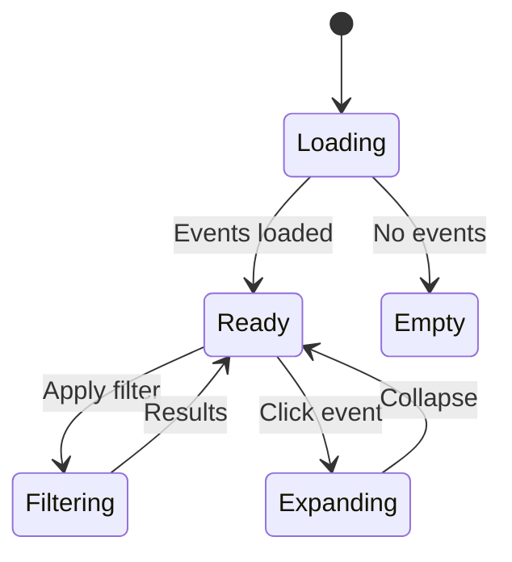
```mermaid
stateDiagram-v2
    [*] --> Loading
    Loading --> Ready: Events loaded
    Loading --> Empty: No events

    Ready --> Filtering: Apply filter
    Filtering --> Ready: Results

    Ready --> Expanding: Click event
    Expanding --> Ready: Collapse
```

---

## Dashboard

**Route**: `/dashboard`
**File**: `src/pages/Dashboard.tsx`

### Component Diagram

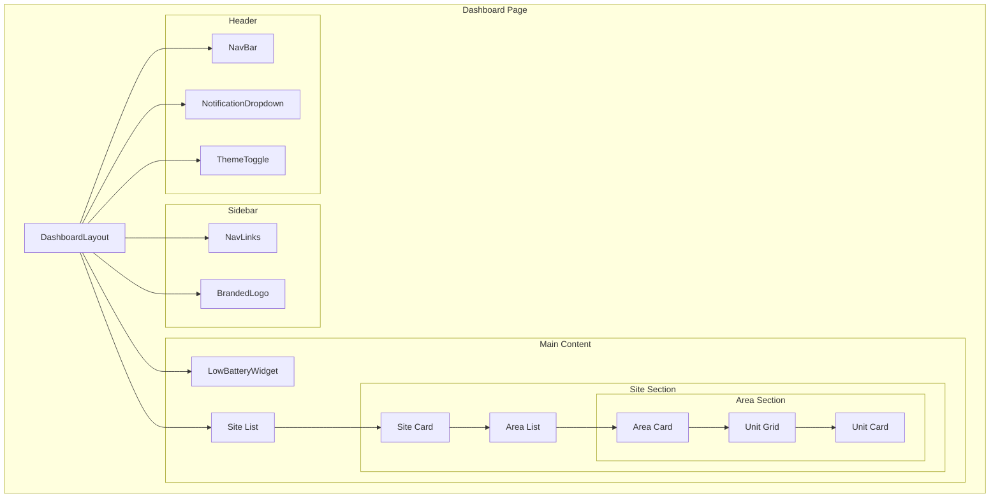
```mermaid
graph TB
    subgraph "Dashboard Page"
        DL[DashboardLayout]

        subgraph "Header"
            NB[NavBar]
            ND[NotificationDropdown]
            TT[ThemeToggle]
        end

        subgraph "Sidebar"
            NL[NavLinks]
            BC[BrandedLogo]
        end

        subgraph "Main Content"
            BW[LowBatteryWidget]
            SL[Site List]

            subgraph "Site Section"
                SC[Site Card]
                AL[Area List]

                subgraph "Area Section"
                    AC[Area Card]
                    UG[Unit Grid]
                    UC[Unit Card]
                end
            end
        end
    end

    DL --> NB
    DL --> ND
    DL --> TT
    DL --> NL
    DL --> BC
    DL --> BW
    DL --> SL
    SL --> SC
    SC --> AL
    AL --> AC
    AC --> UG
    UG --> UC
```

### Data Flow

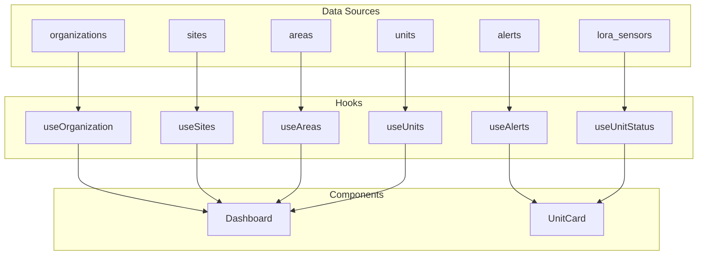
```mermaid
flowchart TB
    subgraph "Data Sources"
        ORG[organizations]
        SITES[sites]
        AREAS[areas]
        UNITS[units]
        ALERTS[alerts]
        SENSORS[lora_sensors]
    end

    subgraph "Hooks"
        UO[useOrganization]
        US[useSites]
        UA[useAreas]
        UU[useUnits]
        UAL[useAlerts]
        UUS[useUnitStatus]
    end

    subgraph "Components"
        DASH[Dashboard]
        UCARD[UnitCard]
    end

    ORG --> UO --> DASH
    SITES --> US --> DASH
    AREAS --> UA --> DASH
    UNITS --> UU --> DASH
    ALERTS --> UAL --> UCARD
    SENSORS --> UUS --> UCARD
```

### State Machine

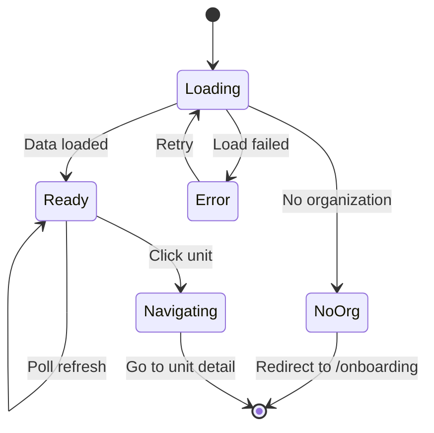
```mermaid
stateDiagram-v2
    [*] --> Loading
    Loading --> Ready: Data loaded
    Loading --> NoOrg: No organization
    Loading --> Error: Load failed

    NoOrg --> [*]: Redirect to /onboarding

    Ready --> Ready: Poll refresh
    Ready --> Navigating: Click unit

    Navigating --> [*]: Go to unit detail

    Error --> Loading: Retry
```

---

## Unit Detail

**Route**: `/units/:unitId`
**File**: `src/pages/UnitDetail.tsx`

### Component Diagram

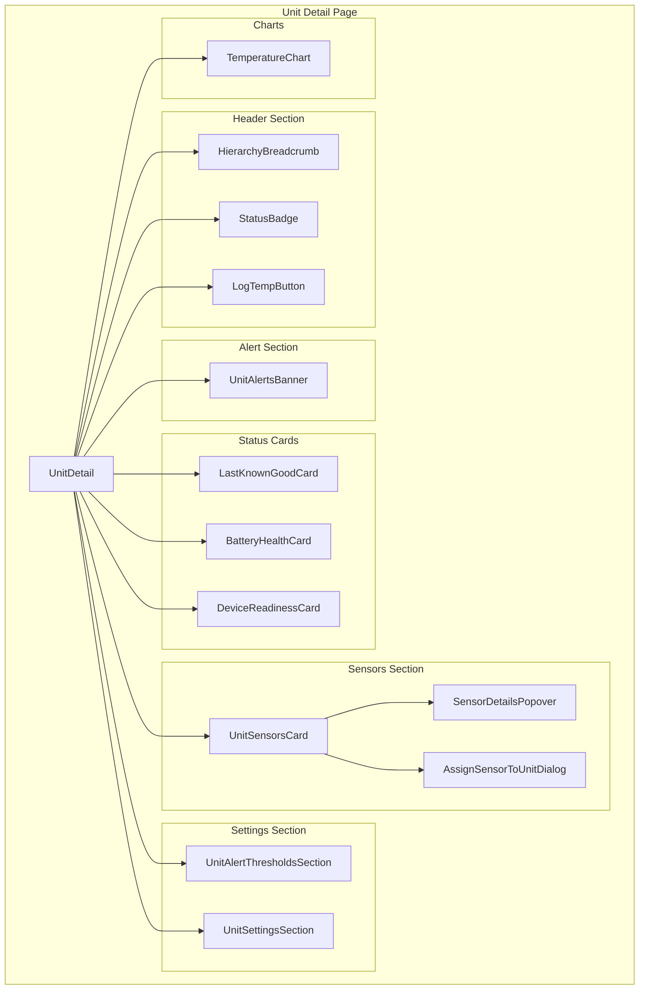
```mermaid
graph TB
    subgraph "Unit Detail Page"
        UD[UnitDetail]

        subgraph "Header Section"
            HB[HierarchyBreadcrumb]
            SB[StatusBadge]
            LTB[LogTempButton]
        end

        subgraph "Alert Section"
            UAB[UnitAlertsBanner]
        end

        subgraph "Status Cards"
            LKG[LastKnownGoodCard]
            BH[BatteryHealthCard]
            DR[DeviceReadinessCard]
        end

        subgraph "Sensors Section"
            USC[UnitSensorsCard]
            SDP[SensorDetailsPopover]
            ASD[AssignSensorToUnitDialog]
        end

        subgraph "Settings Section"
            UATS[UnitAlertThresholdsSection]
            USS[UnitSettingsSection]
        end

        subgraph "Charts"
            TC[TemperatureChart]
        end
    end

    UD --> HB
    UD --> SB
    UD --> LTB
    UD --> UAB
    UD --> LKG
    UD --> BH
    UD --> DR
    UD --> USC
    USC --> SDP
    USC --> ASD
    UD --> UATS
    UD --> USS
    UD --> TC
```

### Data Flow

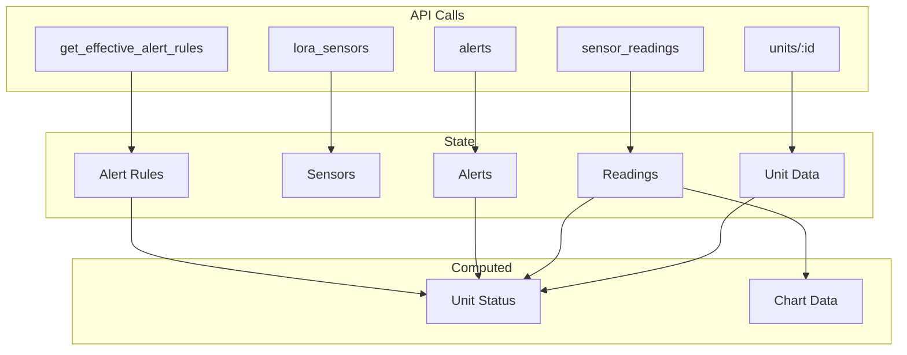
```mermaid
flowchart TB
    subgraph "API Calls"
        U[units/:id]
        S[lora_sensors]
        R[sensor_readings]
        A[alerts]
        AR[get_effective_alert_rules]
    end

    subgraph "State"
        UNIT[Unit Data]
        SENS[Sensors]
        READ[Readings]
        ALR[Alerts]
        RULES[Alert Rules]
    end

    subgraph "Computed"
        STATUS[Unit Status]
        CHART[Chart Data]
    end

    U --> UNIT
    S --> SENS
    R --> READ
    A --> ALR
    AR --> RULES

    UNIT --> STATUS
    READ --> STATUS
    ALR --> STATUS
    RULES --> STATUS

    READ --> CHART
```

### State Machine

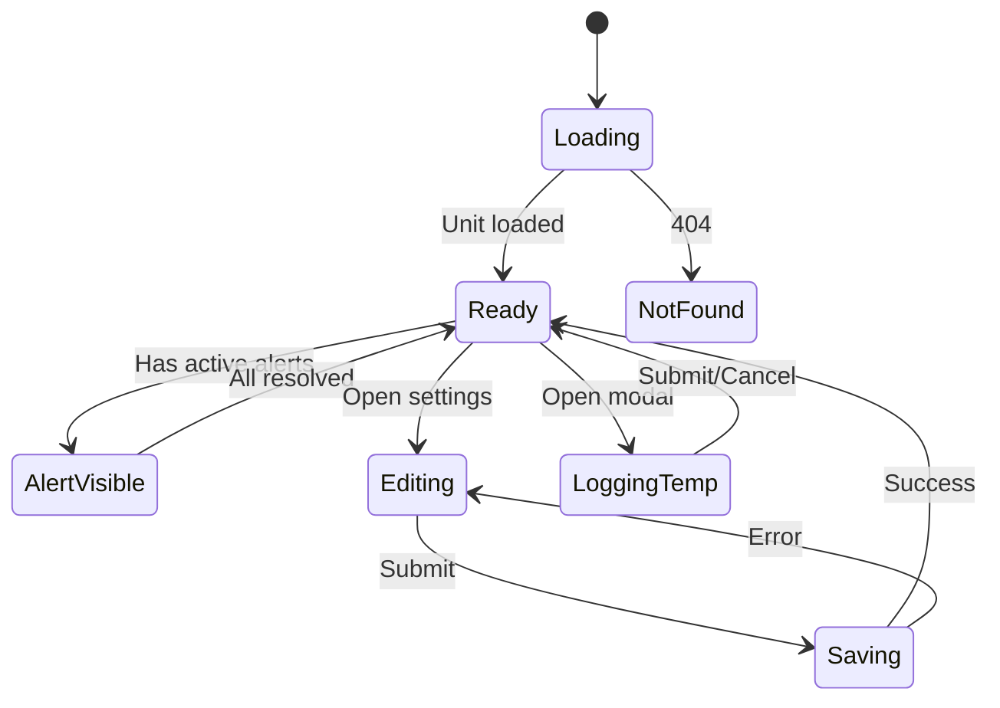
```mermaid
stateDiagram-v2
    [*] --> Loading
    Loading --> Ready: Unit loaded
    Loading --> NotFound: 404

    Ready --> AlertVisible: Has active alerts
    AlertVisible --> Ready: All resolved

    Ready --> Editing: Open settings
    Editing --> Saving: Submit
    Saving --> Ready: Success
    Saving --> Editing: Error

    Ready --> LoggingTemp: Open modal
    LoggingTemp --> Ready: Submit/Cancel
```

---

## Alerts

**Route**: `/alerts`
**File**: `src/pages/Alerts.tsx`

### Component Diagram

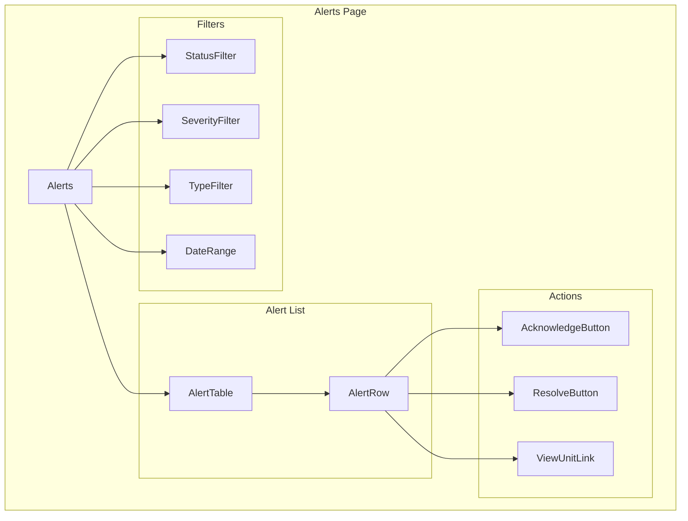
```mermaid
graph TB
    subgraph "Alerts Page"
        AP[Alerts]

        subgraph "Filters"
            SF[StatusFilter]
            SEV[SeverityFilter]
            TF[TypeFilter]
            DR[DateRange]
        end

        subgraph "Alert List"
            AT[AlertTable]
            AR[AlertRow]
        end

        subgraph "Actions"
            ACK[AcknowledgeButton]
            RES[ResolveButton]
            VU[ViewUnitLink]
        end
    end

    AP --> SF
    AP --> SEV
    AP --> TF
    AP --> DR
    AP --> AT
    AT --> AR
    AR --> ACK
    AR --> RES
    AR --> VU
```

### State Machine

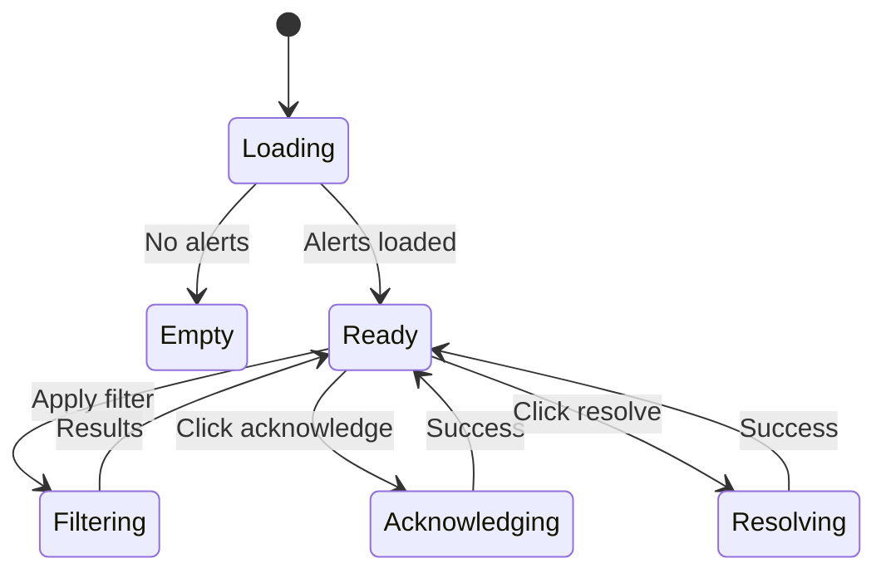
```mermaid
stateDiagram-v2
    [*] --> Loading
    Loading --> Empty: No alerts
    Loading --> Ready: Alerts loaded

    Ready --> Filtering: Apply filter
    Filtering --> Ready: Results

    Ready --> Acknowledging: Click acknowledge
    Acknowledging --> Ready: Success

    Ready --> Resolving: Click resolve
    Resolving --> Ready: Success
```

---

## Settings

**Route**: `/settings`
**File**: `src/pages/Settings.tsx`

### Component Diagram

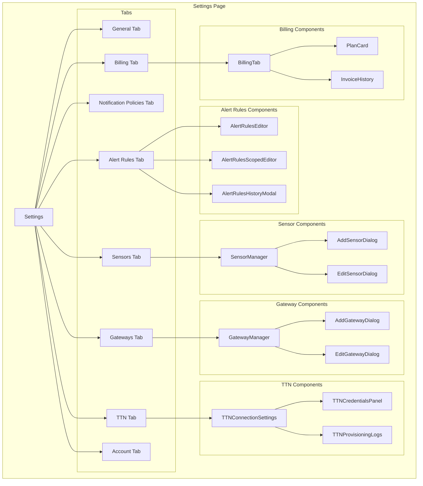
```mermaid
graph TB
    subgraph "Settings Page"
        SP[Settings]

        subgraph "Tabs"
            GT[General Tab]
            ART[Alert Rules Tab]
            NPT[Notification Policies Tab]
            ST[Sensors Tab]
            GWT[Gateways Tab]
            TTNT[TTN Tab]
            BT[Billing Tab]
            AT[Account Tab]
        end

        subgraph "Alert Rules Components"
            ARE[AlertRulesEditor]
            ARSE[AlertRulesScopedEditor]
            ARH[AlertRulesHistoryModal]
        end

        subgraph "Sensor Components"
            SM[SensorManager]
            ASD[AddSensorDialog]
            ESD[EditSensorDialog]
        end

        subgraph "Gateway Components"
            GM[GatewayManager]
            AGD[AddGatewayDialog]
            EGD[EditGatewayDialog]
        end

        subgraph "TTN Components"
            TTNCS[TTNConnectionSettings]
            TTNCP[TTNCredentialsPanel]
            TTNPL[TTNProvisioningLogs]
        end

        subgraph "Billing Components"
            BTB[BillingTab]
            PC[PlanCard]
            IH[InvoiceHistory]
        end
    end

    SP --> GT
    SP --> ART --> ARE
    ART --> ARSE
    ART --> ARH
    SP --> NPT
    SP --> ST --> SM
    SM --> ASD
    SM --> ESD
    SP --> GWT --> GM
    GM --> AGD
    GM --> EGD
    SP --> TTNT --> TTNCS
    TTNCS --> TTNCP
    TTNCS --> TTNPL
    SP --> BT --> BTB
    BTB --> PC
    BTB --> IH
    SP --> AT
```

### State Machine

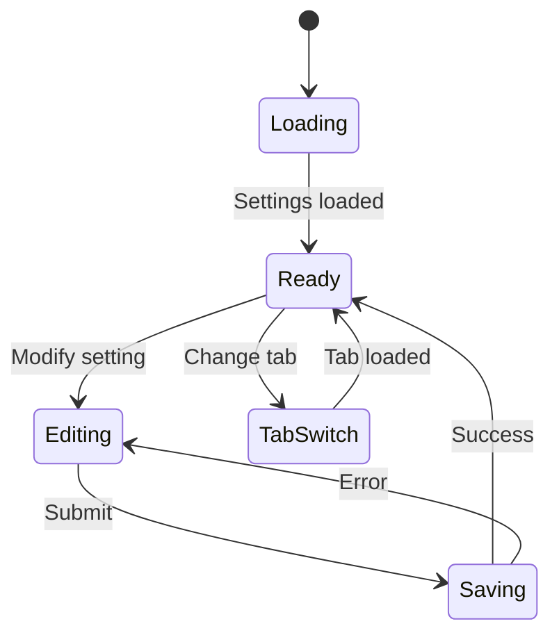
```mermaid
stateDiagram-v2
    [*] --> Loading
    Loading --> Ready: Settings loaded

    Ready --> Editing: Modify setting
    Editing --> Saving: Submit
    Saving --> Ready: Success
    Saving --> Editing: Error

    Ready --> TabSwitch: Change tab
    TabSwitch --> Ready: Tab loaded
```

---

## Manual Log

**Route**: `/manual-log`
**File**: `src/pages/ManualLog.tsx`

### Component Diagram

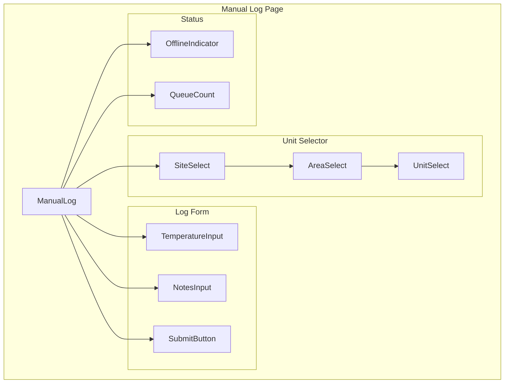
```mermaid
graph TB
    subgraph "Manual Log Page"
        ML[ManualLog]

        subgraph "Unit Selector"
            SS[SiteSelect]
            AS[AreaSelect]
            US[UnitSelect]
        end

        subgraph "Log Form"
            TI[TemperatureInput]
            NI[NotesInput]
            SB[SubmitButton]
        end

        subgraph "Status"
            OI[OfflineIndicator]
            QC[QueueCount]
        end
    end

    ML --> SS
    SS --> AS
    AS --> US
    ML --> TI
    ML --> NI
    ML --> SB
    ML --> OI
    ML --> QC
```

### State Machine

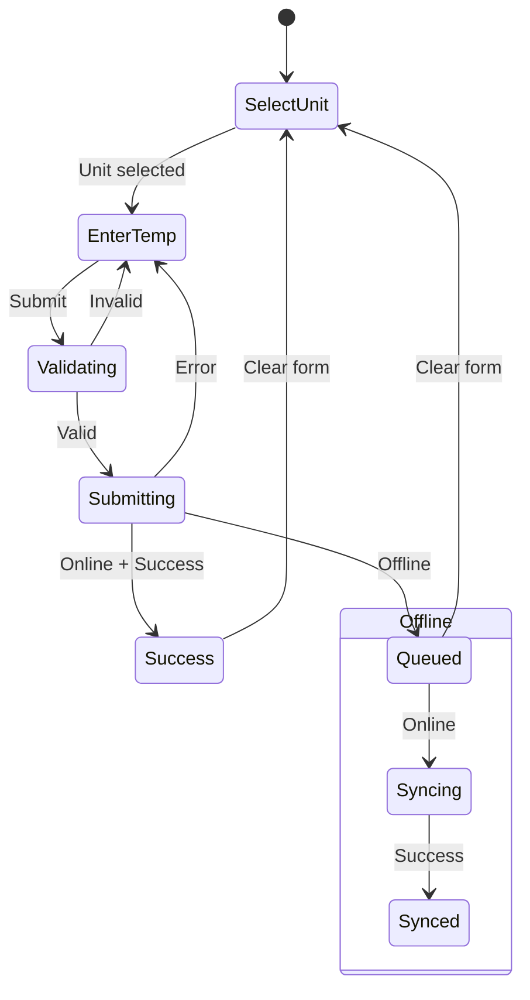
```mermaid
stateDiagram-v2
    [*] --> SelectUnit
    SelectUnit --> EnterTemp: Unit selected

    EnterTemp --> Validating: Submit
    Validating --> Submitting: Valid
    Validating --> EnterTemp: Invalid

    Submitting --> Success: Online + Success
    Submitting --> Queued: Offline
    Submitting --> EnterTemp: Error

    Success --> SelectUnit: Clear form
    Queued --> SelectUnit: Clear form

    state Offline {
        Queued --> Syncing: Online
        Syncing --> Synced: Success
    }
```

---

## Reports

**Route**: `/reports`
**File**: `src/pages/Reports.tsx`

### Component Diagram

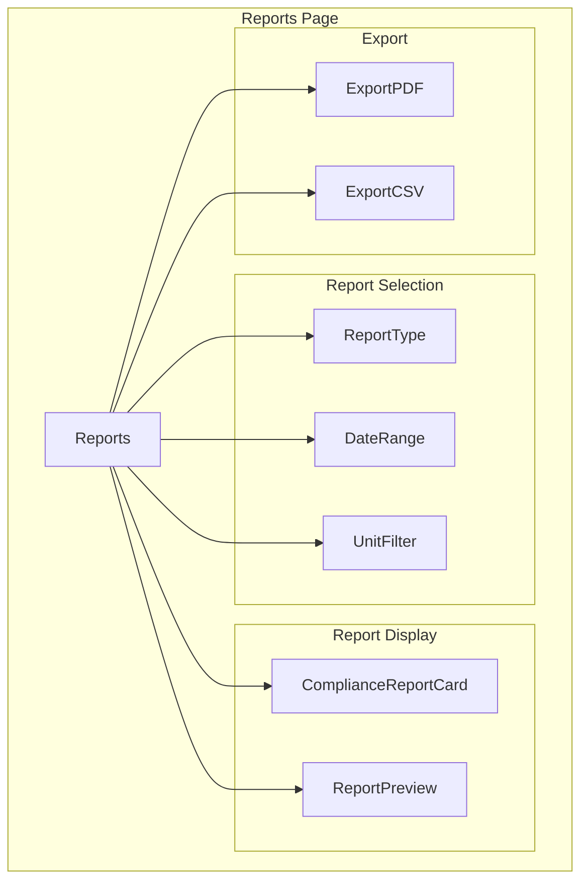
```mermaid
graph TB
    subgraph "Reports Page"
        RP[Reports]

        subgraph "Report Selection"
            RT[ReportType]
            DR[DateRange]
            UF[UnitFilter]
        end

        subgraph "Report Display"
            CRC[ComplianceReportCard]
            RP2[ReportPreview]
        end

        subgraph "Export"
            EP[ExportPDF]
            EC[ExportCSV]
        end
    end

    RP --> RT
    RP --> DR
    RP --> UF
    RP --> CRC
    RP --> RP2
    RP --> EP
    RP --> EC
```

---

## Auth Page

**Route**: `/auth`
**File**: `src/pages/Auth.tsx`

### Component Diagram

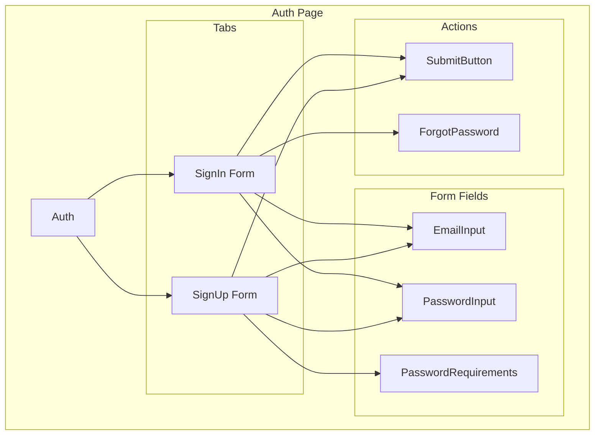
```mermaid
graph TB
    subgraph "Auth Page"
        AP[Auth]

        subgraph "Tabs"
            SI[SignIn Form]
            SU[SignUp Form]
        end

        subgraph "Form Fields"
            EI[EmailInput]
            PI[PasswordInput]
            PR[PasswordRequirements]
        end

        subgraph "Actions"
            SB[SubmitButton]
            FR[ForgotPassword]
        end
    end

    AP --> SI
    AP --> SU
    SI --> EI
    SI --> PI
    SU --> EI
    SU --> PI
    SU --> PR
    SI --> SB
    SU --> SB
    SI --> FR
```

### State Machine

```mermaid
stateDiagram-v2
    [*] --> Idle

    Idle --> Submitting: Submit
    Submitting --> Success: Valid credentials
    Submitting --> Error: Invalid

    Success --> [*]: Redirect
    Error --> Idle: Clear error
```

---

## Site Detail

**Route**: `/sites/:siteId`
**File**: `src/pages/SiteDetail.tsx`

### Component Diagram

```mermaid
graph TB
    subgraph "Site Detail Page"
        SD[SiteDetail]

        subgraph "Header"
            HB[HierarchyBreadcrumb]
            SN[SiteName]
            SA[SiteAddress]
        end

        subgraph "Content"
            AL[AreaList]
            AC[AreaCard]
            UL[UnitList]
        end

        subgraph "Settings"
            SCS[SiteComplianceSettings]
            SGC[SiteGatewaysCard]
        end
    end

    SD --> HB
    SD --> SN
    SD --> SA
    SD --> AL
    AL --> AC
    AC --> UL
    SD --> SCS
    SD --> SGC
```

---

## Area Detail

**Route**: `/sites/:siteId/areas/:areaId`
**File**: `src/pages/AreaDetail.tsx`

### Component Diagram

```mermaid
graph TB
    subgraph "Area Detail Page"
        AD[AreaDetail]

        subgraph "Header"
            HB[HierarchyBreadcrumb]
            AN[AreaName]
        end

        subgraph "Units"
            UG[UnitGrid]
            UC[UnitCard]
            AU[AddUnitButton]
        end
    end

    AD --> HB
    AD --> AN
    AD --> UG
    UG --> UC
    AD --> AU
```

---

## Health Dashboard

**Route**: `/admin/health`
**File**: `src/pages/HealthDashboard.tsx`

### Component Diagram

```mermaid
graph TB
    subgraph "Health Dashboard"
        HD[HealthDashboard]

        subgraph "Summary"
            OHS[OverallHealthSummary]
        end

        subgraph "Checks"
            HCL[HealthCheckList]
            HSC[HealthStatusCard]
            HSB[HealthStatusBadge]
        end
    end

    HD --> OHS
    HD --> HCL
    HCL --> HSC
    HSC --> HSB
```

---

## Onboarding

**Route**: `/onboarding`
**File**: `src/pages/Onboarding.tsx`

### Component Diagram

```mermaid
graph TB
    subgraph "Onboarding Page"
        OB[Onboarding]

        subgraph "Steps"
            S1[Step 1: Organization]
            S2[Step 2: Site]
            S3[Step 3: Area]
            S4[Step 4: Unit]
            S5[Step 5: Sensor]
        end

        subgraph "Progress"
            PI[ProgressIndicator]
        end
    end

    OB --> PI
    OB --> S1
    S1 --> S2
    S2 --> S3
    S3 --> S4
    S4 --> S5
```

### State Machine

```mermaid
stateDiagram-v2
    [*] --> Step1_Org
    Step1_Org --> Step2_Site: Submit
    Step2_Site --> Step3_Area: Submit
    Step3_Area --> Step4_Unit: Submit
    Step4_Unit --> Step5_Sensor: Submit
    Step5_Sensor --> Complete: Skip/Submit
    Complete --> [*]: Redirect to dashboard
```

---

## Related Documentation

- [PAGES.md](../product/PAGES.md) - Full page documentation
- [USER_FLOWS.md](../product/USER_FLOWS.md) - User flow documentation
- [STATE_MACHINES.md](./STATE_MACHINES.md) - State machine details
