# Sequence Diagrams

> Sequence diagrams for major user flows and system processes

---

## Table of Contents

1. [User Registration](#user-registration)
2. [User Sign In](#user-sign-in)
3. [Temperature Reading Flow](#temperature-reading-flow)
4. [Manual Logging Flow](#manual-logging-flow)
5. [Alert Acknowledgment](#alert-acknowledgment)
6. [Excursion Detection](#excursion-detection)
7. [Alert Escalation](#alert-escalation)
8. [TTN Setup Flow](#ttn-setup-flow)
9. [Sensor Provisioning](#sensor-provisioning)
10. [Dashboard Monitoring](#dashboard-monitoring)

---

## User Registration

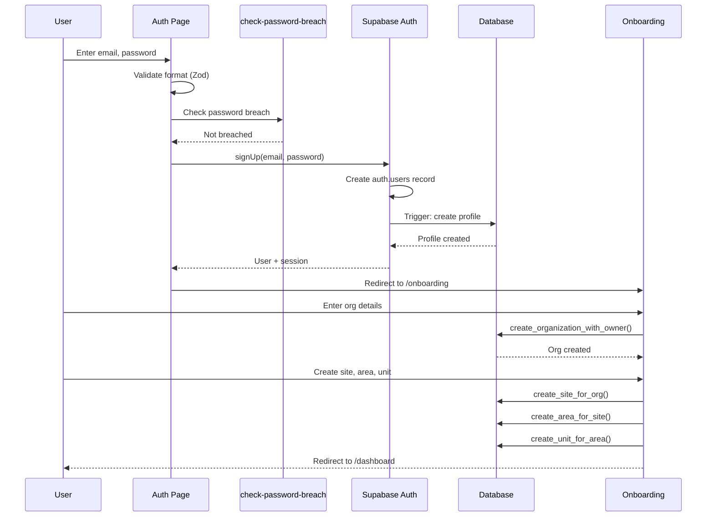
```mermaid
sequenceDiagram
    participant U as User
    participant A as Auth Page
    participant PB as check-password-breach
    participant SA as Supabase Auth
    participant DB as Database
    participant OB as Onboarding

    U->>A: Enter email, password
    A->>A: Validate format (Zod)
    A->>PB: Check password breach
    PB-->>A: Not breached

    A->>SA: signUp(email, password)
    SA->>SA: Create auth.users record
    SA->>DB: Trigger: create profile
    DB-->>SA: Profile created
    SA-->>A: User + session

    A->>OB: Redirect to /onboarding
    U->>OB: Enter org details
    OB->>DB: create_organization_with_owner()
    DB-->>OB: Org created

    U->>OB: Create site, area, unit
    OB->>DB: create_site_for_org()
    OB->>DB: create_area_for_site()
    OB->>DB: create_unit_for_area()

    OB-->>U: Redirect to /dashboard
```

---

## User Sign In

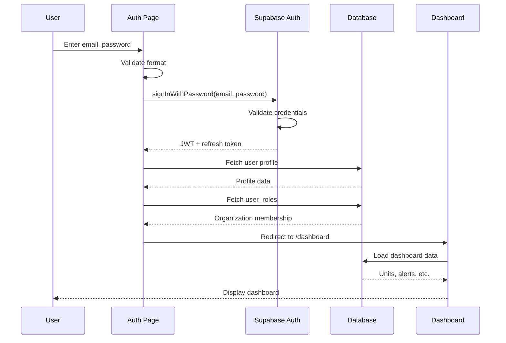
```mermaid
sequenceDiagram
    participant U as User
    participant A as Auth Page
    participant SA as Supabase Auth
    participant DB as Database
    participant D as Dashboard

    U->>A: Enter email, password
    A->>A: Validate format

    A->>SA: signInWithPassword(email, password)
    SA->>SA: Validate credentials
    SA-->>A: JWT + refresh token

    A->>DB: Fetch user profile
    DB-->>A: Profile data

    A->>DB: Fetch user_roles
    DB-->>A: Organization membership

    A->>D: Redirect to /dashboard
    D->>DB: Load dashboard data
    DB-->>D: Units, alerts, etc.
    D-->>U: Display dashboard
```

---

## Temperature Reading Flow

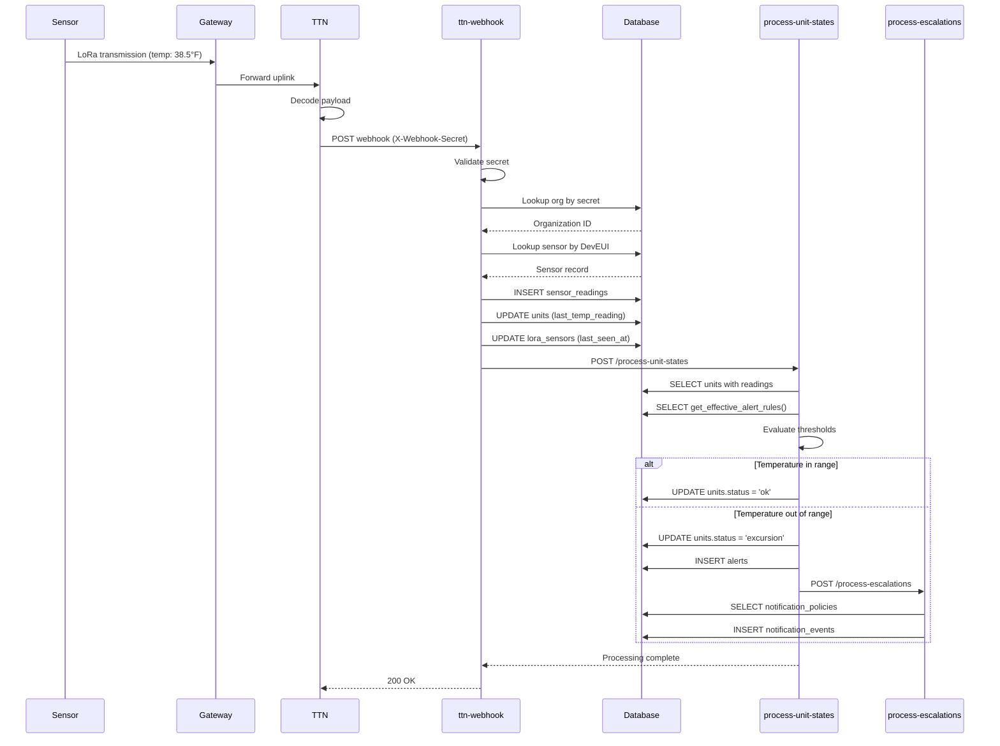
```mermaid
sequenceDiagram
    participant S as Sensor
    participant G as Gateway
    participant T as TTN
    participant W as ttn-webhook
    participant DB as Database
    participant P as process-unit-states
    participant E as process-escalations

    S->>G: LoRa transmission (temp: 38.5°F)
    G->>T: Forward uplink
    T->>T: Decode payload

    T->>W: POST webhook (X-Webhook-Secret)
    W->>W: Validate secret
    W->>DB: Lookup org by secret
    DB-->>W: Organization ID

    W->>DB: Lookup sensor by DevEUI
    DB-->>W: Sensor record

    W->>DB: INSERT sensor_readings
    W->>DB: UPDATE units (last_temp_reading)
    W->>DB: UPDATE lora_sensors (last_seen_at)

    W->>P: POST /process-unit-states
    P->>DB: SELECT units with readings
    P->>DB: SELECT get_effective_alert_rules()

    P->>P: Evaluate thresholds

    alt Temperature in range
        P->>DB: UPDATE units.status = 'ok'
    else Temperature out of range
        P->>DB: UPDATE units.status = 'excursion'
        P->>DB: INSERT alerts
        P->>E: POST /process-escalations
        E->>DB: SELECT notification_policies
        E->>DB: INSERT notification_events
    end

    P-->>W: Processing complete
    W-->>T: 200 OK
```

---

## Manual Logging Flow

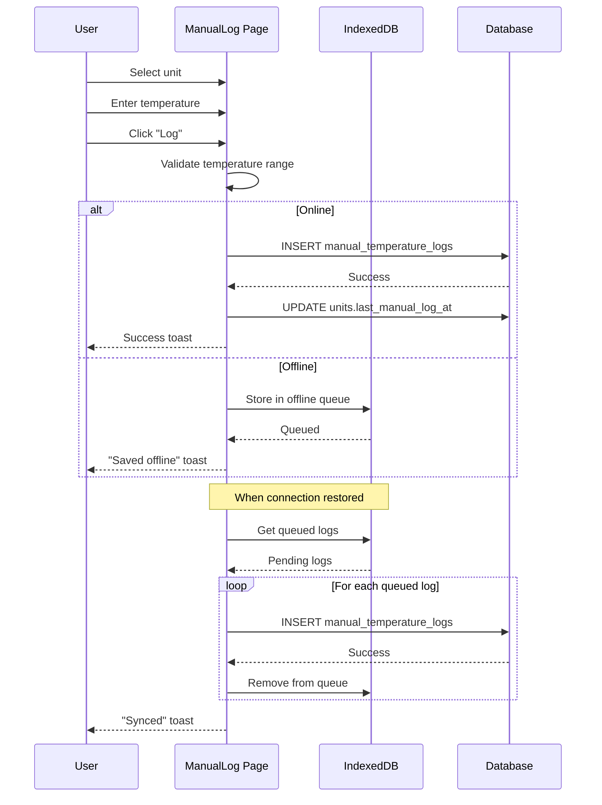
```mermaid
sequenceDiagram
    participant U as User
    participant ML as ManualLog Page
    participant IDB as IndexedDB
    participant DB as Database

    U->>ML: Select unit
    U->>ML: Enter temperature
    U->>ML: Click "Log"

    ML->>ML: Validate temperature range

    alt Online
        ML->>DB: INSERT manual_temperature_logs
        DB-->>ML: Success
        ML->>DB: UPDATE units.last_manual_log_at
        ML-->>U: Success toast
    else Offline
        ML->>IDB: Store in offline queue
        IDB-->>ML: Queued
        ML-->>U: "Saved offline" toast
    end

    Note over ML,IDB: When connection restored

    ML->>IDB: Get queued logs
    IDB-->>ML: Pending logs

    loop For each queued log
        ML->>DB: INSERT manual_temperature_logs
        DB-->>ML: Success
        ML->>IDB: Remove from queue
    end

    ML-->>U: "Synced" toast
```

---

## Alert Acknowledgment

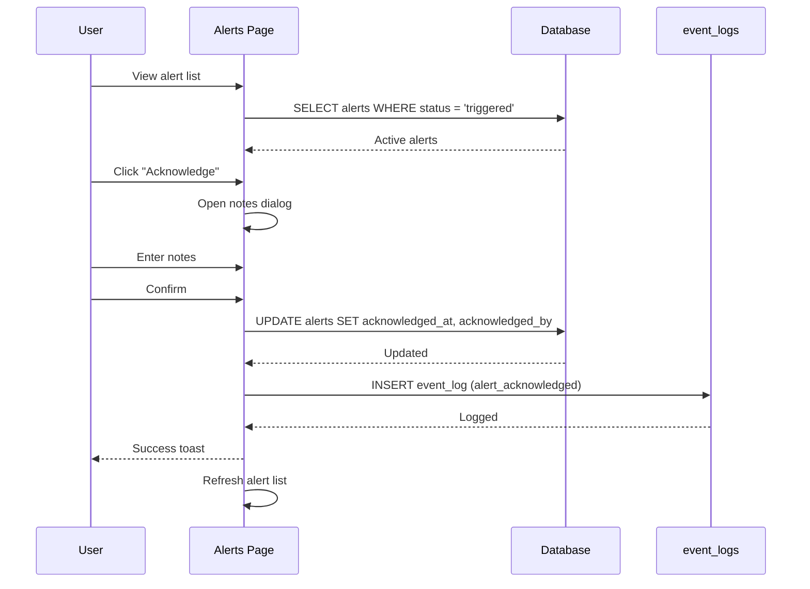
```mermaid
sequenceDiagram
    participant U as User
    participant A as Alerts Page
    participant DB as Database
    participant EL as event_logs

    U->>A: View alert list
    A->>DB: SELECT alerts WHERE status = 'triggered'
    DB-->>A: Active alerts

    U->>A: Click "Acknowledge"
    A->>A: Open notes dialog
    U->>A: Enter notes
    U->>A: Confirm

    A->>DB: UPDATE alerts SET acknowledged_at, acknowledged_by
    DB-->>A: Updated

    A->>EL: INSERT event_log (alert_acknowledged)
    EL-->>A: Logged

    A-->>U: Success toast
    A->>A: Refresh alert list
```

---

## Excursion Detection

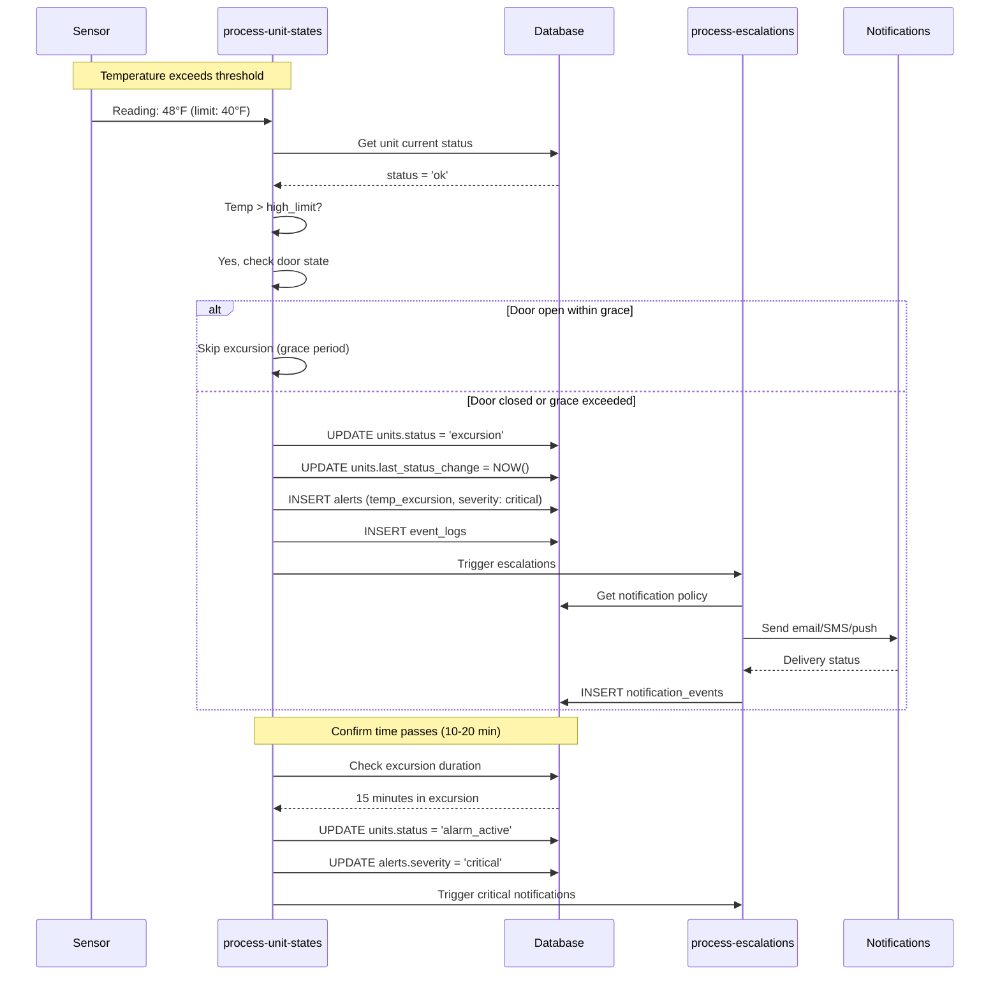
```mermaid
sequenceDiagram
    participant S as Sensor
    participant P as process-unit-states
    participant DB as Database
    participant E as process-escalations
    participant N as Notifications

    Note over S,P: Temperature exceeds threshold

    S->>P: Reading: 48°F (limit: 40°F)
    P->>DB: Get unit current status
    DB-->>P: status = 'ok'

    P->>P: Temp > high_limit?
    P->>P: Yes, check door state

    alt Door open within grace
        P->>P: Skip excursion (grace period)
    else Door closed or grace exceeded
        P->>DB: UPDATE units.status = 'excursion'
        P->>DB: UPDATE units.last_status_change = NOW()
        P->>DB: INSERT alerts (temp_excursion, severity: critical)
        P->>DB: INSERT event_logs

        P->>E: Trigger escalations
        E->>DB: Get notification policy
        E->>N: Send email/SMS/push
        N-->>E: Delivery status
        E->>DB: INSERT notification_events
    end

    Note over P,DB: Confirm time passes (10-20 min)

    P->>DB: Check excursion duration
    DB-->>P: 15 minutes in excursion

    P->>DB: UPDATE units.status = 'alarm_active'
    P->>DB: UPDATE alerts.severity = 'critical'
    P->>E: Trigger critical notifications
```

---

## Alert Escalation

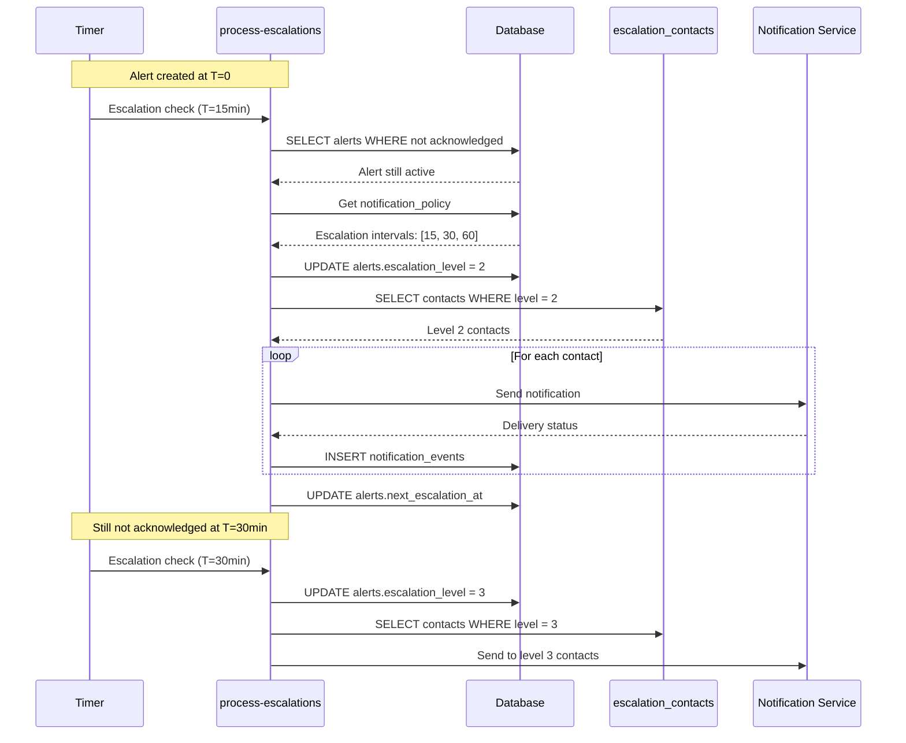
```mermaid
sequenceDiagram
    participant T as Timer
    participant E as process-escalations
    participant DB as Database
    participant EC as escalation_contacts
    participant N as Notification Service

    Note over T,E: Alert created at T=0

    T->>E: Escalation check (T=15min)
    E->>DB: SELECT alerts WHERE not acknowledged
    DB-->>E: Alert still active

    E->>DB: Get notification_policy
    DB-->>E: Escalation intervals: [15, 30, 60]

    E->>DB: UPDATE alerts.escalation_level = 2
    E->>EC: SELECT contacts WHERE level = 2
    EC-->>E: Level 2 contacts

    loop For each contact
        E->>N: Send notification
        N-->>E: Delivery status
        E->>DB: INSERT notification_events
    end

    E->>DB: UPDATE alerts.next_escalation_at

    Note over T,E: Still not acknowledged at T=30min

    T->>E: Escalation check (T=30min)
    E->>DB: UPDATE alerts.escalation_level = 3
    E->>EC: SELECT contacts WHERE level = 3
    E->>N: Send to level 3 contacts
```

---

## TTN Setup Flow

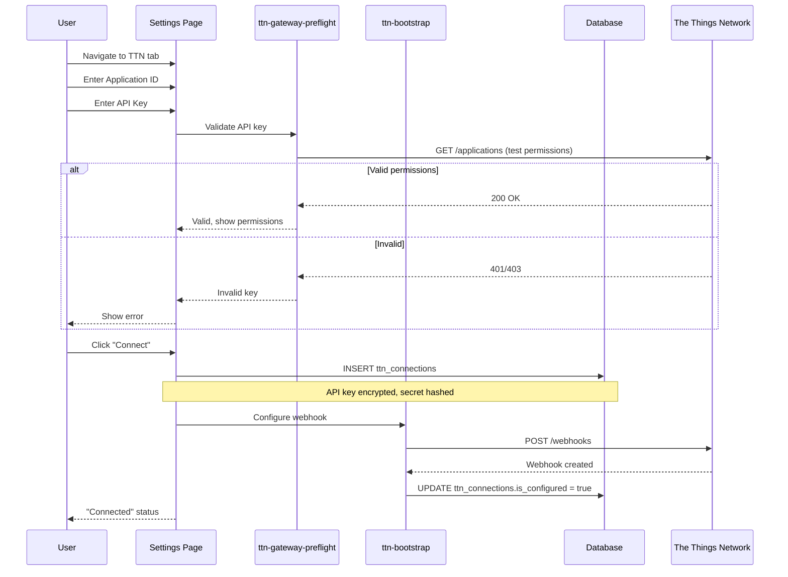
```mermaid
sequenceDiagram
    participant U as User
    participant S as Settings Page
    participant V as ttn-gateway-preflight
    participant B as ttn-bootstrap
    participant DB as Database
    participant TTN as The Things Network

    U->>S: Navigate to TTN tab
    U->>S: Enter Application ID
    U->>S: Enter API Key

    S->>V: Validate API key
    V->>TTN: GET /applications (test permissions)

    alt Valid permissions
        TTN-->>V: 200 OK
        V-->>S: Valid, show permissions
    else Invalid
        TTN-->>V: 401/403
        V-->>S: Invalid key
        S-->>U: Show error
    end

    U->>S: Click "Connect"

    S->>DB: INSERT ttn_connections
    Note over S,DB: API key encrypted, secret hashed

    S->>B: Configure webhook
    B->>TTN: POST /webhooks
    TTN-->>B: Webhook created
    B->>DB: UPDATE ttn_connections.is_configured = true

    S-->>U: "Connected" status
```

---

## Sensor Provisioning

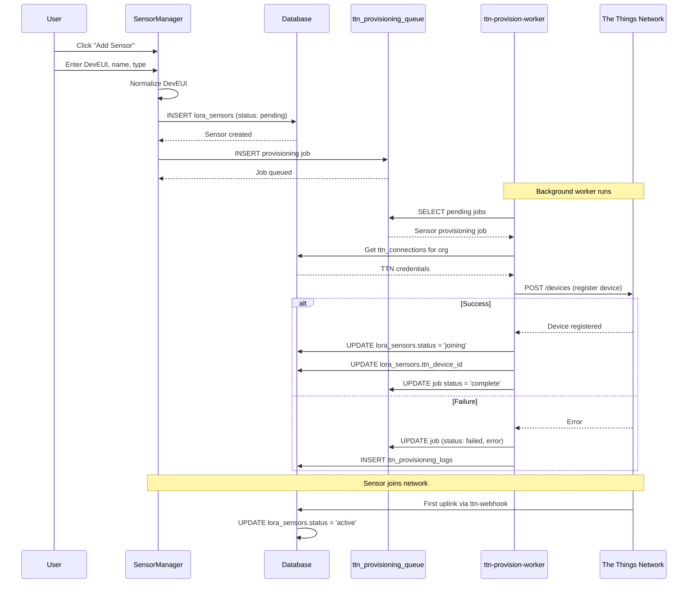
```mermaid
sequenceDiagram
    participant U as User
    participant S as SensorManager
    participant DB as Database
    participant Q as ttn_provisioning_queue
    participant W as ttn-provision-worker
    participant TTN as The Things Network

    U->>S: Click "Add Sensor"
    U->>S: Enter DevEUI, name, type
    S->>S: Normalize DevEUI

    S->>DB: INSERT lora_sensors (status: pending)
    DB-->>S: Sensor created

    S->>Q: INSERT provisioning job
    Q-->>S: Job queued

    Note over W,TTN: Background worker runs

    W->>Q: SELECT pending jobs
    Q-->>W: Sensor provisioning job

    W->>DB: Get ttn_connections for org
    DB-->>W: TTN credentials

    W->>TTN: POST /devices (register device)

    alt Success
        TTN-->>W: Device registered
        W->>DB: UPDATE lora_sensors.status = 'joining'
        W->>DB: UPDATE lora_sensors.ttn_device_id
        W->>Q: UPDATE job status = 'complete'
    else Failure
        TTN-->>W: Error
        W->>Q: UPDATE job (status: failed, error)
        W->>DB: INSERT ttn_provisioning_logs
    end

    Note over S,TTN: Sensor joins network

    TTN->>DB: First uplink via ttn-webhook
    DB->>DB: UPDATE lora_sensors.status = 'active'
```

---

## Dashboard Monitoring

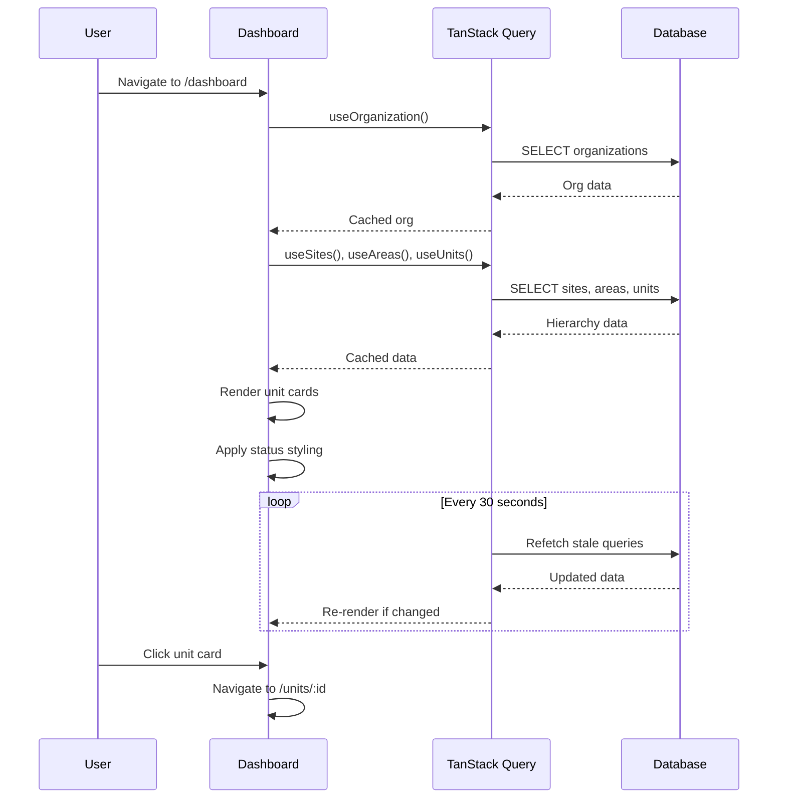
```mermaid
sequenceDiagram
    participant U as User
    participant D as Dashboard
    participant Q as TanStack Query
    participant DB as Database

    U->>D: Navigate to /dashboard

    D->>Q: useOrganization()
    Q->>DB: SELECT organizations
    DB-->>Q: Org data
    Q-->>D: Cached org

    D->>Q: useSites(), useAreas(), useUnits()
    Q->>DB: SELECT sites, areas, units
    DB-->>Q: Hierarchy data
    Q-->>D: Cached data

    D->>D: Render unit cards
    D->>D: Apply status styling

    loop Every 30 seconds
        Q->>DB: Refetch stale queries
        DB-->>Q: Updated data
        Q-->>D: Re-render if changed
    end

    U->>D: Click unit card
    D->>D: Navigate to /units/:id
```

---

## Add Unit

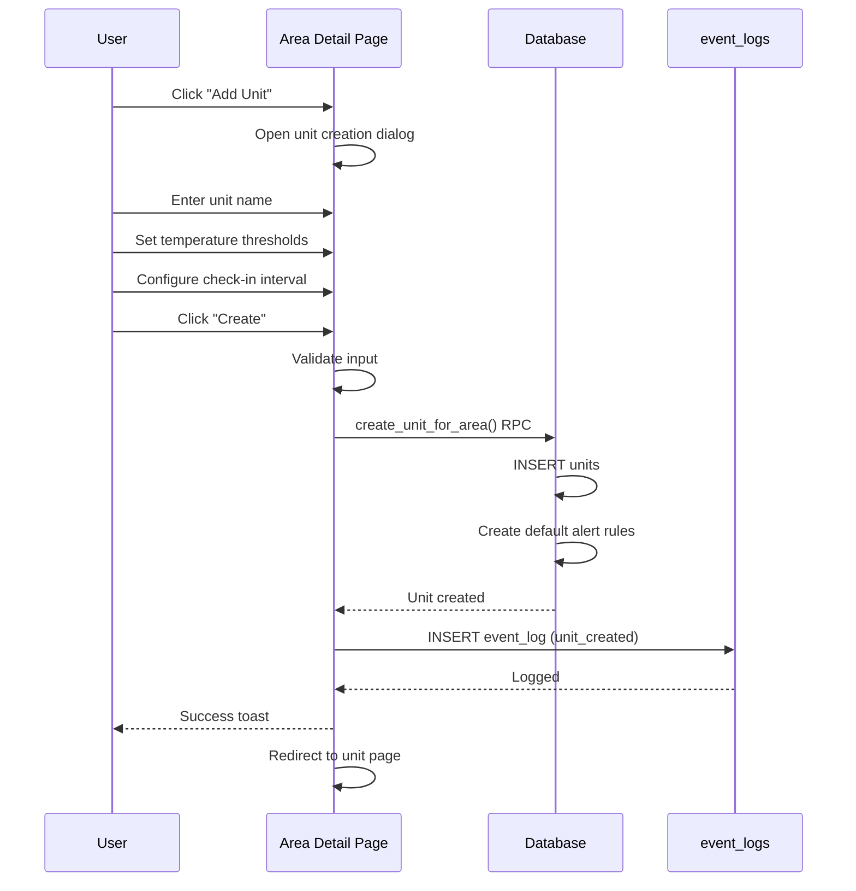
```mermaid
sequenceDiagram
    participant U as User
    participant AD as Area Detail Page
    participant DB as Database
    participant EL as event_logs

    U->>AD: Click "Add Unit"
    AD->>AD: Open unit creation dialog

    U->>AD: Enter unit name
    U->>AD: Set temperature thresholds
    U->>AD: Configure check-in interval
    U->>AD: Click "Create"

    AD->>AD: Validate input
    AD->>DB: create_unit_for_area() RPC
    DB->>DB: INSERT units
    DB->>DB: Create default alert rules
    DB-->>AD: Unit created

    AD->>EL: INSERT event_log (unit_created)
    EL-->>AD: Logged

    AD-->>U: Success toast
    AD->>AD: Redirect to unit page
```

---

## Configure Thresholds

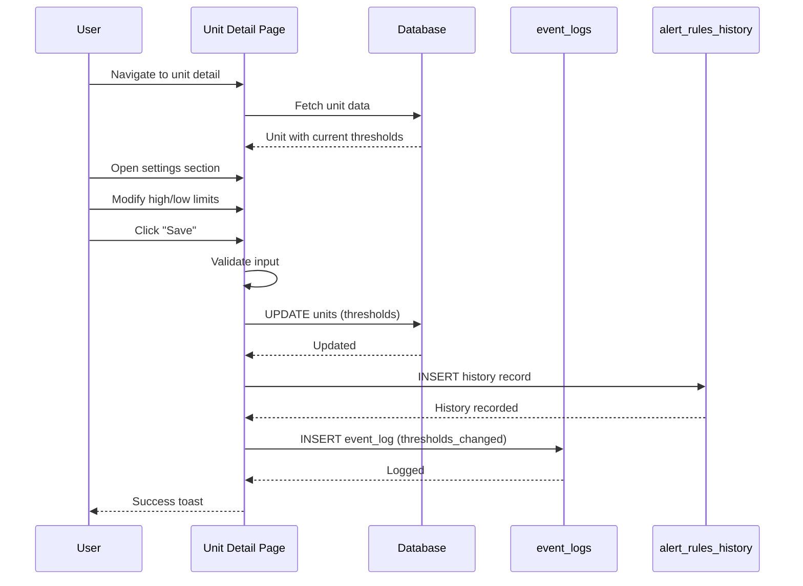
```mermaid
sequenceDiagram
    participant U as User
    participant UD as Unit Detail Page
    participant DB as Database
    participant EL as event_logs
    participant ARH as alert_rules_history

    U->>UD: Navigate to unit detail
    UD->>DB: Fetch unit data
    DB-->>UD: Unit with current thresholds

    U->>UD: Open settings section
    U->>UD: Modify high/low limits
    U->>UD: Click "Save"

    UD->>UD: Validate input
    UD->>DB: UPDATE units (thresholds)
    DB-->>UD: Updated

    UD->>ARH: INSERT history record
    ARH-->>UD: History recorded

    UD->>EL: INSERT event_log (thresholds_changed)
    EL-->>UD: Logged

    UD-->>U: Success toast
```

---

## Configure Notifications

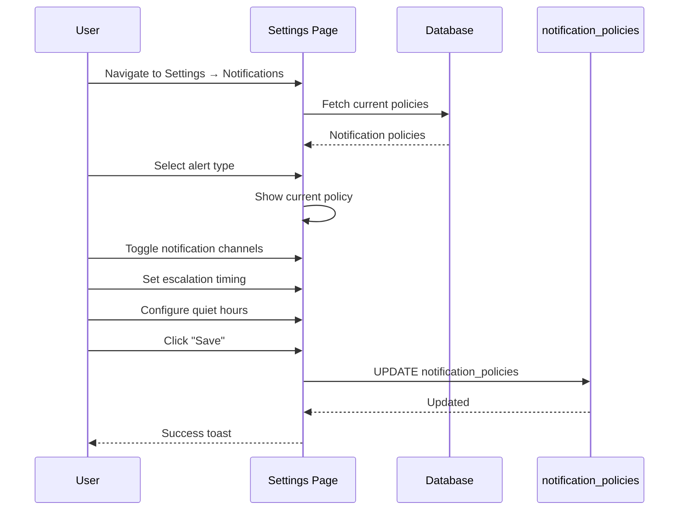
```mermaid
sequenceDiagram
    participant U as User
    participant SP as Settings Page
    participant DB as Database
    participant NP as notification_policies

    U->>SP: Navigate to Settings → Notifications
    SP->>DB: Fetch current policies
    DB-->>SP: Notification policies

    U->>SP: Select alert type
    SP->>SP: Show current policy

    U->>SP: Toggle notification channels
    U->>SP: Set escalation timing
    U->>SP: Configure quiet hours
    U->>SP: Click "Save"

    SP->>NP: UPDATE notification_policies
    NP-->>SP: Updated

    SP-->>U: Success toast
```

---

## Generate Report

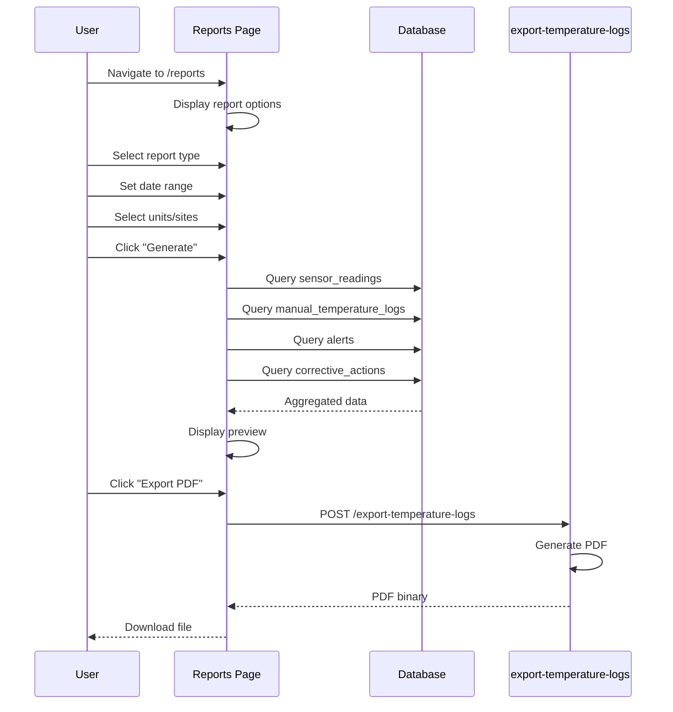
```mermaid
sequenceDiagram
    participant U as User
    participant RP as Reports Page
    participant DB as Database
    participant EF as export-temperature-logs

    U->>RP: Navigate to /reports
    RP->>RP: Display report options

    U->>RP: Select report type
    U->>RP: Set date range
    U->>RP: Select units/sites
    U->>RP: Click "Generate"

    RP->>DB: Query sensor_readings
    RP->>DB: Query manual_temperature_logs
    RP->>DB: Query alerts
    RP->>DB: Query corrective_actions
    DB-->>RP: Aggregated data

    RP->>RP: Display preview

    U->>RP: Click "Export PDF"
    RP->>EF: POST /export-temperature-logs
    EF->>EF: Generate PDF
    EF-->>RP: PDF binary

    RP-->>U: Download file
```

---

## Corrective Action

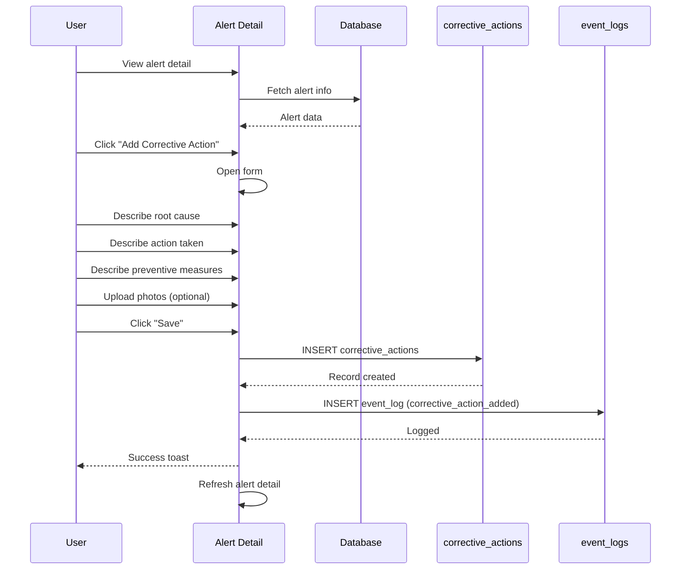
```mermaid
sequenceDiagram
    participant U as User
    participant AL as Alert Detail
    participant DB as Database
    participant CA as corrective_actions
    participant EL as event_logs

    U->>AL: View alert detail
    AL->>DB: Fetch alert info
    DB-->>AL: Alert data

    U->>AL: Click "Add Corrective Action"
    AL->>AL: Open form

    U->>AL: Describe root cause
    U->>AL: Describe action taken
    U->>AL: Describe preventive measures
    U->>AL: Upload photos (optional)
    U->>AL: Click "Save"

    AL->>CA: INSERT corrective_actions
    CA-->>AL: Record created

    AL->>EL: INSERT event_log (corrective_action_added)
    EL-->>AL: Logged

    AL-->>U: Success toast
    AL->>AL: Refresh alert detail
```

---

## Related Documentation

- [USER_FLOWS.md](../product/USER_FLOWS.md) - Detailed flow descriptions
- [PAGE_DIAGRAMS.md](./PAGE_DIAGRAMS.md) - Page component diagrams
- [STATE_MACHINES.md](./STATE_MACHINES.md) - State machine diagrams
