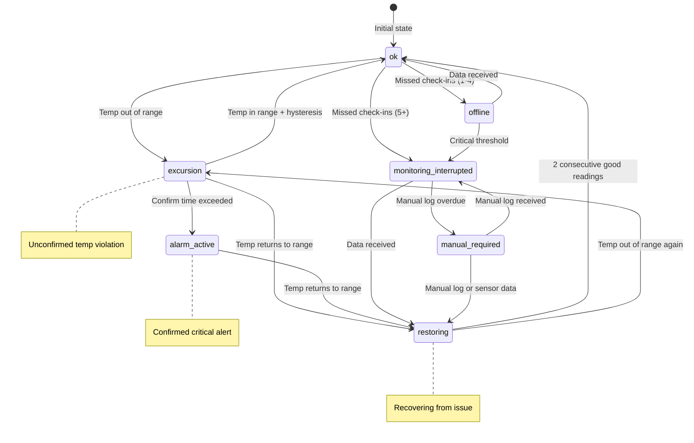
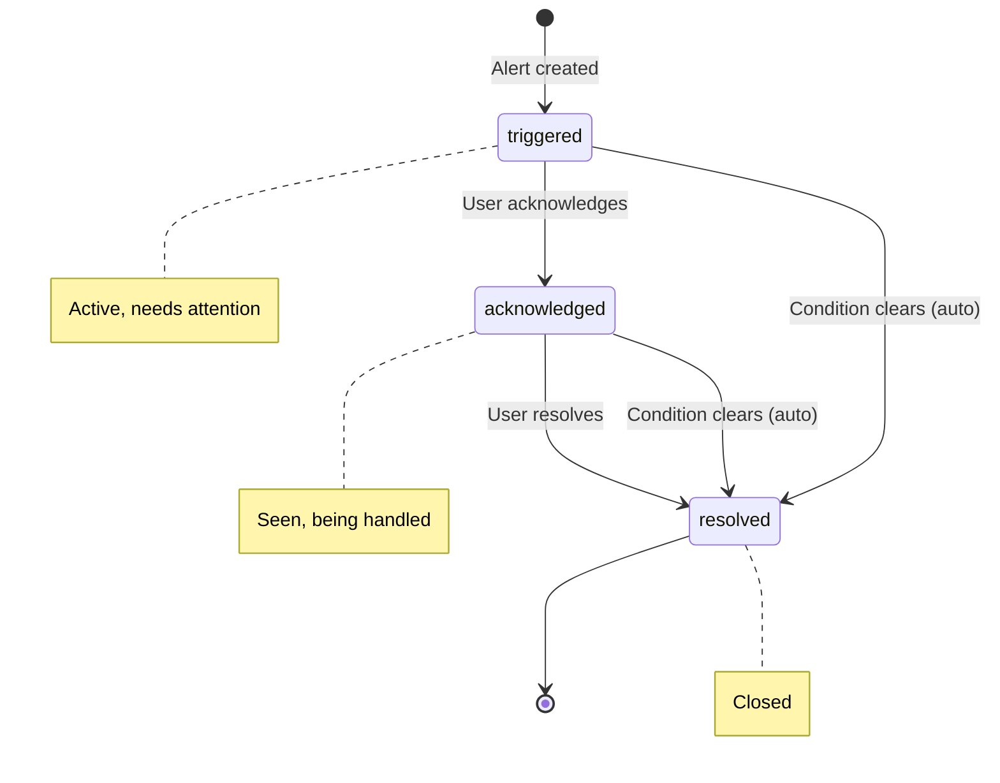
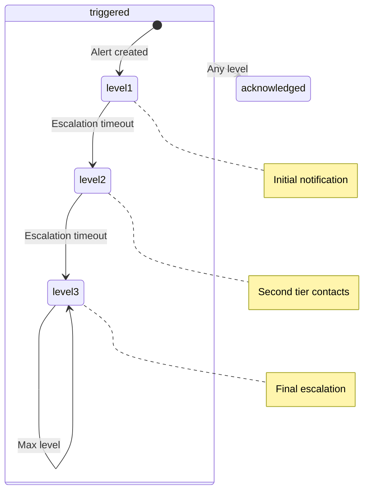
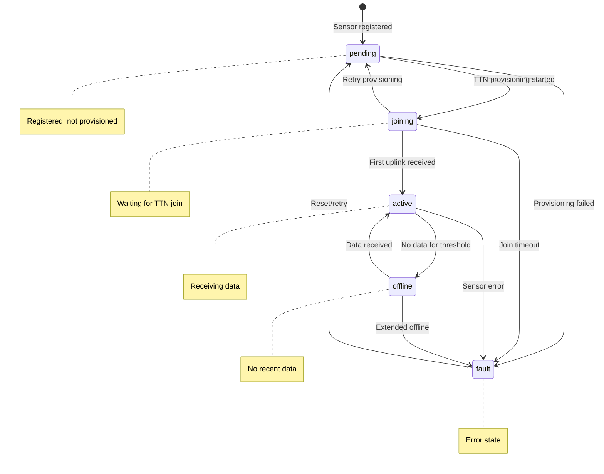
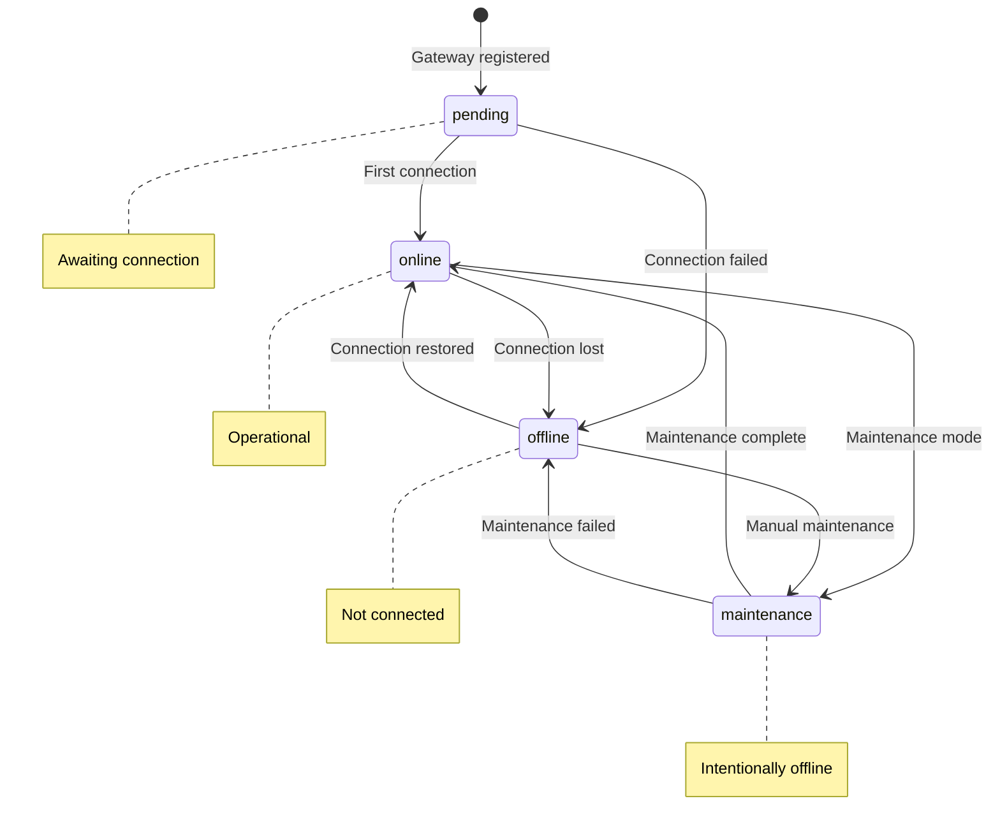
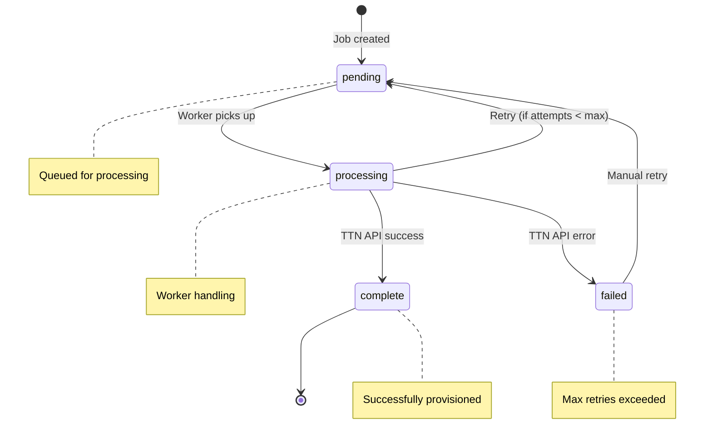
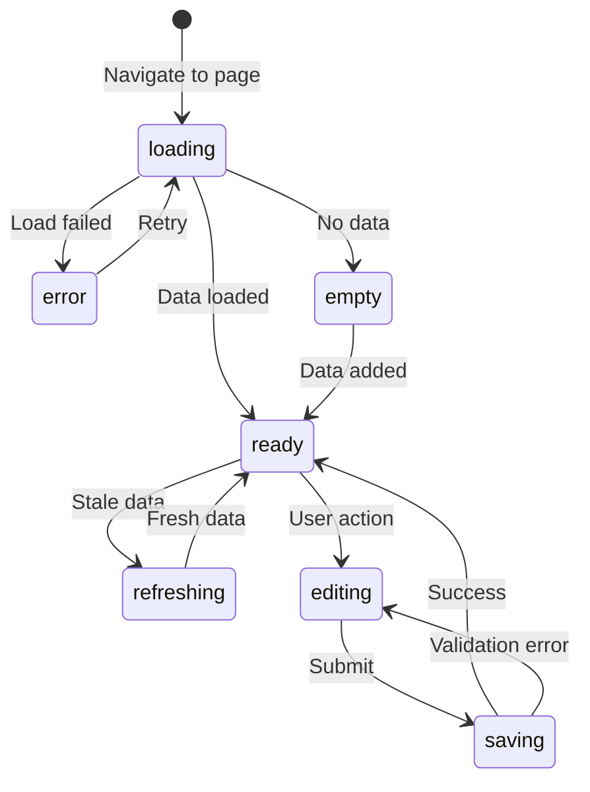
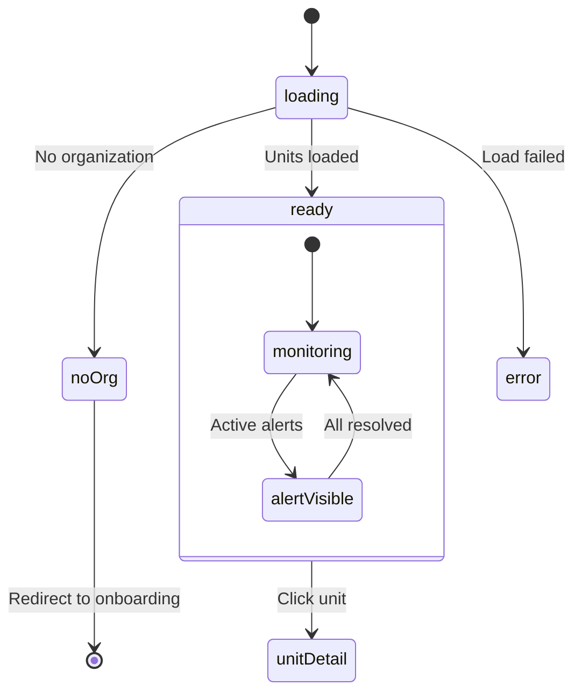
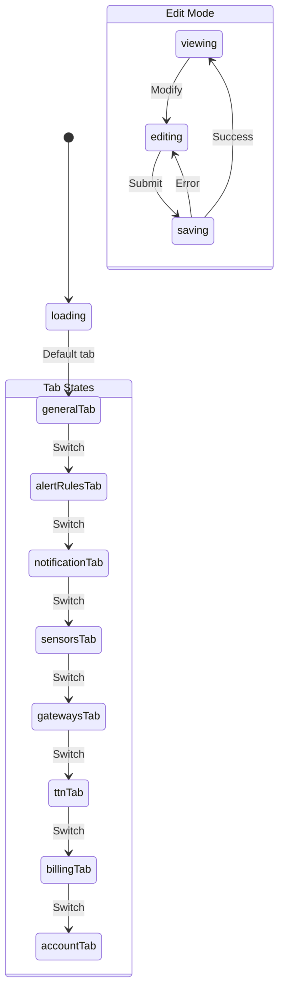
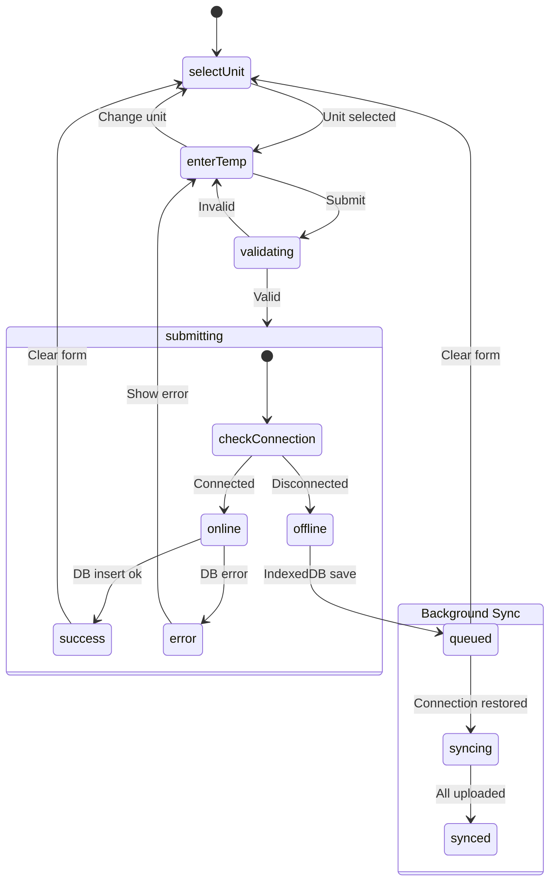

# State Machines

> State machine diagrams for units, alerts, sensors, and application states

---

## Table of Contents

1. [Unit Status](#unit-status)
2. [Alert Status](#alert-status)
3. [Sensor Status](#sensor-status)
4. [Gateway Status](#gateway-status)
5. [Provisioning Job Status](#provisioning-job-status)
6. [Page States](#page-states)

---

## Unit Status

**Source**: `src/lib/statusConfig.ts`, `supabase/functions/process-unit-states/index.ts`

### State Diagram

### State Descriptions

| Status | Description | Priority | Color |
|--------|-------------|----------|-------|
| `ok` | Normal operation | 5 | Green |
| `excursion` | Temp out of range (unconfirmed) | 2 | Orange-red |
| `alarm_active` | Confirmed temp alarm | 1 (highest) | Red |
| `restoring` | Recovering from issue | 4 | Blue |
| `offline` | Warning-level offline (1-4 missed) | 6 | Gray |
| `monitoring_interrupted` | Critical offline (5+ missed) | 3 | Gray |
| `manual_required` | Manual logging needed | 4 | Orange |

### Transitions

| From | To | Trigger |
|------|----|---------|
| `ok` → `excursion` | Temperature exceeds threshold |
| `excursion` → `alarm_active` | Confirm time (10-20 min) passed |
| `alarm_active` → `restoring` | Temperature returns to safe range |
| `restoring` → `ok` | 2 consecutive in-range readings |
| `ok` → `offline` | 1-4 missed check-ins |
| `offline` → `monitoring_interrupted` | 5+ missed check-ins |
| `monitoring_interrupted` → `manual_required` | 4+ hours since last reading |
| `*` → `restoring` | Sensor data received |

---

## Alert Status

**Source**: `src/integrations/supabase/types.ts` (alert_status enum)

### State Diagram

### State Descriptions

| Status | Description | Actions Available |
|--------|-------------|-------------------|
| `triggered` | Active alert, not yet acknowledged | Acknowledge, Resolve |
| `acknowledged` | User has seen and is handling | Resolve |
| `resolved` | Alert closed (auto or manual) | None (archived) |

### Escalation Behavior

---

## Sensor Status

**Source**: `src/integrations/supabase/types.ts` (lora_sensor_status enum)

### State Diagram

### State Descriptions

| Status | Description | Next Actions |
|--------|-------------|--------------|
| `pending` | Registered in FreshTrack, not in TTN | Provision |
| `joining` | Provisioned in TTN, waiting for join | Wait for uplink |
| `active` | Receiving data normally | Monitor |
| `offline` | No recent data | Investigate |
| `fault` | Error condition | Troubleshoot |

---

## Gateway Status

**Source**: `src/integrations/supabase/types.ts` (gateway_status enum)

### State Diagram

---

## Provisioning Job Status

**Source**: `ttn_provisioning_queue` table

### State Diagram

---

## Page States

### Generic Page State Machine

### Dashboard Specific

### Settings Specific

### Manual Log Specific

---

## Related Documentation

- [PAGE_DIAGRAMS.md](./PAGE_DIAGRAMS.md) - Page component diagrams
- [SEQUENCES.md](./SEQUENCES.md) - Sequence diagrams
- [PAGES.md](../product/PAGES.md) - Page documentation
- [API.md](../engineering/API.md) - Alert processing details
