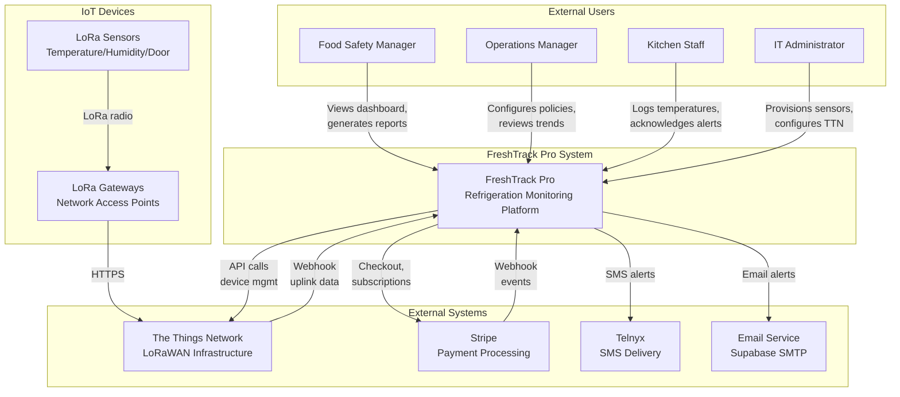
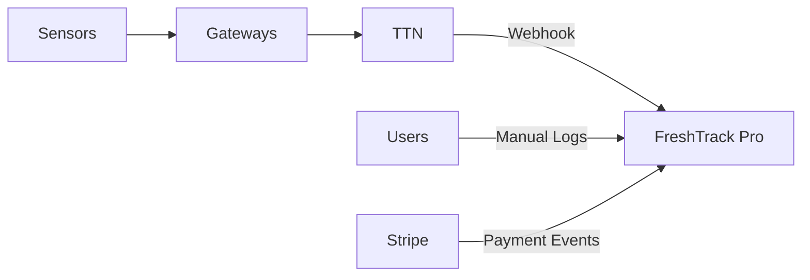
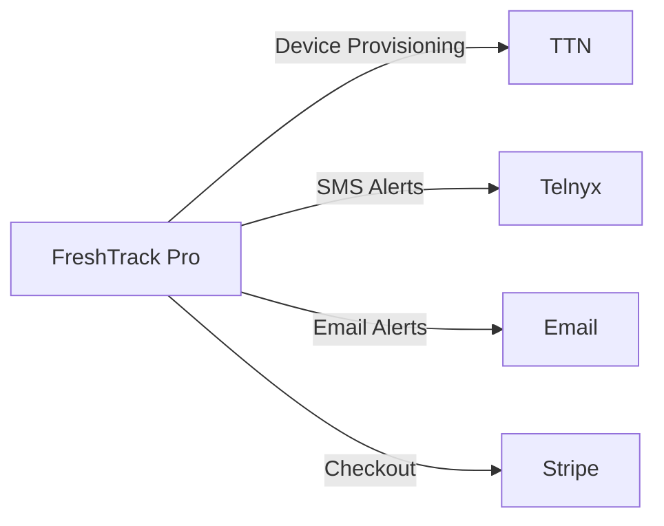
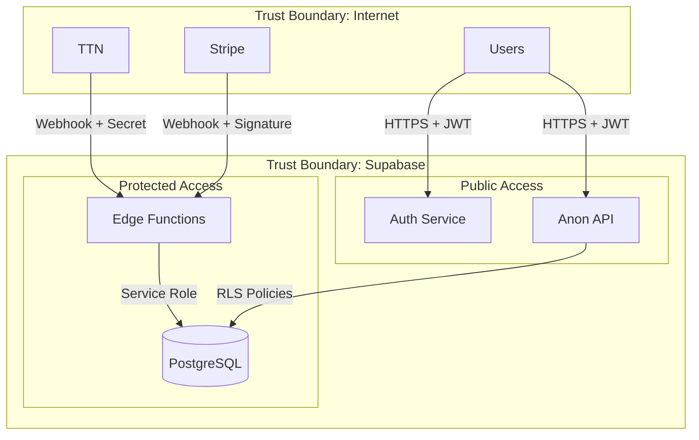

# System Context Diagram

> High-level view of FreshTrack Pro and its external actors

---

## C4 System Context

---

## Actor Descriptions

| Actor | Description | Key Interactions |
|-------|-------------|------------------|
| Food Safety Manager | Strategic oversight of food safety | Dashboard, reports, policy configuration |
| Operations Manager | Facilities and equipment management | Trends, escalations, equipment health |
| Kitchen Staff | Day-to-day operations | Manual logging, alert acknowledgment |
| IT Administrator | Technical setup and maintenance | Sensor provisioning, TTN configuration |

---

## External System Descriptions

| System | Purpose | Integration Type |
|--------|---------|------------------|
| The Things Network | LoRaWAN sensor network | Bidirectional API + Webhook |
| Stripe | Subscription billing | API + Webhook |
| Telnyx | SMS alert delivery | Outbound API |
| Email (Supabase) | Email notifications | SMTP |

---

## Data Flow Summary

### Inbound Data

### Outbound Data

---

## Security Boundaries

---

## Related Diagrams

- [CONTAINER_DIAGRAM.md](./CONTAINER_DIAGRAM.md) - Internal container architecture
- [ARCHITECTURE.md](../architecture/ARCHITECTURE.md) - Detailed architecture documentation
