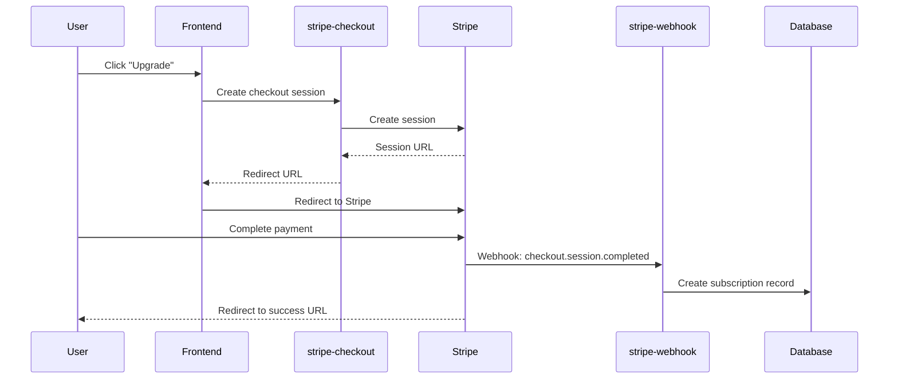

# FreshTrack Pro Integrations

> Third-party service integration documentation

---

## Table of Contents

1. [The Things Network (TTN)](#the-things-network-ttn)
2. [Stripe](#stripe)
3. [Telnyx](#telnyx)
4. [Supabase Auth](#supabase-auth)
5. [Environment Variables](#environment-variables)

---

## The Things Network (TTN)

### Overview

The Things Network provides LoRaWAN infrastructure for sensor connectivity. FreshTrack Pro integrates with TTN for:
- Device registration and provisioning
- Webhook-based data ingestion
- Gateway management

### Architecture

```
┌─────────────┐     LoRa      ┌─────────────┐     HTTPS     ┌─────────────┐
│   Sensor    │ ─────────────▶│   Gateway   │ ─────────────▶│     TTN     │
└─────────────┘               └─────────────┘               └─────────────┘
                                                                   │
                                                              Webhook
                                                                   │
                                                                   ▼
                                                            ┌─────────────┐
                                                            │ ttn-webhook │
                                                            └─────────────┘
```

### Per-Organization Model

Each organization has its own:
- TTN Application
- API Key
- Webhook Secret

Stored in `ttn_connections` table with:
- Encrypted API key
- Hashed webhook secret

### Setup Process

#### 1. Prerequisites

- TTN account at [console.thethingsnetwork.org](https://console.thethingsnetwork.org/)
- TTN Application created
- API Key with required permissions

#### 2. Required API Key Permissions

The TTN API key must have:

| Permission | Purpose |
|------------|---------|
| `applications:read` | Read application info |
| `applications:write` | Update application |
| `devices:read` | List devices |
| `devices:write` | Create/update devices |
| `gateways:read` | List gateways |
| `gateways:write` | Create/update gateways (if managing gateways) |

#### 3. Configuration Steps

1. **In FreshTrack Pro Settings → TTN Tab**:
   - Enter TTN Application ID
   - Enter TTN API Key
   - Click "Validate & Connect"

2. **System automatically**:
   - Validates API key permissions (`ttn-gateway-preflight`)
   - Configures webhook in TTN (`ttn-bootstrap`)
   - Stores encrypted credentials

3. **Verify webhook**:
   - TTN Application → Webhooks → Should show `freshtrack-webhook`

### Webhook Configuration

**Endpoint**: `https://<project>.supabase.co/functions/v1/ttn-webhook`

**Headers**:
| Header | Value |
|--------|-------|
| `X-Webhook-Secret` | Per-org secret from `ttn_connections.webhook_secret` |
| `Content-Type` | `application/json` |

**Enabled Messages**:
- Uplink message
- Join accept (optional)

### Device Provisioning

#### Add Sensor Flow

1. User enters DevEUI, JoinEUI, AppKey
2. System queues job in `ttn_provisioning_queue`
3. `ttn-provision-device` registers in TTN
4. Sensor status changes: `pending` → `joining` → `active`

#### DevEUI Formats Supported

The system normalizes DevEUI to lowercase hex without separators:

| Input Format | Normalized |
|--------------|------------|
| `0004A30B001C1234` | `0004a30b001c1234` |
| `00:04:A3:0B:00:1C:12:34` | `0004a30b001c1234` |
| `00-04-A3-0B-00-1C-12-34` | `0004a30b001c1234` |
| `00 04 A3 0B 00 1C 12 34` | `0004a30b001c1234` |

### TTN Cluster

Default cluster: `eu1` (Europe)

Configure via `ttn_connections.cluster`:
- `eu1` - Europe (default)
- `nam1` - North America
- `au1` - Australia

### Troubleshooting

| Issue | Cause | Solution |
|-------|-------|----------|
| Webhook not receiving data | Secret mismatch | Regenerate secret, update TTN |
| Device stuck in "joining" | Wrong AppKey | Verify AppKey matches TTN |
| 401 from TTN API | Invalid API key | Generate new key with correct permissions |
| Sensor not in dashboard | DevEUI mismatch | Check DevEUI format/normalization |

### Related Files

- `supabase/functions/ttn-webhook/index.ts`
- `supabase/functions/ttn-bootstrap/index.ts`
- `supabase/functions/ttn-provision-device/index.ts`
- `supabase/functions/_shared/ttnConfig.ts`
- `supabase/functions/_shared/ttnPermissions.ts`
- `src/components/settings/TTNConnectionSettings.tsx`
- `src/types/ttn.ts`

---

## Stripe

### Overview

Stripe handles subscription billing with:
- Checkout sessions for new subscriptions
- Customer portal for management
- Webhook for event processing

### Subscription Plans

| Plan | Price ID | Monthly | Sensors | Features |
|------|----------|---------|---------|----------|
| Starter | `price_starter` | $29 | 5 | Basic monitoring |
| Pro | `price_pro` | $79 | 25 | + SMS alerts |
| HACCP | `price_haccp` | $199 | 100 | + Compliance reports |
| Enterprise | Custom | Custom | Unlimited | Custom features |

### Integration Flow



### Webhook Events

| Event | Handler Action |
|-------|----------------|
| `checkout.session.completed` | Create subscription, update org |
| `customer.subscription.created` | Log subscription start |
| `customer.subscription.updated` | Update plan, sensor limit |
| `customer.subscription.deleted` | Downgrade to free tier |
| `invoice.paid` | Record invoice |
| `invoice.payment_failed` | Send payment failure notification |

### Setup

#### 1. Stripe Dashboard

1. Create product and prices for each plan
2. Configure webhook endpoint
3. Set up customer portal

#### 2. Environment Variables

```env
STRIPE_SECRET_KEY=sk_live_xxx
STRIPE_WEBHOOK_SECRET=whsec_xxx
STRIPE_PUBLISHABLE_KEY=pk_live_xxx (frontend)
```

#### 3. Webhook URL

`https://<project>.supabase.co/functions/v1/stripe-webhook`

### Related Files

- `supabase/functions/stripe-checkout/index.ts`
- `supabase/functions/stripe-portal/index.ts`
- `supabase/functions/stripe-webhook/index.ts`
- `src/components/billing/BillingTab.tsx`
- `src/lib/stripe.ts`

---

## Telnyx

### Overview

Telnyx provides SMS delivery for critical alerts via the Messaging API using a toll-free number and dedicated messaging profile.

### Configuration

| Property | Value |
|----------|-------|
| **Messaging Profile** | `frost guard` |
| **Profile ID** | `40019baa-aa62-463c-b254-463c66f4b2d3` |
| **Phone Number** | `+18889890560` (Toll-Free) |
| **Verification ID** | `99ac127c-6dae-57ee-afc4-32949ac9124e` |

### Integration Architecture

```
┌─────────────────────┐     ┌──────────────────┐     ┌─────────────────┐
│ process-escalations │────▶│  send-sms-alert  │────▶│   Telnyx API    │
└─────────────────────┘     └──────────────────┘     └─────────────────┘
                                                              │
                                                         Webhook
                                                              │
                                                              ▼
                                                     ┌─────────────────┐
                                                     │  telnyx-webhook │
                                                     └─────────────────┘
                                                              │
                                                              ▼
                                                     ┌─────────────────┐
                                                     │  sms_alert_log  │
                                                     └─────────────────┘
```

### API Endpoint

| Property | Value |
|----------|-------|
| URL | `https://api.telnyx.com/v2/messages` |
| Auth | Bearer token via `TELNYX_API_KEY` |
| Method | POST with JSON body |
| Messaging Profile ID | Included in payload for routing |

### Phone Number Format

All phone numbers must be in E.164 format:
- `+15551234567` (US)
- `+447911123456` (UK)

Validation in `src/lib/validation.ts`:
```typescript
const phoneSchema = z.string().regex(/^\+[1-9]\d{1,14}$/);
```

### Message Format

```
FreshTrack Alert: [Unit Name]
Temperature at [XX]°F - exceeds [High/Low] limit of [XX]°F
```

### Rate Limiting

- Max 1 SMS per alert per contact per 15 minutes
- Escalation respects quiet hours

### Setup

#### 1. Telnyx Account Setup

1. Create account at [telnyx.com](https://telnyx.com)
2. Create a Messaging Profile (e.g., "frost guard")
3. Purchase a toll-free number and assign to the profile
4. Get API key from Portal → API Keys
5. Get the messaging profile ID from Messaging → Messaging Profiles

#### 2. Environment Variables (Supabase Secrets)

| Secret | Description |
|--------|-------------|
| `TELNYX_API_KEY` | API key starting with `KEY...` |
| `TELNYX_PHONE_NUMBER` | Toll-free number: `+18889890560` |
| `TELNYX_MESSAGING_PROFILE_ID` | Profile ID: `40019baa-aa62-463c-b254-463c66f4b2d3` |
| `TELNYX_PUBLIC_KEY` | Ed25519 public key for webhook signature verification |

```bash
supabase secrets set TELNYX_API_KEY=KEYxxx
supabase secrets set TELNYX_PHONE_NUMBER=+18889890560
supabase secrets set TELNYX_MESSAGING_PROFILE_ID=40019baa-aa62-463c-b254-463c66f4b2d3
supabase secrets set TELNYX_PUBLIC_KEY=your-ed25519-public-key
```

#### 3. Webhook Configuration (Required)

Configure webhook in Telnyx Portal → Messaging → Messaging Profiles → "frost guard" → Edit:

| Setting | Value |
|---------|-------|
| **Webhook URL** | `https://mfwyiifehsvwnjwqoxht.supabase.co/functions/v1/telnyx-webhook` |
| **Failover URL** | `https://mfwyiifehsvwnjwqoxht.supabase.co/functions/v1/telnyx-webhook` |

**Required Event Types:**
- `message.sent` - Message accepted by carrier
- `message.delivered` - Message delivered to handset
- `message.failed` - Delivery failed
- `message.received` - Inbound message (for STOP/HELP)

#### 4. Webhook Signature Verification

Telnyx uses Ed25519 signatures for webhook authentication. The `telnyx-webhook` function validates:
1. Extracts signature from `telnyx-signature-ed25519` header
2. Extracts timestamp from `telnyx-timestamp` header
3. Verifies signature using `TELNYX_PUBLIC_KEY`

#### 5. Toll-Free Verification

Toll-free numbers require verification before sending SMS. Check status:
- Use `telnyx-verification-status` edge function
- Or view in Settings → Notifications in the FreshTrack UI

**Verification Requirements:**
- Business name and contact information
- Use case description (food safety alerts)
- Sample message content
- Opt-in mechanism (consent collection)

### Opt-In and Compliance

FreshTrack collects SMS consent during user/contact setup:
- Opt-in asset stored in `src/assets/telnyx-opt-in-verification.png`
- STOP/HELP messages handled automatically by Telnyx
- Opted-out users tracked via `message.received` webhooks

### Error Codes

| Code | Meaning | User Action |
|------|---------|-------------|
| 10009 | Auth failed | Check API key |
| 40001 | Landline | Use mobile number |
| 40300 | Opted out | Reply START |
| 40310 | Invalid number | Check format |
| 40311 | Not SMS-capable | Use different number |
| 40002/40003 | Blocked | Check message content |
| 40008 | Unverified toll-free | Complete verification |

### Troubleshooting

| Issue | Cause | Solution |
|-------|-------|----------|
| SMS not delivered | Invalid phone format | Ensure E.164 format |
| Delivery failed | Number opted out | User replies START |
| Auth error | Invalid API key | Regenerate key in portal |
| Rate limited | Too many SMS | Check escalation policy |
| Webhook not receiving | Wrong URL or signature | Verify webhook config and public key |
| Toll-free rejected | Unverified number | Complete toll-free verification |

### Related Files

- `supabase/functions/send-sms-alert/index.ts` - SMS sending logic
- `supabase/functions/telnyx-webhook/index.ts` - Delivery status webhooks
- `supabase/functions/telnyx-verification-status/index.ts` - Check verification status
- `supabase/functions/telnyx-configure-webhook/index.ts` - Automate webhook setup
- `supabase/functions/process-escalations/index.ts` - Escalation orchestration
- `src/components/settings/SmsAlertHistory.tsx` - SMS history UI
- `src/components/settings/TelnyxWebhookUrlsCard.tsx` - Webhook URL display
- `src/components/settings/TollFreeVerificationCard.tsx` - Verification status UI

---

## Supabase Auth

### Overview

Supabase Auth provides:
- Email/password authentication
- Session management with JWT
- Password reset flow
- OAuth providers (if configured)

### Authentication Flow

1. User submits credentials
2. Supabase validates and returns JWT
3. JWT stored in localStorage
4. JWT included in all API requests
5. Auto-refresh before expiration

### Password Requirements

| Requirement | Validation |
|-------------|------------|
| Minimum length | 8 characters |
| Uppercase | At least 1 |
| Lowercase | At least 1 |
| Number | At least 1 |
| Special character | At least 1 |
| Breach check | `check-password-breach` function |

### Session Configuration

- Access token expiry: 1 hour
- Refresh token expiry: 7 days
- Auto-refresh: Enabled

### Profile Creation

Database trigger creates `profiles` record on user signup:

```sql
CREATE OR REPLACE FUNCTION handle_new_user()
RETURNS TRIGGER AS $$
BEGIN
  INSERT INTO public.profiles (id, email)
  VALUES (NEW.id, NEW.email);
  RETURN NEW;
END;
$$ LANGUAGE plpgsql SECURITY DEFINER;

CREATE TRIGGER on_auth_user_created
  AFTER INSERT ON auth.users
  FOR EACH ROW EXECUTE FUNCTION handle_new_user();
```

### Related Files

- `src/pages/Auth.tsx`
- `src/pages/AuthCallback.tsx`
- `src/hooks/useAuthAndOnboarding.ts`
- `src/integrations/supabase/client.ts`

---

## Environment Variables

### Required for Production

| Variable | Service | Location |
|----------|---------|----------|
| `VITE_SUPABASE_URL` | Supabase | Frontend |
| `VITE_SUPABASE_PUBLISHABLE_KEY` | Supabase | Frontend |
| `SUPABASE_SERVICE_ROLE_KEY` | Supabase | Edge Functions (auto) |
| `INTERNAL_API_KEY` | Internal | Edge Functions |
| `STRIPE_SECRET_KEY` | Stripe | Edge Functions |
| `STRIPE_WEBHOOK_SECRET` | Stripe | Edge Functions |
| `TELNYX_API_KEY` | Telnyx | Edge Functions |
| `TELNYX_PHONE_NUMBER` | Telnyx | Edge Functions |

### Per-Organization (Database)

| Variable | Table | Column |
|----------|-------|--------|
| TTN API Key | `ttn_connections` | `api_key` (encrypted) |
| TTN Webhook Secret | `ttn_connections` | `webhook_secret` (hashed) |
| TTN Application ID | `ttn_connections` | `application_id` |

### Setting Supabase Secrets

```bash
# Via Supabase CLI
supabase secrets set INTERNAL_API_KEY=xxx
supabase secrets set STRIPE_SECRET_KEY=sk_live_xxx
supabase secrets set TELNYX_API_KEY=KEYxxx
supabase secrets set TELNYX_PHONE_NUMBER=+15551234567

# List secrets
supabase secrets list
```

### Verification Steps

1. **TTN**: Check Settings → TTN tab for "Connected" status
2. **Stripe**: Check Settings → Billing tab loads plans
3. **Telnyx**: Check SMS delivery in Settings → Notification History
4. **Auth**: Verify login/logout works

---

## TBD Items

| Integration | TBD | File to Verify |
|-------------|-----|----------------|
| TTN | Cluster configuration options | `supabase/functions/_shared/ttnConfig.ts` |
| Stripe | Enterprise plan setup | `src/lib/stripe.ts` |
| Telnyx | Rate limit configuration | `supabase/functions/process-escalations/index.ts` |
