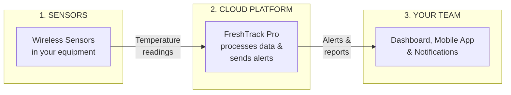
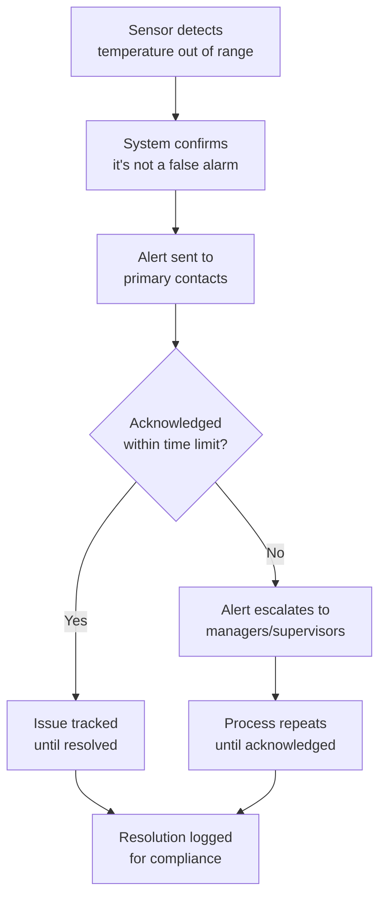
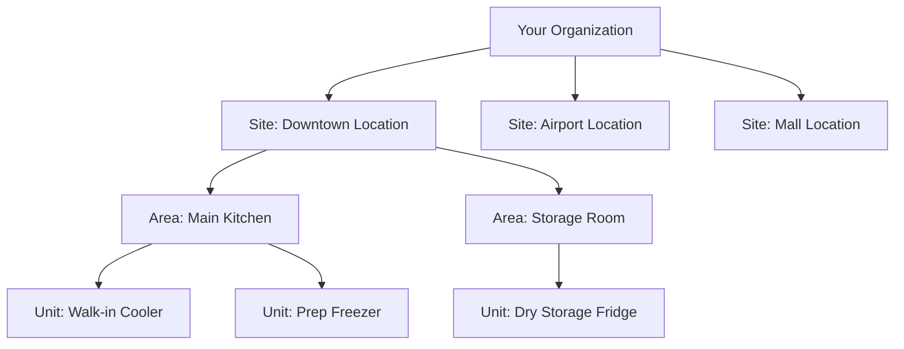

# FreshTrack Pro: System at a Glance

> A simple look at how FreshTrack Pro works

---

## How It Works (The Simple Version)

FreshTrack Pro is like having a tireless employee who:
1. **Checks every refrigerator** every 5 minutes
2. **Records every reading** automatically
3. **Calls you immediately** if something is wrong
4. **Keeps perfect records** for inspectors

All of this happens automatically, 24 hours a day, 7 days a week.

---

## The Three Parts of FreshTrack Pro

### 1. Wireless Sensors
Small devices placed inside refrigerators, freezers, and cold storage units that:
- Measure temperature continuously
- Send readings wirelessly (no cables needed)
- Run for years on a single battery

### 2. Cloud Platform
The "brain" of FreshTrack Pro that:
- Receives all sensor readings
- Compares temperatures to your safe limits
- Sends alerts when something is wrong
- Stores all data securely for compliance

### 3. Your Team's Access
How you and your team interact with FreshTrack Pro:
- **Web Dashboard** — Full view of all locations from any computer
- **Mobile App** — Check status and respond to alerts from anywhere
- **Notifications** — Email, text, and push alerts when action is needed

---

## The Alert Flow

What happens when a temperature problem occurs:

**Key Points:**
- Alerts aren't sent for brief fluctuations (like when someone opens a door)
- If the first person doesn't respond, alerts automatically escalate
- Everything is documented for your records

---

## Your Organization Structure

FreshTrack Pro mirrors how your business is organized:

**Benefits of this structure:**
- Set rules at any level (organization-wide, per-site, or per-unit)
- Give staff access to only their locations
- Roll up reporting by site, region, or entire organization

---

## What Gets Tracked

| Data Point | How It's Captured |
|------------|-------------------|
| **Temperature** | Automatic sensor readings every 5 minutes |
| **Door events** | Sensors detect when doors open/close |
| **Sensor health** | Battery levels and signal strength |
| **Alerts** | When triggered, who responded, how long to resolve |
| **Manual logs** | Staff entries for backup or verification |
| **Changes** | Who changed settings, when, and what |

**All data is stored securely and never deleted** — available for compliance audits at any time.

---

## The Dashboard at a Glance

When you log in, you see:

| Section | What It Shows |
|---------|---------------|
| **Status Overview** | Green/yellow/red indicators for every unit |
| **Active Alerts** | Any issues needing immediate attention |
| **Recent Activity** | Latest readings and events |
| **Quick Actions** | Log temperature, acknowledge alerts, generate reports |

**Color Coding:**
- 🟢 **Green** — Everything normal
- 🟡 **Yellow/Orange** — Needs attention (warning)
- 🔴 **Red** — Immediate action required (critical)
- ⚫ **Gray** — Offline or no data

---

## Security & Reliability

| Concern | How FreshTrack Pro Addresses It |
|---------|--------------------------------|
| **Data Security** | All data encrypted, stored in secure cloud infrastructure |
| **Access Control** | Role-based permissions — staff only see what they need |
| **Uptime** | Cloud platform designed for 99.9%+ availability |
| **Data Backup** | Automatic backups, no data loss |
| **Compliance** | Meets HACCP, FDA, and industry standards |

---

## Integration Points

FreshTrack Pro can work with:

| Integration | Purpose |
|-------------|---------|
| **Email systems** | Alert delivery |
| **SMS/Text messaging** | Critical alerts to phones |
| **Payment processing** | Subscription billing |

*Enterprise customers can discuss additional integrations.*

---

## Summary

FreshTrack Pro is a complete, end-to-end solution:

1. **Sensors** collect data from your equipment
2. **Cloud platform** analyzes data and sends alerts
3. **Web & mobile apps** give you visibility and control
4. **Automatic documentation** keeps you compliant

No servers to maintain. No software to install. Just protection for your cold chain.

---

## Related Documents

- [Overview](./OVERVIEW.md) — What FreshTrack Pro is
- [Value Proposition](./VALUE_PROPOSITION.md) — Why it matters
- [User Journeys](./USER_JOURNEYS.md) — Day in the life
- [FAQ](./FAQ.md) — Common questions
