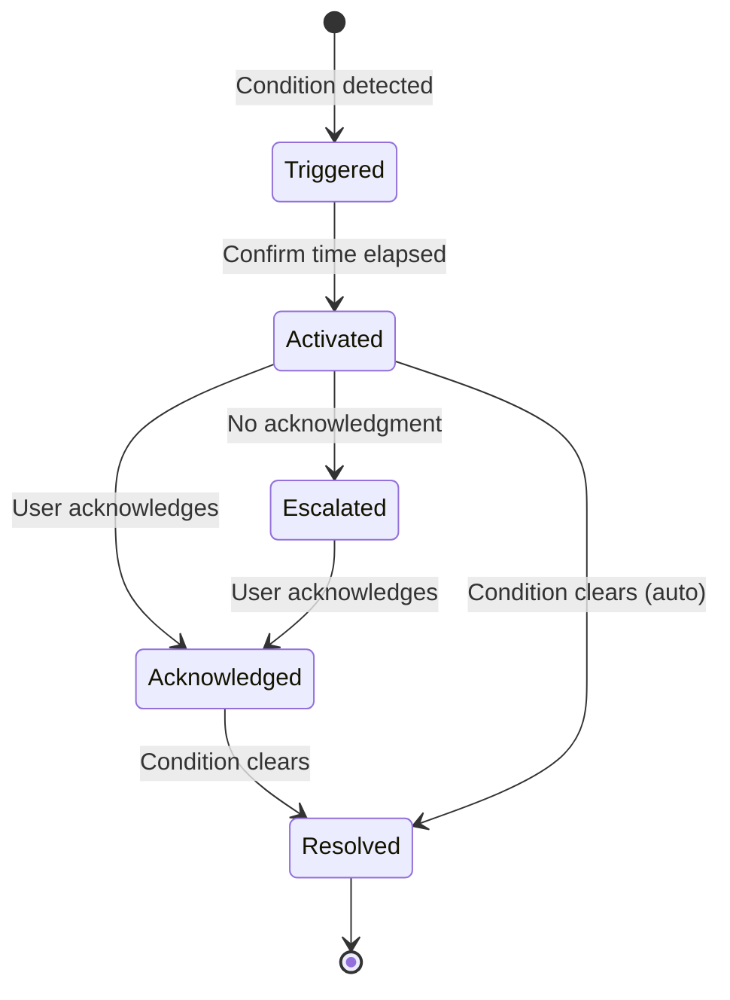
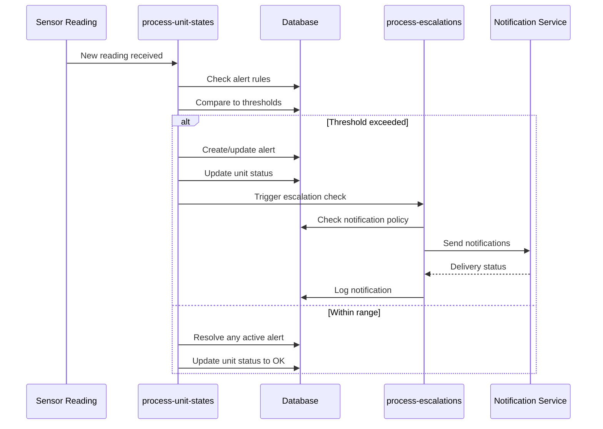

# Alerting

> Alert conditions, severity levels, and escalation paths

---

## Alert Types Overview

### Application Alerts (Customer-Facing)

These are alerts visible to customers in the FreshTrack Pro application:

| Alert Type | Description | Severity |
|------------|-------------|----------|
| `temp_excursion` | Temperature outside safe range | Warning → Critical |
| `temp_high` | Temperature above max threshold | Warning → Critical |
| `temp_low` | Temperature below min threshold | Warning → Critical |
| `monitoring_interrupted` | No readings received | Warning → Critical |
| `door_open` | Door open too long | Warning |
| `low_battery` | Sensor battery low | Warning |
| `sensor_offline` | Sensor not reporting | Warning |
| `gateway_offline` | Gateway not reporting | Warning |

### System Alerts (Operations)

These require operational attention:

| Alert Type | Description | Severity |
|------------|-------------|----------|
| Health check failure | System component unhealthy | Critical |
| High error rate | Edge function errors > threshold | High |
| Integration failure | TTN/Stripe/notification failure | High |
| Database latency | Query time > threshold | Medium |
| Capacity warning | Storage/connections nearing limit | Medium |

---

## Alert Lifecycle

### State Diagram



### State Definitions

| State | Description | Actions Available |
|-------|-------------|-------------------|
| **Triggered** | Condition detected, waiting confirm time | Auto-resolve if clears |
| **Activated** | Confirmed, notifications sent | Acknowledge, auto-resolve |
| **Escalated** | Escalation level increased | Acknowledge |
| **Acknowledged** | User has responded | Wait for resolution |
| **Resolved** | Condition cleared | View history |

---

## Severity Levels

### Application Severity

| Level | Color | Description | Example |
|-------|-------|-------------|---------|
| **Critical** | Red | Immediate action required | Temp > 45°F for >15min |
| **Warning** | Orange | Attention needed | Temp slightly out of range |
| **Info** | Blue | Informational | System status update |

### Operational Severity

| Level | Response Time | Description |
|-------|---------------|-------------|
| **P1 - Critical** | < 15 minutes | Service down, data at risk |
| **P2 - High** | < 1 hour | Significant degradation |
| **P3 - Medium** | < 4 hours | Minor impact |
| **P4 - Low** | < 24 hours | Informational |

---

## Alert Conditions

### Temperature Alerts

#### High Temperature

```
Condition:
  current_temp > max_threshold
  AND duration > confirm_time_minutes

Transitions:
  excursion → alarm_active (after confirm time)
  alarm_active → ok (when temp returns to range)
```

#### Low Temperature

```
Condition:
  current_temp < min_threshold
  AND duration > confirm_time_minutes

Transitions:
  Same as high temperature
```

#### Confirm Time

- Prevents false alarms from brief fluctuations
- Default: 5 minutes (configurable per unit)
- Range: 1-60 minutes

### Monitoring Alerts

#### No Data Received

```
Condition:
  last_reading_at < (now - check_in_interval - buffer)
  Buffer: 30 seconds

Unit Status:
  monitoring_interrupted (if critical)
  offline (if warning level)
```

#### Sensor Offline

```
Condition:
  sensor.last_seen_at < (now - 2 * expected_interval)

Threshold:
  Expected interval: 5-15 minutes (sensor-dependent)
```

### Device Alerts

#### Low Battery

```
Condition:
  battery_level < 20%

Notification:
  Warning at 20%
  Critical at 10%
```

#### Door Open

```
Condition:
  door_state = 'open'
  AND duration > door_grace_period

Grace Period:
  Default: 5 minutes (configurable)
```

---

## Escalation Paths

### Customer Alert Escalation

```
Level 1 (Immediate)
├── Primary notification contacts
├── Channels: Email, SMS, Push
└── Wait: escalation_delay minutes

Level 2 (After delay)
├── Secondary/manager contacts
├── Channels: Same as configured
└── Wait: escalation_delay minutes

Level 3 (After 2x delay)
├── Emergency/owner contacts
├── Channels: All available
└── Final level
```

### Escalation Configuration

Stored in `notification_policies` table:

| Field | Description |
|-------|-------------|
| `escalation_delay_minutes` | Time before escalation |
| `escalation_contacts` | Contact IDs per level |
| `quiet_hours_start/end` | Suppress non-critical during hours |
| `channels` | email, sms, push |

### Operational Escalation

| Level | Time | Contacts | Actions |
|-------|------|----------|---------|
| L1 | 0 min | On-call engineer | Investigate |
| L2 | 15 min | Engineering lead | Join investigation |
| L3 | 30 min | Engineering manager | Incident command |
| L4 | 60 min | CTO/Leadership | Executive awareness |

---

## Notification Channels

### Email Notifications

- **Provider:** Resend API
- **Trigger:** All alert levels
- **Content:** Alert details, unit info, action links
- **Retry:** 3 attempts with backoff

### SMS Notifications

- **Provider:** Telnyx
- **Trigger:** Critical alerts, escalations
- **Content:** Brief alert summary, call to action
- **Retry:** 3 attempts

### Push Notifications

- **Platform:** Web push (PWA)
- **Trigger:** All alerts (if enabled)
- **Content:** Title and brief message
- **Delivery:** Best-effort

### Notification Status

| Status | Description |
|--------|-------------|
| `queued` | Waiting to send |
| `sent` | Successfully dispatched |
| `delivered` | Confirmed delivery |
| `failed` | Delivery failed |
| `suppressed` | Quiet hours or disabled |

---

## Alert Processing

### Process Flow



### Processing Functions

| Function | Purpose | Trigger |
|----------|---------|---------|
| `process-unit-states` | Evaluate alerts, update status | After reading ingestion |
| `process-escalations` | Send notifications, escalate | Alert state changes |

---

## Operational Alerts (Recommended)

### Current State

FreshTrack Pro does not currently have automated operational alerting. Monitoring is through:
- Health Dashboard (manual check)
- Supabase Dashboard (platform metrics)
- Debug Terminal (application logs)

### Recommended Alerting Setup

#### Integration with External Service

| Service | Use Case | Integration Method |
|---------|----------|-------------------|
| PagerDuty | On-call management | Webhook from health check |
| Opsgenie | Incident management | API integration |
| Slack | Team notifications | Webhook |
| Email | Backup notifications | SMTP |

#### Recommended Alert Rules

| Condition | Threshold | Severity |
|-----------|-----------|----------|
| Health check returns error | Any check failed | P2 |
| Health check returns degraded | >3 checks degraded | P3 |
| Edge function error rate | >5% in 5 minutes | P2 |
| Database latency | >500ms avg | P3 |
| TTN webhook failures | >10% in 1 hour | P2 |
| No readings received | 0 in 15 minutes | P1 |

#### Implementation Approach

```javascript
// Recommended: Add to health-check function
if (overallStatus === 'error') {
  await fetch(process.env.PAGERDUTY_WEBHOOK, {
    method: 'POST',
    body: JSON.stringify({
      routing_key: process.env.PAGERDUTY_KEY,
      event_action: 'trigger',
      payload: {
        summary: 'FreshTrack Pro health check failed',
        severity: 'critical',
        source: 'health-check',
        custom_details: checkResults
      }
    })
  });
}
```

---

## Alert Configuration

### Per-Organization Settings

| Setting | Location | Description |
|---------|----------|-------------|
| Alert rules | `alert_rules` table | Thresholds per unit/site |
| Notification policy | `notification_policies` | Channels, contacts |
| Escalation contacts | `escalation_contacts` | Contact hierarchy |
| Quiet hours | `notification_policies` | Suppress timing |

### Default Thresholds

| Unit Type | Min Temp | Max Temp | Confirm Time |
|-----------|----------|----------|--------------|
| Cooler | 33°F | 40°F | 5 min |
| Freezer | -10°F | 0°F | 5 min |
| Walk-in Cooler | 35°F | 41°F | 10 min |
| Prep Station | 35°F | 40°F | 5 min |

### Alert Rule Cascade

```
Organization Default
    ↓ (override)
Site Settings
    ↓ (override)
Unit Settings
```

Resolved via `get_effective_alert_rules` RPC.

---

## Silencing and Suppression

### Quiet Hours

- Configurable per notification policy
- Suppresses non-critical alerts
- Critical alerts always sent
- Logged as "suppressed" for audit

### Manual Suppression

| Action | Effect | Duration |
|--------|--------|----------|
| Acknowledge alert | Stops escalation | Until resolved |
| Disable unit monitoring | No alerts | Until re-enabled |
| Contact opt-out | Skip contact | Permanent |

### Maintenance Windows

Currently: Manual acknowledgment during maintenance
Recommended: Scheduled suppression windows (to implement)

---

## Alert Auditing

### What's Logged

| Event | Logged Data |
|-------|-------------|
| Alert created | Type, severity, unit, timestamp |
| Alert acknowledged | User, timestamp, note |
| Alert resolved | Timestamp, auto/manual |
| Notification sent | Channel, recipient, status |
| Escalation triggered | Level, contacts notified |

### Audit Queries

```sql
-- Recent alerts by organization
SELECT * FROM alerts
WHERE organization_id = ?
ORDER BY created_at DESC
LIMIT 50;

-- Alert response times
SELECT
  id,
  type,
  created_at,
  acknowledged_at,
  EXTRACT(EPOCH FROM (acknowledged_at - created_at))/60 as minutes_to_ack
FROM alerts
WHERE acknowledged_at IS NOT NULL
ORDER BY created_at DESC;

-- Escalated alerts
SELECT * FROM alerts
WHERE escalation_level > 0
ORDER BY created_at DESC;
```

---

## Troubleshooting Alerts

### Alert Not Triggering

1. Check alert rules exist for unit
2. Verify confirm time hasn't elapsed yet
3. Check `process-unit-states` function logs
4. Verify sensor is sending data

### Notification Not Received

1. Check notification policy configuration
2. Verify contact has valid email/phone
3. Check `process-escalations` function logs
4. Check notification delivery status in DB
5. Verify not in quiet hours

### Alert Not Resolving

1. Verify temperature returned to range
2. Check `process-unit-states` is running
3. Check for stale readings (sensor offline)
4. Manual resolution may be needed

---

## Related Documents

- [METRICS_OVERVIEW.md](./METRICS_OVERVIEW.md) — Metric definitions and thresholds
- [DASHBOARDS.md](./DASHBOARDS.md) — Dashboard configuration
- [LOGGING.md](./LOGGING.md) — Log sources and debugging
- [RUNBOOKS.md](./RUNBOOKS.md) — Operational procedures
