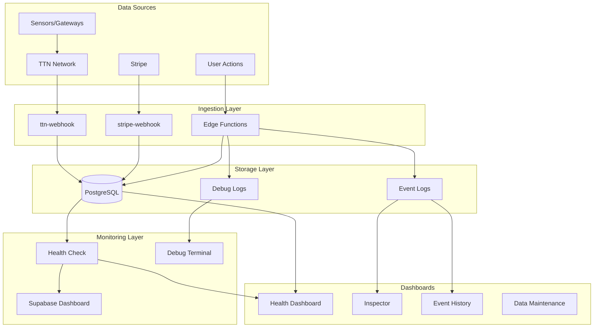

# Dashboards

> Monitoring dashboards and visualization for FreshTrack Pro

---

## Dashboard Architecture

### Metrics Flow Diagram



---

## Existing Dashboards

### 1. Health Dashboard

**Location:** `/admin/health`
**Access:** Admin users only
**Component:** `src/pages/HealthDashboard.tsx`

#### What It Shows

| Section | Information | Update Frequency |
|---------|-------------|------------------|
| Overall Status | System health summary | 1 minute (auto-refresh) |
| Category Breakdown | Database, Edge Functions, TTN, Overall | 1 minute |
| Check List | Individual check results | 1 minute |
| Latency Display | Response times per check | Per check |

#### Visual Elements

- **Status Badges:** healthy (green), degraded (yellow), unhealthy (red), unknown (gray)
- **Expandable Cards:** Click to see check details
- **Search/Filter:** Find specific checks
- **Sort Options:** By status, name, or latency

#### Health Check Categories

```
Database Checks
├── Query Latency
├── RPC Latency
└── Table Availability

Edge Function Checks
├── Critical Functions (flagged)
└── Non-Critical Functions

TTN Integration
├── Configuration Status
├── Provisioning Status
└── Application ID Check
```

#### Refresh Controls

| Control | Behavior |
|---------|----------|
| Auto-refresh | 1-minute interval (toggle) |
| Quick check | 5-minute interval for header badge |
| Manual refresh | Click to run all checks |

---

### 2. Debug Terminal

**Location:** Bottom dock (when enabled)
**Access:** Users with debug mode enabled
**Component:** `src/components/debug/DebugTerminal.tsx`

#### What It Shows

| Tab | Contents |
|-----|----------|
| **Events** | All logged events |
| **CRUD** | Database operations |
| **Network** | Edge function calls |
| **Sync** | Data synchronization |
| **TTN** | TTN-related operations |
| **Errors** | Error-level logs only |

#### Log Entry Details

```
[timestamp] [level] [category] Message
├── Duration: Xms (for operations)
├── Entity: type/id
├── Correlation ID: (for tracing)
└── Payload: (expandable JSON)
```

#### Controls

| Control | Function |
|---------|----------|
| Pause/Resume | Stop/start log collection |
| Clear | Empty the log buffer |
| Auto-scroll | Follow new entries |
| Export JSON | Download full log |
| Support Snapshot | Redacted export for support |
| Filter | By level, category, search |

---

### 3. Inspector (Audit Trail)

**Location:** `/inspector`
**Access:** Admin, Inspector roles
**Component:** `src/pages/Inspector.tsx`

#### What It Shows

| Section | Information |
|---------|-------------|
| Temperature Logs | Manual and sensor readings |
| Exception Logs | Alerts, violations, issues |
| Corrective Actions | Responses to exceptions |
| Monitoring Gaps | Periods without data |

#### Filters Available

- Date range
- Site selection
- Unit selection
- Log type

#### Export Options

- CSV export
- PDF report generation

---

### 4. Event History

**Location:** `/event-history` (or via admin menu)
**Access:** Admin users
**Component:** `src/pages/EventHistory.tsx`

#### What It Shows

All business events from `event_logs` table:

| Event Category | Examples |
|----------------|----------|
| Device | sensor_paired, reading_received, device_offline |
| Alert | created, activated, acknowledged, resolved |
| Compliance | manual_temp_logged, excursion_started |
| Settings | unit_settings_updated, alert_rules_updated |
| Notification | sent, failed, delivered |
| TTN | settings.updated, .enabled, .tested |
| System | user_login, report_exported |

#### Display Features

- Expandable event details
- Actor identification (user/system)
- Entity links (site, unit, sensor)
- Severity badges
- Pagination (50 per page)

---

### 5. Data Maintenance

**Location:** `/admin/maintenance`
**Access:** Owner/Admin only
**Component:** `src/pages/DataMaintenance.tsx`

#### What It Shows

| Section | Information |
|---------|-------------|
| Orphan Organizations | Orgs with no active users |
| Cleanup Jobs | Background job status |
| Data Integrity | Referential integrity checks |

#### Actions Available

- Soft delete orphan orgs
- View job history
- Manual cleanup triggers

---

## Supabase Dashboard

### Location

Access via: https://supabase.com/dashboard/project/{project-id}

### Key Sections

#### Database

| View | Information |
|------|-------------|
| Table Editor | Browse/edit data |
| SQL Editor | Run queries |
| Database Health | Connection stats |

#### Edge Functions

| View | Information |
|------|-------------|
| Function List | All deployed functions |
| Logs | Real-time function logs |
| Metrics | Invocations, latency, errors |

#### Authentication

| View | Information |
|------|-------------|
| Users | Registered users |
| Sessions | Active sessions |
| Logs | Auth events |

#### Storage

| View | Information |
|------|-------------|
| Buckets | File storage |
| Usage | Storage metrics |

---

## Recommended Dashboards

### Operations Dashboard (To Build)

**Purpose:** Single pane for ops team

```
┌─────────────────────────────────────────────────────────────┐
│                    OPERATIONS DASHBOARD                      │
├─────────────────┬───────────────────┬───────────────────────┤
│ System Health   │ Alert Summary     │ Integration Status    │
│ ● Database: OK  │ Active: 5         │ ● TTN: Healthy        │
│ ● Functions: OK │ Unack: 2          │ ● Stripe: Healthy     │
│ ● TTN: OK       │ Critical: 1       │ ● Email: Healthy      │
├─────────────────┴───────────────────┴───────────────────────┤
│                    Key Metrics (24h)                         │
│ Readings: 145,234 | Alerts: 23 | MTTR: 18min | Uptime: 99.9%│
├─────────────────────────────────────────────────────────────┤
│                    Recent Events                             │
│ 12:34 - Alert resolved: Unit 42 temperature normal          │
│ 12:28 - Alert created: Unit 15 high temperature             │
│ 12:15 - Sensor offline: DEV-A1B2C3                          │
└─────────────────────────────────────────────────────────────┘
```

#### Recommended Implementation

| Component | Tool | Data Source |
|-----------|------|-------------|
| System Health | Health check API | `/functions/v1/health-check` |
| Alert Summary | Database query | `alerts` table |
| Integration Status | Health checks | TTN, Stripe checks |
| Key Metrics | Database queries | Aggregated data |
| Recent Events | Event logs | `event_logs` table |

---

### Customer Success Dashboard (To Build)

**Purpose:** Customer health and usage

```
┌─────────────────────────────────────────────────────────────┐
│                 CUSTOMER SUCCESS DASHBOARD                   │
├─────────────────────────────────────────────────────────────┤
│ Active Organizations: 127  │  Active Users: 892             │
│ New This Month: 12         │  Churn Risk: 3                 │
├─────────────────────────────────────────────────────────────┤
│ Engagement Metrics                                           │
│ Daily Active Users: 234                                      │
│ Reports Generated: 89 (last 7 days)                          │
│ Alerts Acknowledged: 95%                                     │
├─────────────────────────────────────────────────────────────┤
│ Health Distribution                                          │
│ ███████████████████░░░ 89% Healthy                           │
│ ████░░░░░░░░░░░░░░░░░░ 8% At Risk                            │
│ ██░░░░░░░░░░░░░░░░░░░░ 3% Needs Attention                    │
└─────────────────────────────────────────────────────────────┘
```

---

### Integration Monitor (To Build)

**Purpose:** Track external service health

```
┌─────────────────────────────────────────────────────────────┐
│                   INTEGRATION MONITOR                        │
├──────────────────────────────────────────────────────────────┤
│ TTN (The Things Network)                                     │
│ ├── Status: ● Online                                         │
│ ├── Webhooks/hour: 1,234                                     │
│ ├── Success rate: 99.8%                                      │
│ └── Last received: 2 seconds ago                             │
├──────────────────────────────────────────────────────────────┤
│ Stripe                                                       │
│ ├── Status: ● Online                                         │
│ ├── Events/day: 45                                           │
│ ├── Failed payments: 2                                       │
│ └── Last webhook: 3 hours ago                                │
├──────────────────────────────────────────────────────────────┤
│ Notifications                                                │
│ ├── Email (Resend): ● Online | Sent today: 89                │
│ ├── SMS (Telnyx): ● Online | Sent today: 12                  │
│ └── Push: ● Online | Sent today: 234                         │
└──────────────────────────────────────────────────────────────┘
```

---

## Dashboard Access Matrix

| Dashboard | Owner | Admin | Manager | Staff | Viewer |
|-----------|:-----:|:-----:|:-------:|:-----:|:------:|
| Health Dashboard | ✓ | ✓ | - | - | - |
| Debug Terminal | ✓ | ✓ | ✓ | - | - |
| Inspector | ✓ | ✓ | - | - | ✓ |
| Event History | ✓ | ✓ | - | - | - |
| Data Maintenance | ✓ | ✓ | - | - | - |
| Supabase Dashboard | Infra team only | - | - | - | - |

---

## Dashboard URLs

### Application Dashboards

| Dashboard | URL Path |
|-----------|----------|
| Health Dashboard | `/admin/health` |
| Inspector | `/inspector` |
| Event History | `/event-history` |
| Data Maintenance | `/admin/maintenance` |

### External Dashboards

| Dashboard | URL |
|-----------|-----|
| Supabase | `https://supabase.com/dashboard/project/{id}` |
| TTN Console | `https://nam1.cloud.thethings.network/console` (or region-specific) |
| Stripe | `https://dashboard.stripe.com` |
| Resend | `https://resend.com/emails` |

---

## Monitoring Best Practices

### Daily Checks

1. Review Health Dashboard status
2. Check active alert count
3. Verify sensor online rate
4. Review any failed notifications

### Weekly Checks

1. Review Event History for patterns
2. Check integration success rates
3. Review customer usage metrics
4. Check storage and database growth

### Monthly Checks

1. Review overall system performance
2. Analyze alert trends
3. Review error rates and patterns
4. Capacity planning review

---

## Related Documents

- [METRICS_OVERVIEW.md](./METRICS_OVERVIEW.md) — Metric definitions and thresholds
- [ALERTING.md](./ALERTING.md) — Alert conditions and escalation
- [LOGGING.md](./LOGGING.md) — Log sources and debugging
- [RUNBOOKS.md](./RUNBOOKS.md) — Operational procedures
