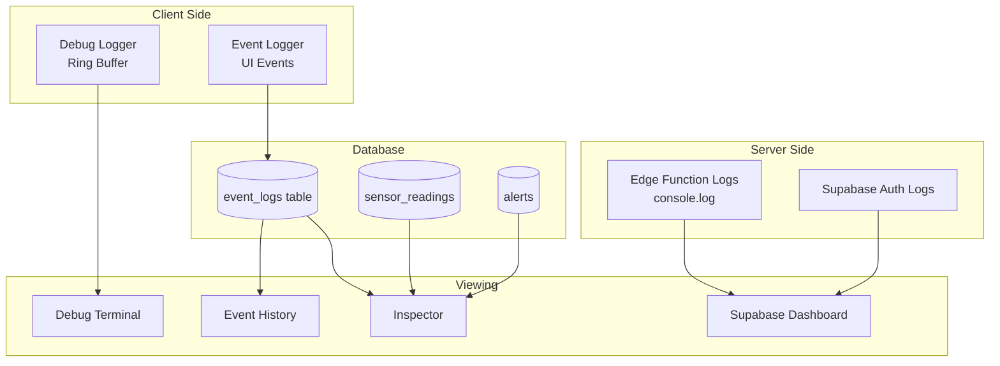

# Logging

> Log sources, formats, and debugging procedures

---

## Log Sources Overview

### Log Architecture



---

## Client-Side Logging

### Debug Logger

**Location:** `src/lib/debugLogger.ts`
**Storage:** In-memory ring buffer (5000 entries)

#### Log Levels

| Level | Color | Use Case |
|-------|-------|----------|
| `debug` | Gray | Verbose debugging |
| `info` | Blue | Normal operations |
| `warn` | Orange | Potential issues |
| `error` | Red | Errors and failures |

#### Log Categories

| Category | Description | Examples |
|----------|-------------|----------|
| `ui` | User interface events | Button clicks, navigation |
| `routing` | Route changes | Page transitions |
| `db` | Database operations | Queries, mutations |
| `sync` | Data synchronization | Offline sync, refresh |
| `ttn` | TTN operations | Provisioning, webhooks |
| `provisioning` | Device provisioning | Sensor/gateway setup |
| `edge` | Edge function calls | API requests |
| `network` | Network activity | Fetch, WebSocket |
| `auth` | Authentication | Login, logout, token |
| `crud` | CRUD operations | Create, update, delete |
| `realtime` | Real-time updates | Subscriptions |
| `mutation` | Data mutations | Form submissions |
| `query` | Data queries | Data fetching |

#### Using the Debug Logger

```typescript
import { debugLog, startOperation, endOperation } from '@/lib/debugLogger';

// Simple log
debugLog.info('crud', 'Created new unit', { unitId, name });

// Operation tracking
const opId = startOperation('provisioning', 'Provisioning sensor');
try {
  await provisionSensor(sensor);
  endOperation(opId, 'success', { sensorId: sensor.id });
} catch (error) {
  endOperation(opId, 'error', { error: error.message });
}

// With correlation ID (for tracing related operations)
debugLog.info('ttn', 'Starting TTN sync', {
  correlationId: 'abc-123'
});
```

#### Automatic Redaction

The debug logger automatically redacts sensitive data:

| Field Pattern | Redaction |
|---------------|-----------|
| `api_key`, `apiKey` | `[REDACTED]` |
| `secret`, `password` | `[REDACTED]` |
| `token`, `authorization` | `[REDACTED]` |
| `private_key`, `credential` | `[REDACTED]` |
| `ttn_api_key_last4` | Shows last 4 only |
| `dev_eui`, `gateway_eui` | Shows last 4 only |

#### Exporting Logs

```typescript
import { exportLogs, generateSnapshot } from '@/lib/debugLogger';

// Full JSON export
const jsonLogs = exportLogs();

// Support snapshot (safe for sharing)
const snapshot = generateSnapshot({
  focusTimestamp: errorTime,
  includeNetwork: true,
  maxLogs: 500
});
```

---

### Event Logger

**Location:** `src/lib/eventLogger.ts`
**Storage:** `event_logs` database table

#### Log Functions

```typescript
// General event logging
logEvent({
  event_type: 'unit.settings_updated',
  category: 'settings',
  severity: 'info',
  title: 'Unit settings changed',
  site_id: unit.site_id,
  unit_id: unit.id,
  event_data: { changes: diff }
});

// Alert-specific logging
logAlertEvent(alert, 'acknowledged', userId, { note: 'Checking now' });

// Manual temperature logging
logManualTempEvent(unit, temperature, userId, { note: 'Visual check' });

// Settings change logging
logSettingsEvent('alert_rules', 'updated', userId, {
  before: oldRules,
  after: newRules
});
```

#### Event Types

| Type Pattern | Description |
|--------------|-------------|
| `sensor.*` | Sensor events (paired, reading, offline) |
| `alert.*` | Alert lifecycle (created, acknowledged, resolved) |
| `compliance.*` | Compliance events (excursion, gap) |
| `settings.*` | Configuration changes |
| `notification.*` | Notification delivery |
| `ttn.*` | TTN integration events |
| `system.*` | System events (login, export) |

---

## Server-Side Logging

### Edge Function Logging

All edge functions use `console.log` with prefixes:

```typescript
// Standard pattern
console.log('[ttn-webhook] Received uplink', {
  dev_eui: payload.end_device_ids.dev_eui
});

// Error logging
console.error('[ttn-webhook] Device not found', {
  dev_eui: normalizedEui
});

// Timing
const startTime = Date.now();
// ... operation ...
console.log('[process-unit-states] Completed', {
  duration_ms: Date.now() - startTime,
  units_processed: count
});
```

### Function Log Prefixes

| Function | Prefix |
|----------|--------|
| `ttn-webhook` | `[ttn-webhook]` |
| `stripe-webhook` | `[stripe-webhook]` |
| `process-unit-states` | `[process-unit-states]` |
| `process-escalations` | `[process-escalations]` |
| `ingest-readings` | `[ingest-readings]` |
| `health-check` | `[health-check]` |

### Viewing Server Logs

#### Supabase Dashboard

1. Navigate to Edge Functions
2. Select function
3. View "Logs" tab
4. Filter by time range

#### CLI Access

```bash
# Stream logs (requires Supabase CLI)
supabase functions logs ttn-webhook --follow

# View recent logs
supabase functions logs ttn-webhook --limit 100
```

---

## Database Logging

### Event Logs Table

**Table:** `event_logs`

| Column | Type | Description |
|--------|------|-------------|
| `id` | UUID | Primary key |
| `organization_id` | UUID | Tenant scope |
| `event_type` | TEXT | Event identifier |
| `category` | TEXT | Event category |
| `severity` | TEXT | info/warning/critical |
| `title` | TEXT | Human-readable title |
| `actor_id` | UUID | User who triggered |
| `actor_type` | TEXT | user/system |
| `site_id` | UUID | Related site |
| `area_id` | UUID | Related area |
| `unit_id` | UUID | Related unit |
| `event_data` | JSONB | Additional data |
| `ip_address` | INET | Client IP |
| `user_agent` | TEXT | Browser info |
| `previous_hash` | TEXT | Hash chain |
| `event_hash` | TEXT | Event hash |
| `created_at` | TIMESTAMPTZ | Timestamp |

### Query Examples

```sql
-- Recent events for an organization
SELECT * FROM event_logs
WHERE organization_id = 'org-uuid'
ORDER BY created_at DESC
LIMIT 50;

-- Events by type
SELECT * FROM event_logs
WHERE event_type LIKE 'alert.%'
ORDER BY created_at DESC;

-- Events by actor
SELECT * FROM event_logs
WHERE actor_id = 'user-uuid'
ORDER BY created_at DESC;

-- Events with search
SELECT * FROM event_logs
WHERE title ILIKE '%temperature%'
OR event_data::text ILIKE '%temperature%'
ORDER BY created_at DESC;
```

---

## Log Retention

### Current Retention

| Log Type | Retention | Location |
|----------|-----------|----------|
| Debug logs | Session only | Browser memory |
| Event logs | Permanent | Database |
| Edge function logs | 7 days | Supabase |
| Auth logs | 7 days | Supabase |

### Recommendations

| Log Type | Recommended Retention | Reason |
|----------|----------------------|--------|
| Event logs | 2+ years | Compliance (HACCP) |
| Edge function logs | 30 days | Debugging |
| Auth logs | 90 days | Security |

---

## Debugging Procedures

### Using the Debug Terminal

1. **Enable Debug Mode**
   - Press `Ctrl+Shift+D` or toggle in settings
   - Debug terminal appears at bottom

2. **Filter Logs**
   - Use tabs: Events, CRUD, Network, Sync, TTN, Errors
   - Search by keyword
   - Filter by category or entity

3. **Trace Operations**
   - Click correlation ID link to filter related
   - Expand entries to see full payload
   - Note duration for performance issues

4. **Export for Support**
   - Click "Support Snapshot" button
   - Automatically redacts sensitive data
   - Share JSON with support team

### Debugging Common Issues

#### No Sensor Readings

```
1. Check TTN tab in Debug Terminal
2. Look for webhook entries
3. If no entries:
   - Check TTN Console for uplinks
   - Verify webhook URL in TTN
   - Check webhook secret matches
4. If entries exist:
   - Look for error messages
   - Check device matching logs
   - Verify DevEUI format
```

#### Alert Not Triggering

```
1. Check DB tab for alert rule queries
2. Verify rules returned for unit
3. Check Edge tab for process-unit-states calls
4. Look for evaluation logs
5. Check confirm time hasn't elapsed
```

#### Notification Not Delivered

```
1. Check event_logs for notification events
2. Look for process-escalations logs
3. Verify contact configuration
4. Check for quiet hours suppression
5. Review notification delivery status
```

### Edge Function Debugging

#### View Logs in Supabase

1. Go to Supabase Dashboard
2. Navigate to Edge Functions
3. Select the function
4. Click "Logs" tab
5. Set time range
6. Search for relevant entries

#### Log Search Patterns

```
# Find webhook errors
[ttn-webhook] Error

# Find device matching
Device not found

# Find processing times
duration_ms

# Find specific device
DEV-EUI-HERE
```

---

## Support Snapshot

### What's Included

```json
{
  "meta": {
    "version": "1.0.0",
    "environment": "production",
    "timestamp": "2026-01-12T12:00:00Z",
    "currentRoute": "/dashboard"
  },
  "user": {
    "emailDomain": "example.com",
    "organizationId": "org-uuid",
    "debugEnabled": true
  },
  "logs": {
    "entries": [...],  // Last 500 entries
    "totalCount": 1234
  },
  "network": {
    "recentCalls": [...]  // Last 50 edge calls
  },
  "domain": {
    "ttnConfig": {
      "cluster": "eu1",
      "hasAppId": true
    },
    "sensors": { "count": 25, "active": 23 },
    "gateways": { "count": 2, "online": 2 }
  }
}
```

### What's Redacted

- Full API keys (shows last4 only)
- Full email addresses (shows domain only)
- Password fields
- Auth tokens
- Session data

### Generating Snapshot

```typescript
// Via UI
// Click "Support Snapshot" in Debug Terminal

// Via code
import { generateSnapshot } from '@/lib/snapshotBuilder';

const snapshot = generateSnapshot({
  focusTimestamp: errorTimestamp,
  includeNetwork: true,
  maxLogs: 500,
  surroundingSeconds: 30
});
```

---

## Log Analysis

### Performance Analysis

```typescript
// Find slow operations
const slowOps = logs.filter(log =>
  log.duration && log.duration > 1000
);

// Find error patterns
const errors = logs.filter(log =>
  log.level === 'error'
);

// Group by category
const byCategory = logs.reduce((acc, log) => {
  acc[log.category] = (acc[log.category] || 0) + 1;
  return acc;
}, {});
```

### Common Patterns to Watch

| Pattern | Indicates |
|---------|-----------|
| Repeated `401` errors | Auth issues |
| High `duration_ms` values | Performance problems |
| `Device not found` | DevEUI mismatch |
| `RLS policy violation` | Permission issue |
| `Connection timeout` | Network problems |

---

## Best Practices

### Logging Guidelines

1. **Always use structured logging**
   ```typescript
   // Good
   console.log('[function] Event', { key: value });

   // Bad
   console.log('Something happened with ' + value);
   ```

2. **Include context**
   ```typescript
   // Good
   console.log('[process] Completed', {
     duration_ms: Date.now() - start,
     items_processed: count,
     errors: errorCount
   });
   ```

3. **Use appropriate levels**
   - `debug`: Verbose, development only
   - `info`: Normal operations
   - `warn`: Potential issues
   - `error`: Failures

4. **Never log secrets**
   ```typescript
   // Good
   console.log('Using key ending in', key.slice(-4));

   // Bad
   console.log('API key:', apiKey);
   ```

5. **Use correlation IDs for tracing**
   ```typescript
   const correlationId = crypto.randomUUID();
   debugLog.info('Starting operation', { correlationId });
   // ... pass correlationId through the operation
   ```

---

## Related Documents

- [METRICS_OVERVIEW.md](./METRICS_OVERVIEW.md) — Metric definitions and thresholds
- [DASHBOARDS.md](./DASHBOARDS.md) — Dashboard configuration
- [ALERTING.md](./ALERTING.md) — Alert conditions and escalation
- [RUNBOOKS.md](./RUNBOOKS.md) — Operational procedures
