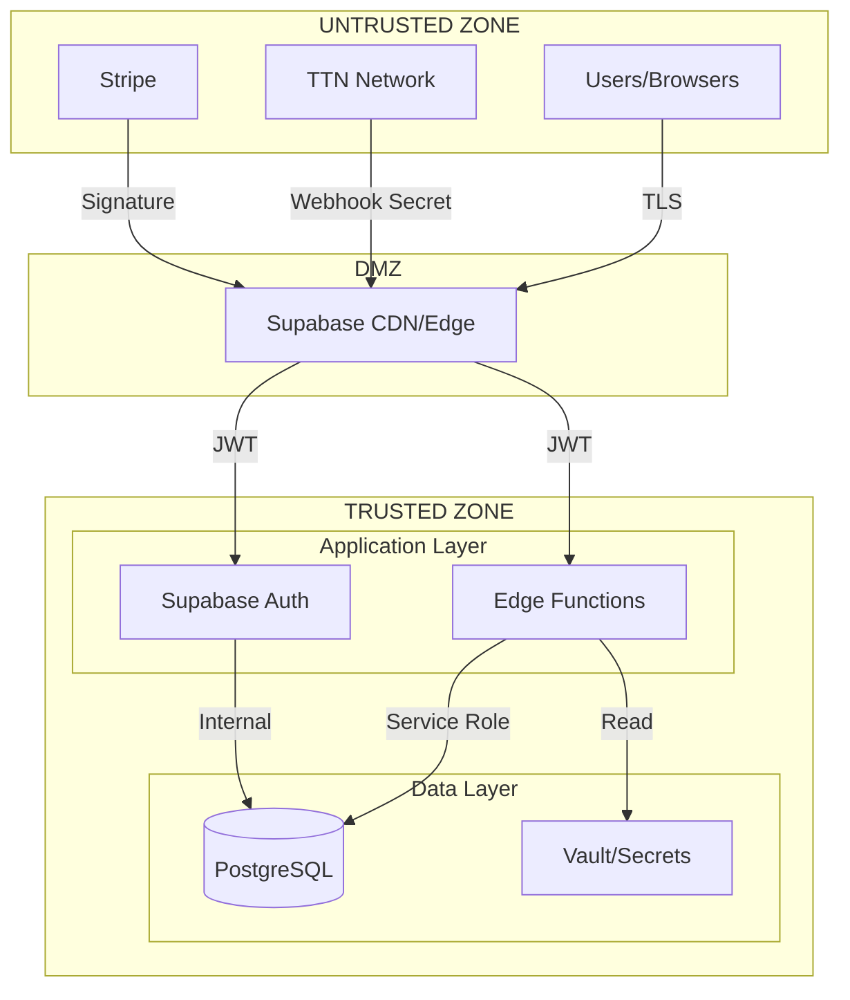

# Security Overview

> FreshTrack Pro Security Architecture and Principles

---

## Executive Summary

FreshTrack Pro is a multi-tenant SaaS platform for refrigeration monitoring. Security is architected around **tenant isolation**, **defense in depth**, and **least privilege access**. The platform handles sensitive operational data and integrates with external IoT infrastructure (The Things Network) and payment processing (Stripe).

### Security Classification

| Data Type | Classification | Handling |
|-----------|----------------|----------|
| Temperature readings | Business Sensitive | Encrypted in transit, RLS protected |
| TTN API keys | Secret | Encrypted at rest, never logged |
| User credentials | Secret | Managed by Supabase Auth |
| Organization data | Business Sensitive | Tenant-isolated via RLS |
| Payment information | PCI Sensitive | Handled by Stripe (not stored) |

---

## Security Principles

### 1. Defense in Depth

Multiple security layers protect each transaction:

```
┌─────────────────────────────────────────────────────────────┐
│                     PERIMETER LAYER                          │
│  TLS 1.3 • CDN WAF • Rate Limiting                          │
├─────────────────────────────────────────────────────────────┤
│                   APPLICATION LAYER                          │
│  JWT Validation • CORS • Input Validation • CSRF Protection │
├─────────────────────────────────────────────────────────────┤
│                   AUTHORIZATION LAYER                        │
│  RBAC • RLS Policies • Org Scope Verification               │
├─────────────────────────────────────────────────────────────┤
│                      DATA LAYER                              │
│  Encryption at Rest • Column Encryption • Audit Logging     │
└─────────────────────────────────────────────────────────────┘
```

### 2. Tenant Isolation (Zero Trust Between Tenants)

Every database query is scoped to the authenticated user's organization:

- **Row Level Security (RLS)**: PostgreSQL policies enforce org boundaries
- **Foreign Key Constraints**: Data relationships maintain org scope
- **Unique Constraints**: Scoped to organization (e.g., DevEUI per org)
- **Function-Level Checks**: Edge functions verify org membership

### 3. Least Privilege Access

| Principal | Access Level | Justification |
|-----------|-------------|---------------|
| Anonymous users | Public pages only | No data access |
| Authenticated users | Own organization only | RLS enforced |
| Staff role | Read + limited write | Operational needs |
| Admin role | Full org access | Management needs |
| Service role | Cross-org (internal only) | Scheduled jobs |

### 4. Secure by Default

- All database tables have RLS **enabled by default**
- All edge functions require JWT verification unless explicitly disabled
- All external webhooks require signature/secret verification
- Sensitive fields are encrypted before storage

---

## Trust Boundaries



### Boundary Definitions

| Boundary | From | To | Validation |
|----------|------|-----|------------|
| **B1** | Browser | CDN | TLS, CORS |
| **B2** | CDN | Edge Functions | JWT signature |
| **B3** | TTN | Webhook | Per-org secret (constant-time compare) |
| **B4** | Stripe | Webhook | HMAC signature |
| **B5** | Edge Functions | Database | RLS policies + service role |
| **B6** | Edge Functions | Secrets | Environment variables |

---

## High-Level Security Controls

### Authentication Controls

| Control | Implementation | Status |
|---------|----------------|--------|
| Password authentication | Supabase Auth | Active |
| Session management | JWT with refresh tokens | Active |
| Password strength | 8+ chars, complexity rules | Active |
| Account lockout | Supabase rate limiting | Active |
| Email verification | Supabase email confirmation | Active |
| MFA/2FA | **TBD** - Not currently implemented | Planned |

### Authorization Controls

| Control | Implementation | Status |
|---------|----------------|--------|
| Role-Based Access Control | 6 roles (owner → inspector) | Active |
| Row-Level Security | PostgreSQL RLS policies | Active |
| Organization isolation | `organization_id` on all tables | Active |
| Permission functions | `has_role()`, `user_belongs_to_org()` | Active |
| API endpoint protection | JWT verification per function | Active |

### Data Protection Controls

| Control | Implementation | Status |
|---------|----------------|--------|
| Transport encryption | TLS 1.3 (Supabase managed) | Active |
| Database encryption | Supabase managed encryption at rest | Active |
| Sensitive field encryption | XOR-based obfuscation (v2 format) | Active |
| Secret storage | Environment variables / Vault | Active |
| Audit logging | `event_logs` table with hash chain | Active |

### Network Controls

| Control | Implementation | Status |
|---------|----------------|--------|
| CORS | Configured per function | Active |
| Rate limiting | Supabase platform level | Active |
| DDoS protection | Supabase/Cloudflare | Active |
| Webhook validation | Per-integration verification | Active |

---

## Security Architecture by Layer

### Frontend (Browser)

- Single-page React application
- JWT stored in localStorage (with refresh mechanism)
- No sensitive data stored client-side (except session token)
- CSP headers managed by hosting platform
- Input validation with Zod schemas

### API Layer (Edge Functions)

- Deno runtime with V8 isolates
- Per-request JWT verification
- Service role for internal operations
- Constant-time secret comparison for webhooks
- Request validation before processing

### Database Layer (PostgreSQL)

- Row Level Security on all tables
- `SECURITY DEFINER` functions for privileged operations
- Encrypted columns for API keys
- Audit tables for compliance
- Cascading deletes preserve referential integrity

### External Integrations

| Integration | Auth Method | Data Flow |
|-------------|-------------|-----------|
| The Things Network | Per-org webhook secret | Inbound only |
| Stripe | HMAC signature | Bidirectional |
| Resend (Email) | API key | Outbound only |
| Telnyx (SMS) | API key | Outbound only |

---

## Compliance Considerations

### Data Residency

- Primary database: Supabase cloud (region configurable)
- CDN: Global edge locations
- TTN data: EU1 cluster enforced for European deployments

### Regulatory Alignment

| Requirement | Status | Notes |
|-------------|--------|-------|
| GDPR | Partial | Data deletion, audit logs implemented |
| HACCP | Active | Temperature logging, tamper-evident records |
| FDA 21 CFR Part 11 | Partial | Audit trail, electronic signatures TBD |
| SOC 2 | TBD | Supabase platform certified |
| PCI DSS | N/A | No card data stored (Stripe handles) |

### Audit Capabilities

- **Event logs**: All significant actions logged with actor, timestamp, IP
- **Hash chaining**: Events include `previous_hash` for tamper detection
- **Immutable design**: Append-only logging tables
- **Retention**: Configurable per compliance requirements

---

## Security Responsibilities

### Platform (Supabase)

- Infrastructure security
- Database encryption at rest
- Network security and DDoS protection
- Auth service security
- Patching and updates

### Application (FreshTrack Pro)

- RLS policy correctness
- Input validation
- Secret management
- Secure coding practices
- Vulnerability remediation

### Customer

- Strong passwords
- User access management
- Device physical security
- Timely security updates
- Incident reporting

---

## Known Security Considerations

### Acknowledged Risks

| Risk | Mitigation | Status |
|------|------------|--------|
| CORS wildcard (*) | Protected by JWT/API key auth | Documented |
| localStorage JWT | Refresh token rotation | Active |
| API key in logs (last4) | Log access controls required | TBD |
| Debug encryption mode | Temporary, requires reversion | In Progress |

### Security Debt

1. **MFA not implemented** - Planned for future release
2. **API key rotation UI** - Manual process currently
3. **Rate limiting visibility** - Platform-level, not application-configurable
4. **Webhook secret rotation** - No automated rotation

---

## Security Contacts

| Role | Responsibility |
|------|----------------|
| Security Lead | Architecture, policy, incident response |
| Platform Team | Infrastructure, Supabase configuration |
| Development Team | Secure coding, vulnerability fixes |
| Operations | Monitoring, log analysis |

---

## Related Documents

- [AUTH_MODEL.md](./AUTH_MODEL.md) — Authentication and authorization details
- [DATA_PROTECTION.md](./DATA_PROTECTION.md) — Encryption and secrets management
- [THREAT_MODEL.md](./THREAT_MODEL.md) — Threats, attack surfaces, mitigations
- [INCIDENT_RESPONSE.md](./INCIDENT_RESPONSE.md) — Security incident procedures
