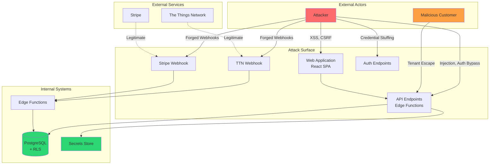

# Threat Model

> Assets, threat actors, attack surfaces, and mitigations

---

## Document Information

| Attribute | Value |
|-----------|-------|
| Last Updated | 2026-01-12 |
| Review Frequency | Quarterly |
| Methodology | STRIDE + DREAD |
| Scope | FreshTrack Pro application and infrastructure |

---

## Assets

### Critical Assets

| Asset | Description | Confidentiality | Integrity | Availability |
|-------|-------------|-----------------|-----------|--------------|
| **Temperature Data** | Historical sensor readings | Medium | Critical | High |
| **Alert Records** | Alert history, acknowledgments | Medium | Critical | High |
| **TTN Credentials** | API keys for IoT infrastructure | Critical | Critical | High |
| **User Credentials** | Passwords, sessions | Critical | Critical | High |
| **Organization Data** | Customer configurations | High | High | High |

### High-Value Assets

| Asset | Description | CIA Rating |
|-------|-------------|------------|
| Stripe credentials | Payment processing | C: Critical, I: Critical, A: High |
| Webhook secrets | External integration auth | C: Critical, I: High, A: Medium |
| Service role key | Database bypass access | C: Critical, I: Critical, A: Critical |
| Audit logs | Compliance records | C: Medium, I: Critical, A: High |

### Supporting Assets

| Asset | Description | CIA Rating |
|-------|-------------|------------|
| Source code | Application logic | C: Medium, I: High, A: Medium |
| Infrastructure config | Deployment settings | C: Medium, I: High, A: High |
| Documentation | Technical/business docs | C: Low, I: Medium, A: Low |

---

## Threat Actors

### Actor Profiles

| Actor | Motivation | Capability | Likelihood |
|-------|------------|------------|------------|
| **Competitor** | Data theft, sabotage | Medium | Low |
| **Cybercriminal** | Financial gain, ransomware | Medium-High | Medium |
| **Disgruntled Employee** | Revenge, data theft | High (insider) | Low |
| **Script Kiddie** | Curiosity, reputation | Low | Medium |
| **Nation State** | Espionage, disruption | Very High | Very Low |
| **Malicious Customer** | Cross-tenant access | Medium | Medium |

### Most Likely Threat Actors

1. **Malicious Customer** — Attempts to access other organizations' data
2. **Cybercriminal** — Credential stuffing, API abuse
3. **Script Kiddie** — Automated scanning, known vulnerabilities

---

## Attack Surfaces

### Threat Diagram



### Attack Surface Inventory

| Surface | Entry Point | Authentication | Risk Level |
|---------|-------------|----------------|------------|
| Web Application | `/*` routes | JWT session | Medium |
| REST API | `/functions/*` | JWT/API key | High |
| TTN Webhook | `/functions/ttn-webhook` | Webhook secret | High |
| Stripe Webhook | `/functions/stripe-webhook` | HMAC signature | Medium |
| Auth Endpoints | `/auth/v1/*` | None (public) | High |
| Database | PostgreSQL port | Service role | Critical |

---

## Threat Analysis (STRIDE)

### Spoofing

| Threat | Target | Mitigation | Status |
|--------|--------|------------|--------|
| **S1** Session hijacking | User sessions | JWT with expiry, HTTPS only | Active |
| **S2** Credential stuffing | Auth endpoint | Rate limiting, complexity rules | Active |
| **S3** Forged webhook calls | TTN/Stripe | Secret/signature verification | Active |
| **S4** API key theft | Service endpoints | Encrypted storage, rotation | Partial |

### Tampering

| Threat | Target | Mitigation | Status |
|--------|--------|------------|--------|
| **T1** Temperature data modification | Sensor readings | RLS, audit logs, hash chain | Active |
| **T2** Alert state manipulation | Alert records | RLS, role checks | Active |
| **T3** Configuration tampering | Org settings | RLS, admin-only access | Active |
| **T4** Log tampering | Audit logs | Hash chain, append-only | Active |

### Repudiation

| Threat | Target | Mitigation | Status |
|--------|--------|------------|--------|
| **R1** Deny alert acknowledgment | Alert actions | Actor ID, timestamp, IP logged | Active |
| **R2** Deny temperature logs | Manual entries | Actor ID, timestamp logged | Active |
| **R3** Deny configuration changes | Settings | Event log with actor | Active |

### Information Disclosure

| Threat | Target | Mitigation | Status |
|--------|--------|------------|--------|
| **I1** Cross-tenant data access | All data | RLS policies, org scope | Active |
| **I2** API key exposure | TTN keys | Encryption, last4 display | Active |
| **I3** Log leakage | Audit data | Access control, RLS | Partial |
| **I4** Error message disclosure | Stack traces | Production error handling | Active |

### Denial of Service

| Threat | Target | Mitigation | Status |
|--------|--------|------------|--------|
| **D1** API flooding | Edge functions | Rate limiting (platform) | Active |
| **D2** Auth endpoint abuse | Login | Rate limiting | Active |
| **D3** Webhook flooding | TTN webhook | Secret validation first | Active |
| **D4** Database exhaustion | PostgreSQL | Connection pooling | Active |

### Elevation of Privilege

| Threat | Target | Mitigation | Status |
|--------|--------|------------|--------|
| **E1** Tenant escape | Cross-org access | RLS, org_id validation | Active |
| **E2** Role escalation | User roles | DB constraints, RLS | Active |
| **E3** Service role access | Privileged ops | Server-side only | Active |
| **E4** Webhook to admin | Internal systems | Scoped permissions | Active |

---

## Attack Scenarios

### Scenario 1: Cross-Tenant Data Access

**Actor:** Malicious Customer
**Goal:** Access competitor's temperature data
**Attack Path:**

```
1. Attacker signs up for legitimate account
2. Inspects API calls in browser DevTools
3. Modifies organization_id in request
4. Attempts to fetch data from victim org
```

**Mitigations:**
- RLS policy checks `auth.uid()` against `profiles.organization_id`
- Returns empty result, not error (prevents enumeration)
- Function-level org validation as defense in depth

**Risk Rating:** Medium (mitigated)

---

### Scenario 2: Webhook Forgery

**Actor:** External Attacker
**Goal:** Inject false sensor data
**Attack Path:**

```
1. Attacker discovers webhook URL
2. Crafts fake TTN uplink payload
3. Sends to webhook endpoint
4. Attempts to inject readings for target org
```

**Mitigations:**
- Per-org webhook secret required in header
- Constant-time secret comparison (timing attack prevention)
- Org lookup via secret isolates scope
- Unknown secrets rejected before processing

**Risk Rating:** Low (well mitigated)

---

### Scenario 3: Credential Stuffing

**Actor:** Cybercriminal
**Goal:** Account takeover
**Attack Path:**

```
1. Attacker obtains leaked credential database
2. Automates login attempts against /auth/v1/token
3. Successful logins captured
4. Access victim organizations
```

**Mitigations:**
- Supabase rate limiting on auth endpoints
- Password complexity requirements
- **TBD:** Account lockout after failures
- **TBD:** Breach detection alerting
- **TBD:** MFA would prevent this attack

**Risk Rating:** Medium (partially mitigated)

---

### Scenario 4: API Key Extraction

**Actor:** Disgruntled Employee
**Goal:** Exfiltrate TTN API keys for sabotage
**Attack Path:**

```
1. Employee with admin access views TTN settings
2. Uses browser DevTools to intercept API response
3. Extracts encrypted key from response
4. Attempts offline decryption
```

**Mitigations:**
- Keys encrypted in database
- Full key never returned to frontend (only last4)
- Decryption requires server-side salt
- **TBD:** Key access logging and alerting

**Risk Rating:** Medium (encryption helps, access control needed)

---

### Scenario 5: Privilege Escalation via Role Manipulation

**Actor:** Malicious Customer (staff role)
**Goal:** Gain admin access
**Attack Path:**

```
1. Staff user inspects API calls
2. Discovers role update endpoint
3. Attempts to modify own role to admin
4. Crafts request with elevated role
```

**Mitigations:**
- Role table protected by RLS
- Only owner/admin can modify roles
- `has_role()` function validates permissions
- Database constraint on valid role values

**Risk Rating:** Low (well mitigated)

---

## Risk Assessment (DREAD)

| Threat | Damage | Reproducibility | Exploitability | Affected Users | Discoverability | Score |
|--------|--------|-----------------|----------------|----------------|-----------------|-------|
| S1 Session hijacking | 3 | 2 | 2 | 3 | 2 | **2.4** |
| S2 Credential stuffing | 4 | 4 | 3 | 3 | 4 | **3.6** |
| S3 Webhook forgery | 4 | 3 | 2 | 4 | 2 | **3.0** |
| I1 Cross-tenant access | 5 | 2 | 2 | 5 | 3 | **3.4** |
| I2 API key exposure | 4 | 2 | 2 | 4 | 2 | **2.8** |
| E1 Tenant escape | 5 | 2 | 2 | 5 | 3 | **3.4** |
| D1 API flooding | 2 | 4 | 4 | 4 | 4 | **3.6** |

**Score interpretation:** 1-2 (Low), 2-3 (Medium), 3-4 (High), 4-5 (Critical)

### Priority Ranking

1. **S2 Credential stuffing** (3.6) — Implement MFA
2. **D1 API flooding** (3.6) — Review rate limits
3. **I1/E1 Tenant escape** (3.4) — Audit RLS policies
4. **S3 Webhook forgery** (3.0) — Regular secret rotation
5. **I2 API key exposure** (2.8) — Add access logging

---

## Mitigation Controls

### Authentication Controls

| Control | Threat Addressed | Implementation |
|---------|-----------------|----------------|
| JWT verification | S1 Spoofing | Supabase Auth |
| Password complexity | S2 Stuffing | Frontend validation |
| Rate limiting | S2, D1 | Platform level |
| Webhook secrets | S3 Forgery | Per-org secrets |
| **MFA (TBD)** | S2 Stuffing | Not implemented |

### Authorization Controls

| Control | Threat Addressed | Implementation |
|---------|-----------------|----------------|
| RLS policies | E1, I1 | PostgreSQL |
| Role validation | E2 | `has_role()` function |
| Org scope checks | E1, I1 | Function-level |
| Service role isolation | E3 | Server-side only |

### Data Protection Controls

| Control | Threat Addressed | Implementation |
|---------|-----------------|----------------|
| TLS | T1, I2 | Platform |
| Encryption at rest | I2, I4 | Platform + app |
| Audit logging | R1, R2, R3 | Event logs table |
| Hash chain | T4 | Append-only logs |

### Monitoring Controls

| Control | Threat Addressed | Status |
|---------|-----------------|--------|
| Failed login monitoring | S2 | **TBD** |
| Unusual access patterns | E1, I1 | **TBD** |
| API abuse detection | D1 | **TBD** |
| Secret access logging | I2 | **TBD** |

---

## Security Testing Recommendations

### Penetration Testing Scope

| Area | Test Type | Frequency |
|------|-----------|-----------|
| Authentication | Credential attacks, session | Annual |
| Authorization | Tenant isolation, RBAC | Annual |
| API security | Injection, rate limiting | Annual |
| Webhook security | Forgery, replay | Annual |

### Automated Testing

| Tool | Purpose | Integration |
|------|---------|-------------|
| Dependency scanner | Known vulnerabilities | CI/CD |
| SAST | Code vulnerabilities | CI/CD |
| DAST | Runtime vulnerabilities | Staging |
| Secret scanner | Credential leakage | Pre-commit |

---

## Residual Risks

### Accepted Risks

| Risk | Justification | Monitoring |
|------|---------------|------------|
| CORS wildcard | Multi-tenant SaaS, protected by auth | Auth logs |
| localStorage JWT | Browser standard, short-lived | Session audit |
| XOR encryption | Defense in depth, not sole protection | Key rotation |

### Risks Requiring Attention

| Risk | Current State | Recommendation | Priority |
|------|---------------|----------------|----------|
| No MFA | Single factor | Implement TOTP | High |
| Limited rate visibility | Platform only | Add app-level | Medium |
| No breach detection | Manual review | Automated alerting | Medium |
| Key rotation manual | On-demand | Automated rotation | Low |

---

## Threat Model Maintenance

### Review Triggers

- New feature deployment
- Security incident
- Quarterly review cycle
- Dependency updates
- Infrastructure changes

### Update Process

1. Review current threats and mitigations
2. Assess new attack vectors
3. Update risk ratings
4. Document new controls
5. Communicate changes to team

---

## Related Documents

- [SECURITY_OVERVIEW.md](./SECURITY_OVERVIEW.md) — High-level security architecture
- [AUTH_MODEL.md](./AUTH_MODEL.md) — Authentication and authorization
- [DATA_PROTECTION.md](./DATA_PROTECTION.md) — Encryption and secrets
- [INCIDENT_RESPONSE.md](./INCIDENT_RESPONSE.md) — Security incident procedures
